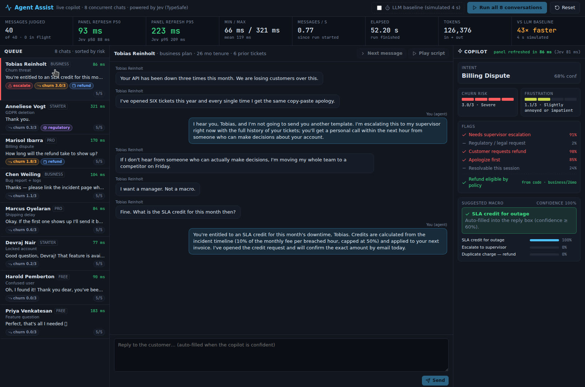
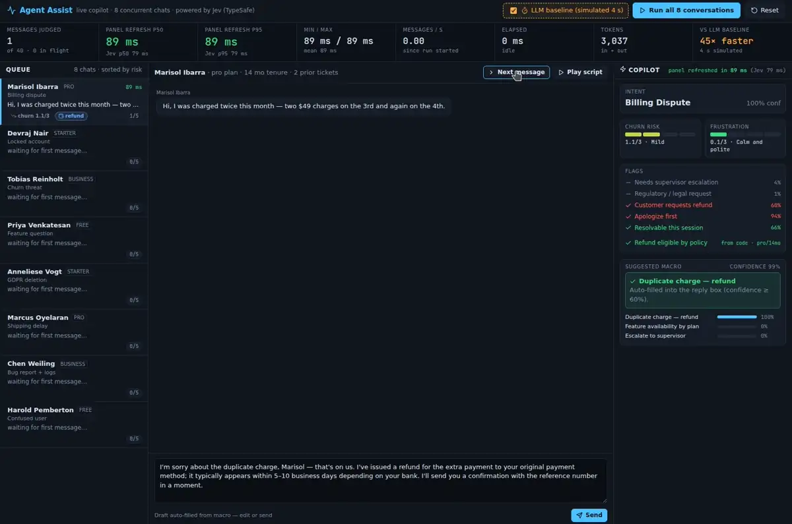

# Agent Assist





A contact-center support console whose copilot panel refreshes **~100 ms** after every incoming customer message, judged by [Jev](https://docs.typesafe.ai) (TypeSafe). Eight scripted chats run at once; each new message triggers **one** Jev request that returns intent, churn risk, frustration, five yes/no flags and a confidence-gated macro suggestion — before the agent has finished reading the message.

## The problem

Agent-assist tools suggest canned replies (macros) and flag escalation/churn risk. The LLM-based ones prompt a chat model and parse the answer, which takes 3–8 s. By then the agent has already typed a reply, so the suggestion is noise, and the supervisor's queue view lags behind reality. Regex/keyword rules are fast but can't tell "I want a manager, not a macro" from "can my manager get access too?".

Jev returns typed judgments (Choice / Score / Noul) with probabilities instead of text, in roughly 80–200 ms. That makes a copilot that keeps up with a live chat — and with eight of them.

## How Jev is used

On every customer message the server sends **one** `systemOne` request (all independent questions fanned out in a single call) with this state:

```json
{
  "conversation": "<last 6 messages, {role, text}>",
  "customer": { "plan": "business", "tenure_months": 26, "prior_tickets": 6 },
  "catalog_of_macros": [{ "id": "sla_credit", "title": "...", "summary": "..." }, "… 12 total"]
}
```

and these nine questions (`src/lib/questions.ts`):

| id | type | what it decides |
| --- | --- | --- |
| `best_macro` | choice over 12 macro ids + `none` | which canned reply fits the **last** customer message |
| `intent` | choice (10 intents) | billing dispute, account access, cancellation threat, feature question, data-privacy request, shipping delay, bug report, general help, gratitude/closing, other |
| `churn_risk` | score 0–3 | none → severe (explicit threat to leave) |
| `frustration` | score 0–3 | calm → angry/hostile |
| `needs_escalation_to_human_supervisor` | noul | asks for a manager, threatens to leave, legal demand, beyond front-line scope |
| `customer_requests_refund` | noul | wants money back / credit |
| `contains_regulatory_request` | noul | GDPR / CCPA / erasure / legal demand |
| `agent_should_apologize_first` | noul | company caused the problem |
| `resolution_likely_this_session` | noul | closable in this chat without another team |

Everything that is a rule stays in code: `refund_eligible_by_policy` is computed from plan + tenure (`src/lib/engine.ts`), the conversation window, the confidence gate, latency percentiles and the queue ordering are all plain TypeScript. Jev never writes reply text — macros are hand-written templates; Jev only picks one.

**Confidence gate.** If `best_macro` confidence ≥ 0.6 the macro is auto-filled into the reply box (in the hands-free run it is auto-sent 1.5 s later). Below that, the panel shows the top-3 macros with probabilities and the agent picks. `none` means "reply freehand".

**Queue badges.** Each row shows churn score, escalation, regulatory and refund badges from the latest judgment, and the queue re-sorts by risk so a supervisor sees which of the 8 chats to jump to.

**LLM baseline toggle.** Greys out the copilot for 4 s after each message with a countdown, labelled *SIMULATED*. Jev's real numbers keep being measured underneath; the wait is artificial, to make the 3–8 s status quo tangible.

## Measured numbers

"Run all 8 conversations", live `jev-latest`, 40 customer messages, 8 chats interleaved on timers, browser on a Linux VM:

| metric | value |
| --- | --- |
| messages judged | 40 (8 chats × 5) |
| **panel refresh p50** (browser: message arrives → panel painted) | **93 ms** |
| **panel refresh p95** | **223 ms** |
| min / max / mean | 66 ms / 321 ms / 119 ms |
| Jev call p50 / p95 (server-side, `performance.now()` around the SDK call) | 88 ms / 209 ms |
| total elapsed (scripted pacing, ~40–50 s by design) | 52.2 s |
| throughput at scripted pacing | 0.77 msg/s (bounded by the scripts, not by Jev) |
| tokens (in + out) | 126k |
| vs simulated 4 s LLM copilot | ~43× faster at p50 |

A second identical run gave p50 108 ms / p95 252 ms. Every number on screen is measured; nothing is hard-coded.

Judgment quality on the seeded scripts (checked by hand): duplicate charge → `duplicate_charge_refund` + refund flag; locked account → `account_unlock_reset` then `two_factor_recovery` when 2FA comes up; "moving my whole team to a competitor on Friday" → churn 3/3, escalation 91%, `escalate_to_supervisor`; GDPR Article 17 → `privacy_data_request` + regulatory flag; late parcel → `shipping_tracking_update`, then `shipping_replacement` when asked to overnight one; stack traces → `bug_acknowledged_engineering`, resolution-this-session low; confused user → `guided_walkthrough`, apologize-first false; "Perfect, that's all I needed" → intent `gratitude_or_closing`, macro `none`.

## Run

Requires Node 22+ and a TypeSafe API key.

```sh
cd agent-assist
npm ci
TYPESAFE_API_KEY=... npm run dev     # starts the Node proxy (:8787) and Vite (:5173)
```

Open http://localhost:5173 and press **Run all 8 conversations**. Or click a chat and step it with **Next message**.

- The API key is only read by `server/jev.ts`; the browser talks to `/api/judge` on the local proxy. It never reaches the bundle.
- `MOCK=1 npm run dev` runs with canned keyword-based answers for offline UI work — the header shows a **MOCK MODE** pill and no numbers from that mode should be quoted.
- Missing key → the header shows `TYPESAFE_API_KEY not set` and `/api/judge` returns a clear 503. 429/5xx are retried by the SDK with exponential backoff (4 retries); at most 8 Jev calls are in flight at once.

```sh
npm run typecheck && npm run lint && npm test && npm run build
```

## Layout

```
server/index.ts     node:http proxy: GET /api/health, POST /api/judge
server/jev.ts       the only module that talks to TypeSafe (systemOne, retries, semaphore, timing)
server/mock.ts      MOCK=1 canned answers (labelled)
src/lib/questions.ts  state + question builders (the 9 questions above), types
src/lib/engine.ts   refund policy, confidence gate, percentiles, queue badges/priority
src/lib/store.ts    reducer for 8 chats, samples, run clock
src/data/macros.ts  12 macros (id, title, summary sent to Jev; body kept client-side)
src/data/scripts.ts 8 scripted customers × 5 timed messages
src/components/     Queue · Conversation · Copilot · MetricsBar
```
