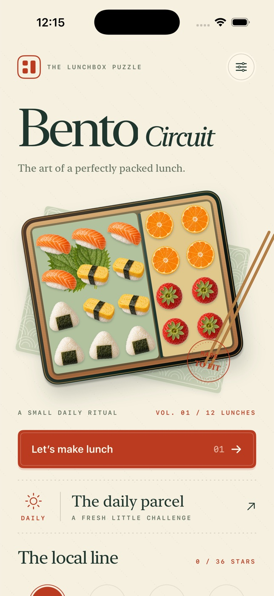

# Bento Circuit



A native iPhone lunchbox packing puzzle. SwiftUI, original illustrated food assets,
UIKit sharing, local persistence, and no third-party runtime dependencies.

## Play

Pack every square before the move budget runs out. Savory food stays left of the
divider; fruit stays right. Select an ingredient, rotate it, then tap the board
square where the piece's **letter-marked cell** should go. Alternatively,
drag an ingredient from the tray into the lunchbox; the dotted preview marks
its destination. Packed pieces can be selected from the tray and repositioned.

Every successful placement or reposition costs one move. Invalid placements
and rotations are free. **Undo** restores the previous board and move count.
**Repack** starts the lunch over. Exhausting the budget before filling the box
is a loss; undo or repack immediately. There is no real-time countdown.

- Three stars: complete the lunch in exactly one placement per piece.
- Two stars: complete with extra placements.
- One star: complete after using **Guide**, which shows the authored placement.
- Best ratings never decrease; completing a lunch unlocks the next of 12 stops.
- The daily parcel chooses an authored layout and starting rotation using a
  stable UTC date seed. Everyone on the same date gets the same puzzle.
- Share creates an original lunch postcard image and text in the native share sheet.
- Partial lunches, undo history, settings and best ratings survive relaunch.

## Build and run

Requirements: macOS with Xcode 16+ and an iOS 17+ simulator. Development verified
with Xcode **26.6 (17F113)** and the **iOS 26.5** runtime on Apple Silicon.

The checked-in `BentoCircuit.xcodeproj` and shared **BentoCircuit** scheme are
ready to open. Select an iPhone simulator and press Run. Signing is disabled
for simulator builds.

From this directory:

```sh
xcodebuild -project BentoCircuit.xcodeproj -scheme BentoCircuit \
  -configuration Debug -sdk iphonesimulator \
  -destination 'generic/platform=iOS Simulator' \
  -derivedDataPath DerivedData CODE_SIGNING_ALLOWED=NO build

xcodebuild -project BentoCircuit.xcodeproj -scheme BentoCircuit \
  -configuration Release -sdk iphonesimulator \
  -destination 'generic/platform=iOS Simulator' \
  -derivedDataPath DerivedData CODE_SIGNING_ALLOWED=NO build

xcrun simctl list devices available
# Replace DEVICE_UUID with a booted iPhone UUID from the command above:
xcrun simctl install DEVICE_UUID DerivedData/Build/Products/Debug-iphonesimulator/BentoCircuit.app
xcrun simctl launch DEVICE_UUID studio.bentocircuit.BentoCircuit
```

The project is reproducibly generated with XcodeGen 2.46.0:
`brew install xcodegen` then `xcodegen generate`. The original icon is generated
with `swift Tools/MakeIcon.swift`; its PNG is checked in.

## Automated verification

```sh
xcrun swift-format lint --strict --recursive Sources Tests Tools

xcodebuild -project BentoCircuit.xcodeproj -scheme BentoCircuit \
  -configuration Debug \
  -destination 'platform=iOS Simulator,id=DEVICE_UUID' \
  -derivedDataPath DerivedData CODE_SIGNING_ALLOWED=NO test
```

Both build configurations typecheck the complete app. XCTest covers every
authored solution, connected polyominoes, exact coverage, compartment separation,
rotation, overlap and bounds rejection, move budgets and undo recovery, ratings,
daily determinism, Codable snapshots, persistence and non-decreasing best scores.
To format: `xcrun swift-format format --in-place --recursive Sources Tests Tools`.

## Design and limitations

Rice-paper ivory, persimmon seals and seaweed ink give the game a Japanese
railway-stationery identity. Original generated food illustrations are packaged
locally as transparent asset-catalog images: salmon, tamago, onigiri, mandarin,
strawberry and shiso. They share one art direction across the app icon, cloth-wrapped
home lunchbox, ingredient tray, playable board and collectible result postcard.
The box uses layered lacquer, wood grain and metallic edging; the cloth uses a
procedural wave pattern. The journey is a station line, controls are tactile keys,
and a completed lunch gets a custom ribbon knot and paper confetti.

Portrait iPhone layout; scrolling preserves access to controls on short screens.
Interactive elements have accessibility names/identifiers, and tap placement
provides an alternative to dragging. System Reduce Motion shortens celebration.
Moving to the background persists the board and opens a breather on return.
Sounds are opt-in, haptics can be disabled. Device audio/haptic feel, VoiceOver
usability and signed App Store distribution require physical-device evaluation.
No network services, analytics, purchases or leaderboards. English-only V1.
Daily parcels reuse authored lunches rather than promise an unlimited unique catalog.

Build outputs and evidence are excluded from version control.
