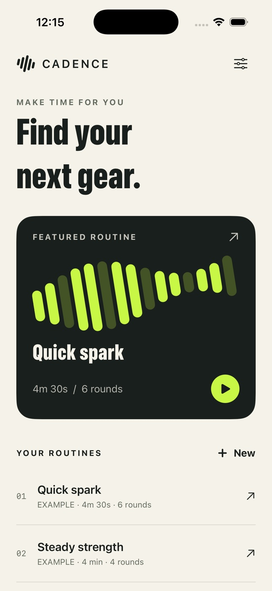

# Cadence Coach



A native, offline iPhone interval coach. A warm cream routine studio gives way to
a graphite workout instrument with electric lime work phases and soft sea-glass
rest phases. Original procedural interval artwork and app icon, system typography,
SwiftUI, AVFoundation and no runtime dependencies.

## V1

- Three clearly labeled example routines, including a 30-second introduction.
- Create and edit sequences of 1–12 named work/rest intervals (1–3,600 seconds),
  repeated for 1–30 rounds. Add, reorder or delete intervals.
- Full-screen countdown, round/phase progress, next phase and active time.
- Pause, resume, skip, restart, end early, and repeat.
- Synthesized high/low phase tones, mute and haptics; visual cues work silently.
- Saved training log with performed active/work time, finished and skipped counts.
- Persistent routines, history, mute preference and in-progress session.
- VoiceOver control labels, Dynamic Type for UI text, scrollable layouts and
  Reduce Motion support.

## Open and run

Requires Xcode with iOS 17+ support. Verified toolchain: Xcode 26.6 (17F113),
macOS arm64, iOS 26.5 Simulator. Open `CadenceCoach.xcodeproj`, choose the shared
**CadenceCoach** scheme and an iPhone Simulator, then Run. No signing account
is needed for Simulator. A physical device requires your own development team.

The generated project is committed. To regenerate after changing `project.yml`:

```sh
brew install xcodegen
cd cadence-coach
xcodegen generate
```

From the app directory:

```sh
xcodebuild -project CadenceCoach.xcodeproj -scheme CadenceCoach \
  -destination 'platform=iOS Simulator,name=iPhone 17 Pro' \
  -derivedDataPath ~/cadence-build CODE_SIGNING_ALLOWED=NO build
xcodebuild -project CadenceCoach.xcodeproj -scheme CadenceCoach \
  -destination 'platform=iOS Simulator,name=iPhone 17 Pro' \
  -parallel-testing-enabled NO \
  -derivedDataPath ~/cadence-build CODE_SIGNING_ALLOWED=NO test
xcrun swift format lint --strict --recursive Sources Tests Tools
```

Regenerate the original icon with:

```sh
swift Tools/GenerateIcon.swift Resources/Assets.xcassets/AppIcon.appiconset/AppIcon.png
```

## Controls and data

Open a routine, inspect its repeated sequence, then start. The routine options
menu opens the editor or deletes the routine. “New” opens a blank-name draft.
Invalid drafts cannot be saved; Cancel confirms discarding changes.

The session's skip action counts only time actually performed. Paused time is
excluded. Restart discards the current attempt; End saves it as ended early.
Reaching the end (even with skips) is marked completed, with skipped and fully
finished interval counts shown separately. History preserves a routine snapshot
when the original routine is edited/deleted.
Dashed phase bars identify skips; long sequences show the current group of 24
phases. Displayed history totals sum the same whole seconds as individual rows.

At accessibility text sizes, metrics and sequence details stack vertically.
Workout Pause/Resume and Skip stay pinned to the safe area with adaptive sizing.
Done and Go again remain pinned on the result screen.

Data is JSON-encoded in app-local UserDefaults, with no cloud sync or account.
Deleting the app removes its data. Clear history requires confirmation.

The timer computes elapsed time from phase timestamps instead of decrementing a
counter, so delayed callbacks and background suspension do not accumulate drift.
On return (including relaunch), it advances through missed phases and caps effort
at the routine's duration. Pausing persists elapsed time. Manual changes to the
device clock can affect an active session; this V1 does not use a server clock.

## Audio and limitations

The app synthesizes tones locally with AVAudioPlayer. Cues respect Silent Mode;
they are foreground-only. The session continues logically in the background but
does not play background audio or schedule notifications. No HealthKit, Live
Activities, wearable support, export, calories or medical claims. Example
movements are general fitness prompts; choose your own exercises and pace.

Designed for iPhone portrait. Simulator verification is not physical-device
validation, production signing, accessibility certification or App Store approval.
