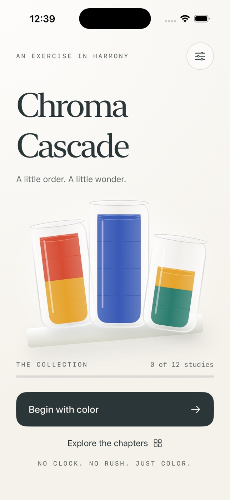

# Chroma Cascade



A native iPhone color-sorting game, composed as a small art gallery. SwiftUI and
Apple frameworks only; no accounts, network, ads, paywalls, or runtime packages.

## Play

Choose any of twelve studies across three chapters. Tap a vessel, then a vessel
with the same top color or an empty one. A contiguous top stack pours as far as
capacity allows. Every vessel holds four layers. Finish with full single-color
vessels and any remaining vessels empty. Tap the selected vessel to deselect it.
Undo is unlimited; restart asks for confirmation. Completed studies record your
personal best and offer the next study. Every study is available from the start.

The first study can be solved in three pours: 1 → 3, 2 → 1, 3 → 2.
Other studies are generated deterministically by reversing valid transfers.
The model tests replay the resulting solution witness for every study.

## Build and test

Requires macOS and Xcode 26.6 (verified), with an iOS simulator runtime.
Deployment target: iOS 17.0. Open `ChromaCascade.xcodeproj` and select the shared
`ChromaCascade` scheme and any iPhone simulator. No signing is needed for Simulator.

From this directory:

```sh
xcodebuild -project ChromaCascade.xcodeproj -scheme ChromaCascade \
  -sdk iphonesimulator -destination 'generic/platform=iOS Simulator' \
  -derivedDataPath build CODE_SIGNING_ALLOWED=NO build
xcodebuild -project ChromaCascade.xcodeproj -scheme ChromaCascade \
  -destination 'platform=iOS Simulator,name=iPhone 17 Pro' \
  -derivedDataPath build CODE_SIGNING_ALLOWED=NO test
xcrun swift-format lint -s -r Sources Tests Tools
```

The generated Xcode project is committed. To regenerate after editing `project.yml`,
install XcodeGen (`brew install xcodegen`) and run `xcodegen generate`.
The original icon can be reproduced with:

```sh
swift Tools/GenerateIcon.swift Assets.xcassets/AppIcon.appiconset/AppIcon.png
```

## Data and accessibility

Progress, complete undo histories, per-study bests, current study, color-symbol
preference, and haptics preference save immediately to local UserDefaults.
Malformed or invalid saved data falls back to a fresh collection. Reset all
progress keeps accessibility and haptics preferences. No data leaves the device.
There is no cloud sync or export in V1.

Every vessel has a VoiceOver description in top-to-bottom order. Symbol mode
adds unique pigment shapes. Standard text uses Dynamic Type where appropriate;
decorative display typography stays fixed. Scrollable screens accommodate
larger text. Reduce Motion removes the transfer animation. Haptics are optional.

Verified natively on iPhone 17 and iPhone 17e simulators running iOS 26.5,
including maximum Dynamic Type, Reduce Motion, a completed study/replay,
invalid moves, restart/reset cancellation, and persistence after relaunch.
All twelve solution witnesses pass the model test suite. Spoken VoiceOver
output/focus order and physical haptic quality have not been validated.

## Scope

Portrait iPhone app. Simulator testing does not establish physical-device
behavior, production signing, App Store approval, or iPad layout support.
There is no audio; the experience is intentionally quiet.
