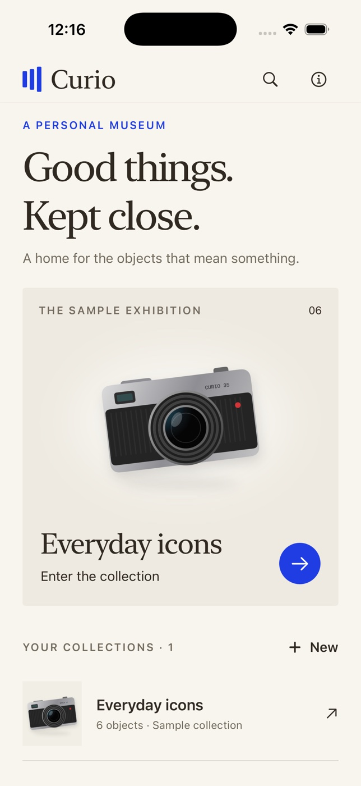

# Curio



A private, offline museum for the objects you love. Native SwiftUI for iPhone,
iOS 17 or later. No runtime dependencies, account, or network requests.

## What works

- Create, rename and delete collections; add, edit, move and delete objects.
- Titles, maker/material, stories, acquired dates, comma-separated tags and photos.
- Gallery and detailed cards; search titles, maker, stories and tags; combine tag
  and favorite filters. Favorite an exhibit from its detail screen.
- Render a real high-resolution PNG museum label and share it or save to Files
  through the native share sheet.
- Six original procedural illustrations and an original generated app icon.
  The initial **Everyday icons** exhibition is explicitly fictional sample data.
- Personal collections take priority on home. New objects begin with an honest
  empty plinth; photo and illustration selection are optional and explicit.
- VoiceOver labels, native Dynamic Type body text, a single-column accessibility
  layout and selection haptics. No essential motion or audio.

## Open and build

Open `Curio.xcodeproj`, select the shared **Curio** scheme and an iPhone simulator.
The generated project is committed, so XcodeGen is not needed to open the app.
Simulator signing is disabled. For physical devices, choose your development team
and enable code signing in Xcode; physical-device signing is not validated here.

To regenerate with XcodeGen 2.46.0:

```sh
brew install xcodegen
cd curio
xcodegen generate
```

Build and run tests (substitute an available device from `xcrun simctl list devices`):

```sh
xcodebuild -project Curio.xcodeproj -scheme Curio \
  -destination 'platform=iOS Simulator,name=iPhone 17 Pro' \
  -derivedDataPath ~/curio-build build CODE_SIGNING_ALLOWED=NO
xcodebuild -project Curio.xcodeproj -scheme Curio \
  -destination 'platform=iOS Simulator,name=iPhone 17 Pro' \
  -derivedDataPath ~/curio-build test CODE_SIGNING_ALLOWED=NO
xcrun swift-format lint --strict --recursive Curio CurioTests Scripts
```

Regenerate the icon with:

```sh
swift Scripts/GenerateIcon.swift Curio/Assets.xcassets/AppIcon.appiconset/AppIcon.png
```

## Controls and data

Tap a collection to enter its gallery. The top-right view button switches between
gallery and detailed object cards. Horizontal chips filter by favorites and tags.
Tap a card for its full story, favorite control, edit/delete menu and label export.
Use **New** on the home screen to create a collection and **Add an object** inside
it. Cancel dismisses an editor without saving. Destructive actions ask for confirmation.

Objects and photo bytes are stored in an atomic JSON archive in Application Support.
Changes are published only after writing succeeds. Read failures preserve the
original file and disable editing rather than silently replacing data.
Photos are resized to at most 1600 pixels on their longest edge and JPEG-compressed.
Deleting a collection removes its objects; catalog numbers are never reused.
Removing every collection leaves a working empty state. Reopening an empty museum
does not seed sample data again. Exported PNGs are stored in a cache until shared.

## Scope

Designed as a focused personal collection app. There is no cloud sync, archive
import/backup, authentication or automatic object recognition. Deleting the app
deletes the museum; exported labels are not a backup. Large collections load as
one archive, so this V1 is intended for personal collections rather than inventories
of thousands of high-resolution photos. Sharing presents destinations available
on the device; no external service delivery is assumed.

The simulator build uses Xcode 26.6 with iOS 26.5. App Store submission, production
signing and physical-device validation are outside this version's validation.

## Validation performed

Native simulator checks covered iPhone 17 Pro and iPhone 17e, including an
accessibility-large text spot check. The tested paths include create/edit/move,
photo import, acquired date, favorite/tag/search combinations, cancellation,
cascade deletion, relaunch persistence and native Save to Files export. The
saved sample label is a decodable 960 × 1391 PNG.

Seven XCTest cases cover persistence/CRUD, combined query behavior, validation
and cascade deletion, preservation of unreadable archives, real PNG rendering,
object moves/catalog stability and safe descriptive filenames. Strict
Swift-format lint and the native Xcode test build pass.

VoiceOver labels are implemented, but runtime VoiceOver reading was not
validated. Extreme collection sizes and UI-level disk-full recovery were not
tested. Museum data has no archive backup/recovery interface in this V1.
