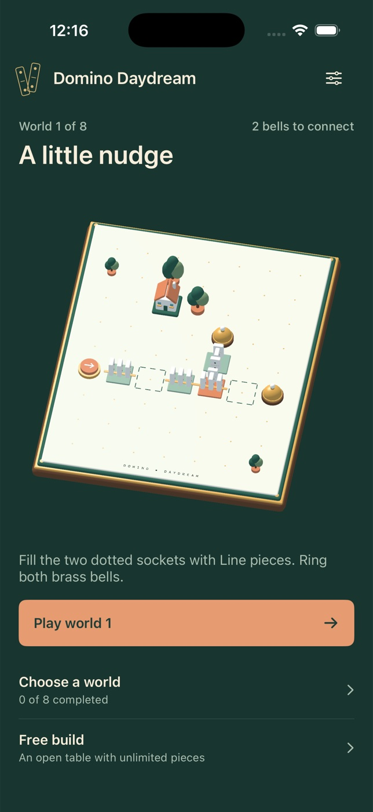

# Domino Daydream



A native SwiftUI and SceneKit tabletop puzzle game for iPhone. Build tiny porcelain machines
on a walnut-and-brass tray, then send a deterministic domino ripple through a miniature
town. No packages, network services, accounts, purchases or signing credentials
are required for simulator use.

## Build and run

Requires macOS and Xcode 26.6 (tested with the iOS 26.5 simulator runtime).
The checked-in Xcode project and shared **DominoDaydream** scheme are ready to open.
Deployment target: iOS 17.0. Portrait iPhone.

```sh
cd domino-daydream
xcodebuild -project DominoDaydream.xcodeproj -scheme DominoDaydream \
  -configuration Debug -sdk iphonesimulator -derivedDataPath DerivedData \
  CODE_SIGNING_ALLOWED=NO build
xcodebuild -project DominoDaydream.xcodeproj -scheme DominoDaydream \
  -configuration Release -sdk iphonesimulator -derivedDataPath DerivedData \
  CODE_SIGNING_ALLOWED=NO build
xcrun simctl list devices available
# Replace DEVICE_UUID with an available iPhone simulator.
xcrun simctl boot DEVICE_UUID
open -a Simulator
xcrun simctl install DEVICE_UUID DerivedData/Build/Products/Debug-iphonesimulator/DominoDaydream.app
xcrun simctl launch DEVICE_UUID studio.daydream.domino
```

To regenerate the project after changing `project.yml`, install XcodeGen 2.46.0
(`brew install xcodegen`) and run `xcodegen generate`. The icon is original,
procedural AppKit artwork; regenerate it with:

```sh
swift Scripts/MakeIcon.swift Assets.xcassets/AppIcon.appiconset/AppIcon.png
```

## Checks

```sh
xcrun swift-format lint --strict --recursive Sources Tests Scripts
xcodebuild -project DominoDaydream.xcodeproj -scheme DominoDaydream \
  -configuration Debug -destination 'platform=iOS Simulator,id=DEVICE_UUID' \
  -derivedDataPath DerivedData CODE_SIGNING_ALLOWED=NO test
```

Builds perform Swift typechecking. XCTest covers the solvability and inventories of
all nine boards, stops at empty/closed edges, bridge water crossings, branching,
deterministic event order, exact domino counts, scoring penalties, rotation,
inventory restoration, undo/reset, sandbox, draft persistence, share artwork,
projected touch coordinates for every grid cell on compact and large viewports,
and unobstructed column labels across all nine boards.

## Play

- **Eight worlds:** complete each world to unlock the next. Ring every brass bell
  in one attempt. There is no time limit.
- **Placement:** choose Line, Turn, Bridge or Split, then tap a dotted socket.
  Only the dotted sockets are editable in puzzles. The open table allows placement
  anywhere on the grid except its trigger and bells.
- **Editing:** tap a placed piece to select it. Rotate turns it clockwise. Select
  a different tray kind to replace it if inventory permits. Lift returns it to the
  tray. Undo restores previous placements, rotation, swaps and resets.
- **Rules:** the coral trigger pushes right. A nudge enters an open edge of a piece
  and leaves through its remaining open edges. Lines connect opposite edges;
  turns connect adjacent edges; splits send two branches. A bridge skips exactly
  one cell in its outgoing direction. Bells stop and receive a branch.
- **Clear feedback:** an empty square or closed edge stops that branch and gets a
  coral marker. Edit board returns immediately to editing. Pause preserves the
  exact point in the ripple; backgrounding automatically pauses.
- **Scoring:** 20 points per fallen porcelain domino, 200 per bell, minus 75 per
  hint and 25 per attempt after the first. A successful score has a 100-point floor.
  Failed attempts score only 100 per reached bell. Hints reveal a selected socket's
  intended piece and clockwise turns. Best scores never decrease.
- **Persistence:** best scores, unlocked worlds, unfinished placements, attempts,
  hints and preferences are saved locally with UserDefaults. No personal data.
- **Share:** a completed board renders an original 1200×1720 result card and text
  into the native iOS share sheet.

The home board previews the next unlocked puzzle and its saved placements. Choose a world
opens the progression list; Free build opens the sandbox. The contextual first-world tutorial is
two placements followed by Start chain. A satisfying first success takes about 30–60
seconds. Later worlds add turns, bridges and multiple branches.

## Accessibility and limits

Every control and board cell has a spoken label and stable accessibility ID.
System Reduce Motion removes intermediate falling, placement motion and bell wobble.
The app supports small/large portrait iPhones and safe areas; gameplay uses fixed-size typography
to protect grid geometry. Full Dynamic Type reflow and nonvisual spatial puzzle
navigation are not provided.

The orthographic 3D diorama uses beveled porcelain, enamel rails, sculpted plants,
miniature buildings, brass bells and directional shadows. Touches project onto the
board plane; accessibility frames project from the same cell coordinates. Share
cards snapshot the actual SceneKit scene before composing the printable artwork.

The interface uses shared system sans-serif typography and flat workshop surfaces.
Coral identifies the primary action, brass marks bell progress, and the selected
piece has both an ivory surface and a checkmark. Navigation, help, results and
share artwork use the same type hierarchy; board coordinates keep their functional
monospaced lettering. The diorama supplies the visual detail while controls stay compact.

This is a deterministic tile-collision simulation with staggered domino falls,
shadows and bell ripples; it is not a general rigid-body physics sandbox.
Fixed tiles cannot be moved, and boards intentionally use guided sockets.
No daily challenge or online leaderboard is advertised.

System sound effects and UIKit haptics are optional. Simulator evidence does not
validate physical-device audio, haptics, thermal behavior or App Store signing.
No App Store upload or public deployment is part of this project.
