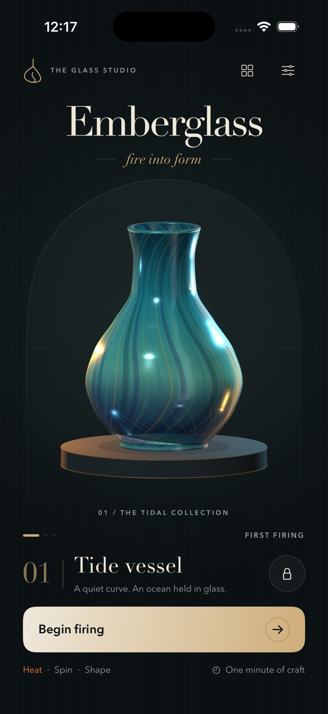

# Emberglass



A native, offline iPhone glassblowing skill game. SwiftUI presents the studio and
its instruments; SceneKit turns the player's traced contour into a rotating,
hollow glass sculpture with reflected studio lighting, flowing colored glaze,
and a stone-and-brass plinth. Three linked stages turn a molten gather into a
scored, collectible vessel.

## Build and run

Requires macOS, Xcode 26.6 (tested), and the iOS 26.5 Simulator runtime. iOS 17+
is the deployment target. No packages, accounts or signing credentials are needed.

Open `Emberglass.xcodeproj`, select the shared **Emberglass** scheme, select an
iPhone simulator, and Run. All commands below run from this directory:

```sh
xcodebuild -project Emberglass.xcodeproj -scheme Emberglass \
  -configuration Debug -sdk iphonesimulator \
  -destination 'generic/platform=iOS Simulator' \
  -derivedDataPath DerivedData CODE_SIGNING_ALLOWED=NO build

xcodebuild -project Emberglass.xcodeproj -scheme Emberglass \
  -configuration Release -sdk iphonesimulator \
  -destination 'generic/platform=iOS Simulator' \
  -derivedDataPath DerivedData CODE_SIGNING_ALLOWED=NO build

xcrun simctl list devices available
# Replace <UUID> with an available iPhone simulator from the list above.
xcrun simctl boot <UUID>
open -a Simulator
xcrun simctl install <UUID> DerivedData/Build/Products/Debug-iphonesimulator/Emberglass.app
xcrun simctl launch <UUID> studio.emberglass.app
```

The Xcode project and shared scheme are checked in. To regenerate them after
editing `project.yml`, install XcodeGen (`brew install xcodegen`) and run
`xcodegen generate`. The native icon source is `Tools/GenerateIcon.swift`;
regenerate it with `xcrun swift Tools/GenerateIcon.swift`.

## Checks

```sh
xcrun swift-format lint --strict --recursive Sources Tests Tools
xcodebuild -project Emberglass.xcodeproj -scheme Emberglass \
  -configuration Debug -destination 'platform=iOS Simulator,id=<UUID>' \
  -derivedDataPath DerivedData CODE_SIGNING_ALLOWED=NO test
```

Both builds typecheck the app. XCTest covers thermal bounds, moving target
reachability, precision falloff, contour coverage and accuracy, weighted scoring,
grade boundaries, archive eviction, unlocks, paused/tutorial time, retry state,
successful end-to-end model progression and relaunch persistence. Renderer tests
cover interpolation through every traced point without overshoot, bounded
endpoints, paired inner/outer mesh topology, and a flat tracing foot that matches
the sculpture.

## Playing

1. **Heat, 14 seconds:** hold the heat pad to warm the white temperature
   marker; release to cool it. Track the moving green window.
2. **Spin, 14 seconds:** drag the dial so the white marker follows the moving
   green balance window.
3. **Shape, up to 26 seconds:** trace all eight dots down the vessel's right
   contour. Your curve mirrors to the left. Reset the curve if needed, or
   choose **Cool & reveal** to finish early.

Heat and balance each contribute 28%; form contributes 44%. Shape points count
only when touched, and accuracy is graded by distance from the target contour.
55 earns a Collectible and unlocks the next commission, 75 an Exquisite,
and 90 a Masterwork. Lower scores are honest studies with actionable retry advice.
Three commissions have distinct contours and palettes. Results keep the actual
curve you shaped; the native share sheet exports an original vessel print
rendered from the same SceneKit scene as the live exhibition.

The read-only gallery keeps the last 24 firings, including studies; share a
vessel from its current result screen. Personal best and
unlocks remain even when old firings leave the gallery. Everything is stored
locally in UserDefaults. Removing the app removes local progress.

Pause freezes the clock. Backgrounding pauses automatically and releases heat
input. Stage guides appear on first use and can be reset in Settings.

## Accessibility and limits

- Portrait iPhone layout; respects safe areas. All controls have semantic labels
  and test identifiers. Heat has a VoiceOver toggle action; shaping exposes
  per-point adjustable controls when VoiceOver is running.
- Reduce Motion stops the rotating sculpture and result scale reveal.
- Haptics can be disabled. This is an intentionally silent studio; no audio is
  implemented. Physical-device haptics are not validated by simulator tests.
- No cloud sync, multiplayer, purchases, daily challenges or online leaderboard.
- A real, unsigned simulator build; no App Store submission or physical-device
  certification is implied. VoiceOver gameplay needs device-based evaluation.

See `QA.md` for actual simulator design passes, checks, and evidence limitations.
