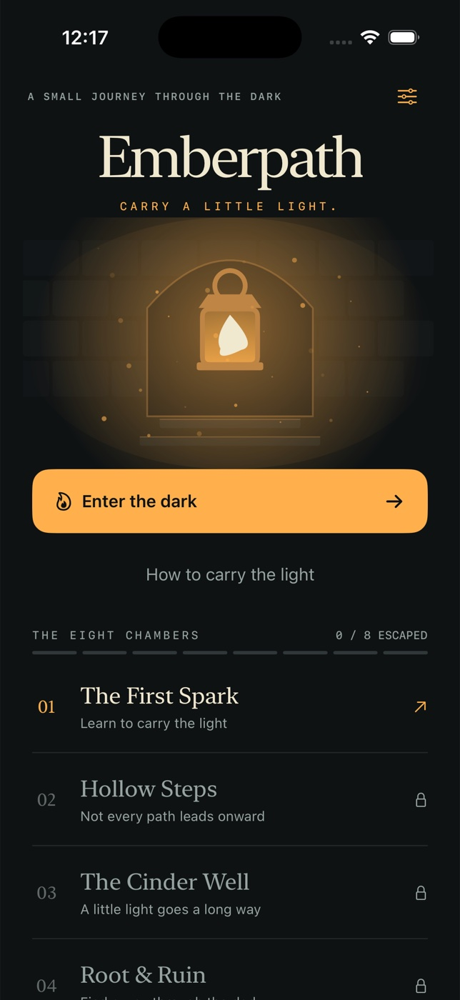

# Emberpath



A native, offline iPhone lantern puzzle. Carry a finite light through eight
handcrafted chambers, gather embers, find golden keys and reach the glowing exit.
Original stone, explorer, lantern, jewel and doorway artwork is drawn with SwiftUI
Canvas. No runtime packages, accounts, ads, network requests or purchases.

## Open and run

Open `Emberpath.xcodeproj`, select the shared **Emberpath** scheme and an iPhone
simulator, then Run. The generated project is included. Requires Xcode 15+ and
iOS 17+ (SwiftUI Canvas, NavigationStack and modern accessibility APIs).

From this directory:

```sh
# Optional project regeneration (verified with XcodeGen 2.46.0):
brew install xcodegen
xcodegen generate

xcodebuild -project Emberpath.xcodeproj -scheme Emberpath \
  -destination 'platform=iOS Simulator,name=iPhone 17 Pro' \
  -derivedDataPath build CODE_SIGNING_ALLOWED=NO build

xcodebuild -project Emberpath.xcodeproj -scheme Emberpath \
  -destination 'platform=iOS Simulator,name=iPhone 17 Pro' \
  -parallel-testing-enabled NO -derivedDataPath build CODE_SIGNING_ALLOWED=NO test

xcrun swift format lint --strict --recursive Emberpath EmberpathTests Tools
```

The icon is included; regenerate its original procedural artwork with
`swift Tools/GenerateIcon.swift`.

## Play

- Tap direction buttons or swipe the map. Successful moves use one light.
- Walls and unopened doors without a key cost nothing.
- Embers restore six light, capped at eighteen. Each is collected once.
- A golden key opens one door. Opened doors stay open.
- Reach the exit with **at least one light** remaining. Zero light is a loss,
  including on the exit. Collecting an ember on the last light rescues the run.
- Undo restores a full turn, including fog, fuel, keys and items. It also works
  after a loss. Restart has a confirmation prompt.
- Finishing a chamber unlocks the next. Replay unlocked rooms to improve your
  fewest-step record.

The board exposes the explorer’s position and neighboring tiles to VoiceOver.
Labels use Dynamic Type, controls have accessible names, movement has optional
gentle haptics, and transitions honor Reduce Motion. No audio is required.
At accessibility text sizes, stats stack vertically and the map scrolls rather
than interpreting movement swipes; use the always-visible direction buttons.

## Data and tests

Current room, full undo history, revealed map, unlocks, records and haptics
preference are encoded to local UserDefaults after changes. **Chambers** returns
home without discarding a run; **Continue the journey** resumes it. Selecting a
chapter starts that chamber fresh. Settings can erase all progress with an
explicit confirmation. No cloud sync; uninstalling the app removes local data.

XCTest covers walls, key/door rules, ember cap and single collection, atomic undo,
fog memory, loss, last-light semantics, restart, persisted unlocks/settings and a
breadth-first solver that proves all eight designed rooms can be escaped.
Run simulator UI testing and XCTest serially on this VM. The first parallel
XCTest launch failed during simulator bootstrap; a serial run passed all nine tests.

## Scope

Portrait iPhone V1. No physical-device validation, production signing, App Store
submission, iPad layout, cloud sync or audio soundtrack. Simulator signing is
disabled; configure your own Apple development team for physical devices.
