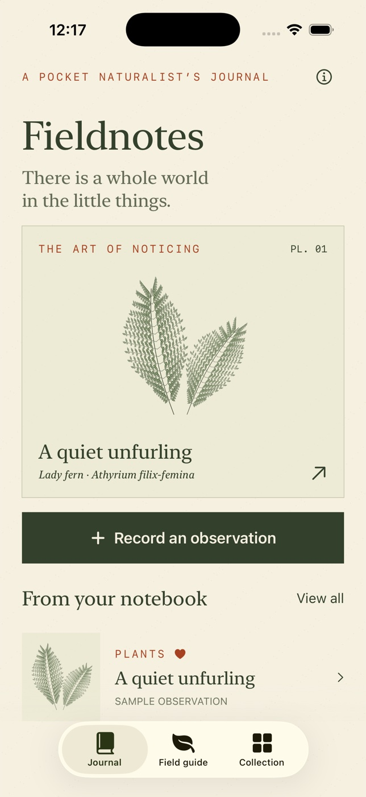

# Fieldnotes



A native iPhone field journal with a warm-paper, natural-history-book design.
SwiftUI, PhotosUI and Foundation only. iOS 17 or later. No network, accounts,
backend, API keys or runtime packages.

## Features

- Journal with original procedural specimen illustrations and three explicitly
  labeled sample observations on first launch.
- Create, edit and delete observations; category, notes, date, location text,
  comma-separated tags and an optional imported photo.
- Favorite specimens and combine text search, category and favorite filters.
- Offline illustrated guide to twelve subjects, with field marks, habitats,
  regional context and observation prompts. Start an entry from any guide page.
- Confirm discarding edits and deleting entries. Remove all samples from About.
- VoiceOver labels, native navigation and forms, scalable serif headings,
  large-text layouts and haptic selection feedback. No essential animation,
  sound or motion. Observation details preserve imported photos' aspect ratios.

## Open and run

Open `Fieldnotes.xcodeproj`, select the shared **Fieldnotes** scheme and an iPhone
simulator, then Run. The generated project is committed, so XcodeGen is optional.
Verified with Xcode 26.6 (17F113), Swift 6.3.3 and iOS 26.5 simulators.

From this directory:

```sh
xcodebuild -project Fieldnotes.xcodeproj -scheme Fieldnotes \
  -destination 'platform=iOS Simulator,name=iPhone 17 Pro' \
  -derivedDataPath ~/FieldnotesDerivedData CODE_SIGNING_ALLOWED=NO build
xcodebuild -project Fieldnotes.xcodeproj -scheme Fieldnotes \
  -destination 'platform=iOS Simulator,name=iPhone 17 Pro' \
  -derivedDataPath ~/FieldnotesDerivedData CODE_SIGNING_ALLOWED=NO test
xcrun swift format lint --strict --recursive Fieldnotes FieldnotesTests Scripts
```

To regenerate the project after changing `project.yml`, install XcodeGen
(`brew install xcodegen`, verified 2.46.0), then run `xcodegen generate`.
To regenerate the original icon: `swift Scripts/GenerateIcon.swift`.

## Controls and data

Use Journal → Record an observation, or a guide page → I noticed this.
Save requires a nonblank name (100 characters maximum). Notes allow 6,000
characters; location 200; tags allow eight unique values of up to 30 characters.
Tags are trimmed, lowercased and deduplicated. Use Collection for combined
filtering. Open an entry to favorite it, edit it or delete it with confirmation.

Entries are encoded as JSON in the app's Application Support directory and
written atomically. Photos are resized to at most 1,600 pixels along their
longest side and encoded as JPEG with 80% quality. They are stored with the
entry. Import uses the system photo picker; no broad library permission is
requested. No GPS or automatic species identification is used. Samples are
seeded only if the journal file does not exist. Removing samples or deleting
every entry preserves an empty journal across relaunches without reseeding.
A corrupt journal is preserved and opened read-only with an error.

## Limitations

- Local device storage only; no sync, export, recovery UI or cloud backup
  integration. Uninstalling the app removes its journal. Large collections with
  many photos increase the size of the JSON file.
- Stylized original illustrations support observation, not authoritative species
  identification. Guide subjects span several regions; check the range for each.
  Never eat or handle a species on the basis of this guide.
- Photo import, not in-app camera capture. No audio or location services.
- Portrait iPhone V1. Physical devices, production signing and App Store
  submission are outside this simulator-tested delivery.
