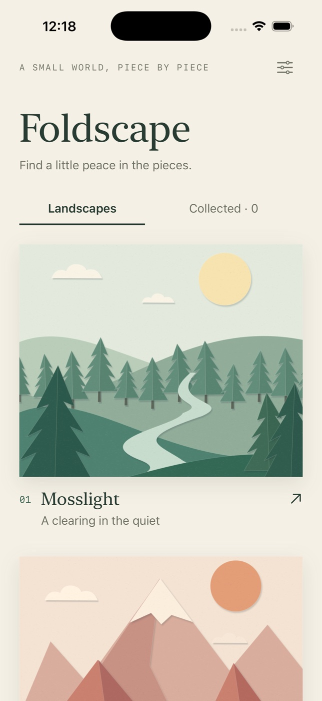

# Foldscape



A native SwiftUI iPhone puzzle: slide eight paper pieces into place and reveal a
living landscape. Six original, locally rendered paper dioramas: Mosslight,
Coral Summit, Indigo Tide, Amber Dunes, Lilac Hour, and Terra Arch.

## Open and run

Open `Foldscape.xcodeproj`, select the shared **Foldscape** scheme and an iPhone
simulator, then Run. Requires Xcode 15+ and iOS 17+. The project was built and
tested on native macOS with Xcode 26.6 and the iOS 26.5 iPhone 17 Pro simulator.

The generated project is committed. To regenerate it after project changes:

```sh
brew install xcodegen
xcodegen generate
```

From this directory:

```sh
xcodebuild -project Foldscape.xcodeproj -scheme Foldscape \
  -destination 'platform=iOS Simulator,name=iPhone 17 Pro' \
  -derivedDataPath ~/foldscape-build CODE_SIGNING_ALLOWED=NO build
xcodebuild -project Foldscape.xcodeproj -scheme Foldscape \
  -destination 'platform=iOS Simulator,name=iPhone 17 Pro' \
  -derivedDataPath ~/foldscape-build CODE_SIGNING_ALLOWED=NO test
xcrun swift format lint --strict --recursive Foldscape FoldscapeTests Tools
```

Seven XCTest cases cover solvability across 600 seeded shuffles, legal moves,
hint-guided completion after arbitrary moves, malformed-board rejection,
persistence and reset, corrupt-storage recovery, and exact board tap mapping.

## Play

- Choose any of the six scenes, then **Gentle** (six shuffle steps) or
  **Wandering** (forty). Every shuffle follows legal moves from the solved board,
  so every puzzle is solvable. There is no timer.
- Tap a piece adjacent to the empty space. Numbers run left to right and top to
  bottom; the empty space finishes in the lower right.
- **Preview** shows the completed artwork without changing the puzzle.
- **Hint** outlines the next piece on a known route home. Hints can retrace moves;
  they do not promise the shortest solution or add to the move count.
- **Restart** asks for confirmation before making a new shuffle.
- Completed scenes appear in **Collected**, with a saved best move count.
- Settings controls piece numbers and haptics. System Reduce Motion disables the
  drifting-cloud and tile-motion effects. Custom controls have VoiceOver labels.

## Data and privacy

All game progress is encoded locally in UserDefaults after every move. There is
no network, account, tracking, analytics, or dependency on secret keys. A fresh
install starts with zero completions. Settings offers a confirmed destructive
reset. Uninstalling the app removes its data; there is no cloud sync.

## Original artwork

`Tools/GenerateArt.swift` draws the six original landscapes and the icon from
Bezier paper cuts, shadows, and deterministic grain. No external runtime
dependencies or stock art are used. Regenerate with:

```sh
swift Tools/GenerateArt.swift Foldscape/Assets.xcassets
```

## Scope

Portrait iPhone V1. No audio, leaderboard, custom image import, or App Store
submission is included. Simulator validation does not imply physical-device
testing, production signing, or App Store approval.
