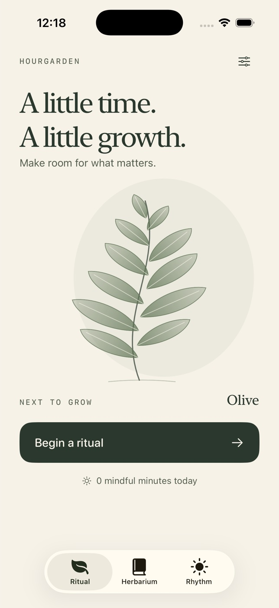

# Hourgarden



A native, offline iPhone focus ritual. Real time becomes an illustrated specimen
in a personal herbarium: olive, eucalyptus, then wild cosmos.

## Run

Requires macOS and Xcode with an iOS 17+ SDK/simulator. Open
`Hourgarden.xcodeproj`, select the shared **Hourgarden** scheme and an iPhone,
then Run. No account, server, packages or API keys are required.

The generated Xcode project is committed. To regenerate it:

```sh
brew install xcodegen
xcodegen generate
```

From this directory:

```sh
xcodebuild -project Hourgarden.xcodeproj -scheme Hourgarden \
  -sdk iphonesimulator -configuration Debug \
  -derivedDataPath ~/hourgarden-build CODE_SIGNING_ALLOWED=NO build
xcodebuild -project Hourgarden.xcodeproj -scheme Hourgarden \
  -destination 'platform=iOS Simulator,name=iPhone 17 Pro' \
  -derivedDataPath ~/hourgarden-build CODE_SIGNING_ALLOWED=NO test
xcrun swift-format lint --strict --recursive Sources Tests GenerateIcon.swift
```

## Ritual & controls

- **Ritual:** choose an intention or type your own (60 characters), choose 1–90
  minutes, and begin. Pause, resume, or confirm ending without planting.
- **20-second preview:** an explicitly labeled, real countdown; it grows a
  specimen but contributes no mindful minutes or completed focus rituals.
- **Herbarium:** inspect all, focus-only or preview specimens. Open a specimen,
  edit its intention, add a reflection (500 characters), or remove it.
- **Rhythm:** today's minutes, a configurable daily goal, and seven-day totals.
- **Settings:** set the daily intention or confirm resetting all local data.

## Time and data

The JSON garden is saved to device UserDefaults on every meaningful transition.
A running ritual stores an absolute deadline; pausing stores remaining seconds.
Closing/backgrounding the app does not pause a running ritual. Returning after
the deadline creates exactly one specimen, dated at the deadline. A completion
awaiting acknowledgment also survives relaunch. Canceling before the deadline
discards that ritual. Completion at the deadline takes priority over cancel.

Focus minutes are credited to the local calendar day of completion. Deleting a
specimen removes those minutes. No sample sessions, simulated elapsed time, or
invented focus history are added. Artwork is original procedural SwiftUI Canvas
and AppKit drawing; regenerate the icon with `swift GenerateIcon.swift`.

## Accessibility

Native controls provide accessible names and actions; custom artwork is hidden
from VoiceOver. Editorial headings scale alongside body text and controls.
At accessibility text sizes the intention choices, archive and session metadata
stack vertically; intention fields expand to multiple lines. The start action
stays anchored above the safe area. Screens remain scrollable. Reduce Motion
shows the mature plant throughout a ritual.
While the intention field is focused, the start action yields space to the
keyboard; use the keyboard’s Done control to restore it.
No sound or animation is necessary to understand session status.

The iOS 17 minimum supports SwiftUI sensory feedback and the two-value
`onChange` API used to reconcile sessions on scene activation.

## Limitations

- Local-only persistence; uninstalling removes the garden. No cloud sync/export.
- No background alerts, Live Activities, widgets or audio. A completed plant is
  reconciled and shown next time the app is active.
- The device wall clock controls deadlines; manual clock changes affect timers.
- iPhone portrait layout. No iPad-specific design.
- Simulator validation does not imply physical-device testing, production
  signing, App Store submission or App Store approval.
