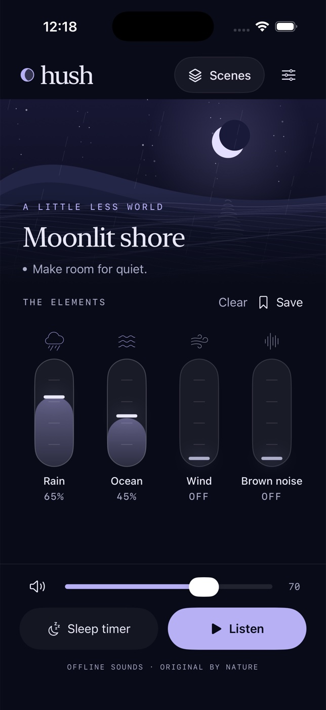

# Hush



A native, offline iPhone soundscape mixer. Midnight ink, a procedural moonlit
coast, and four independent vertical faders: rain, ocean, wind, and brown noise.
All sounds are original deterministic synthesis, generated on device into
crossfaded stereo loops. No network, accounts, third-party runtime packages,
microphone permission, or health claims.

## Open and run

Open `Hush.xcodeproj`, choose the shared **Hush** scheme and an iPhone simulator,
then Run. Requires Xcode 26.6 (verified), targets iOS 17 or newer.
Simulator signing is disabled. Device distribution signing is not configured.

Regenerate the committed project if changing `project.yml`:

```sh
brew install xcodegen
xcodegen generate
```

From this directory:

```sh
xcodebuild -project Hush.xcodeproj -scheme Hush \
  -destination 'platform=iOS Simulator,name=iPhone 17 Pro' \
  -derivedDataPath "$HOME/hush-build" build CODE_SIGNING_ALLOWED=NO
xcodebuild -project Hush.xcodeproj -scheme Hush \
  -destination 'platform=iOS Simulator,name=iPhone 17 Pro' \
  -derivedDataPath "$HOME/hush-build" test CODE_SIGNING_ALLOWED=NO
xcrun swift-format lint --strict --recursive Hush HushTests Scripts
```

Regenerate the original icon with `swift Scripts/GenerateIcon.swift`.

## Controls and behavior

- **Listen / Pause:** audio never autoplays on launch. Playback fades in.
- **Elements:** drag each vertical fader, or use VoiceOver adjustment actions.
- **Master volume / mute:** independent of the four layer levels.
- **Save:** name a personal scene. **Scenes** recalls built-in originals or your
  saved scenes. Saved-scene menus support rename and confirmed deletion.
- **Clear mix:** confirmed reset of the four layers. Keeps your library.
- **Sleep timer:** 15, 30 or 60 minutes, plus a clearly labeled 30-second preview.
  Fades over the final 10 seconds. Cancel keeps listening. Pause does not stop
  the countdown. Timers clear on process termination.
- **Fade to quiet:** manually fades over 3, 8 or 15 seconds, set in Settings.
- Mix, master level, scenes, scene name, haptics and fade preference persist in
  UserDefaults on this device. Playback and mute start fresh on relaunch.
- Background audio and lock-screen play/pause are configured. Headphone
  disconnection and audio interruptions pause playback.
- Reduce Motion freezes the landscape. UI text supports Dynamic Type, and
  custom faders expose accessible labels, values and increment/decrement.

## Tests and limits

XCTest covers gain clamping, malformed persisted levels, persistence round-trip
and corrupt-data fallback, timer boundaries, save/recall/reset, and deterministic,
non-silent, bounded audio synthesis for all four layers. A test audio adapter also
verifies mute, real timer completion, manual fade, empty-mix rejection, edited
scene identity and audio-start failure behavior.

Simulator playback requires a working host output device. This macOS VM uses
BlackHole 2ch 0.7.1 as its virtual output for testing and recording. If the host
has no audio device, AVAudioEngine cannot start; a physical Mac's normal output
does not need BlackHole. Restart the simulator after changing host audio routes.

This is a simulator-tested V1, not an App Store submission. No physical-device,
production-signing, or medical validation. The sounds are stylized synthesis,
not field recordings. Landscape artwork and app icon are original procedural art.
Audio has no external download or API dependency. App deletion removes local
scenes. No sync or export is included.
