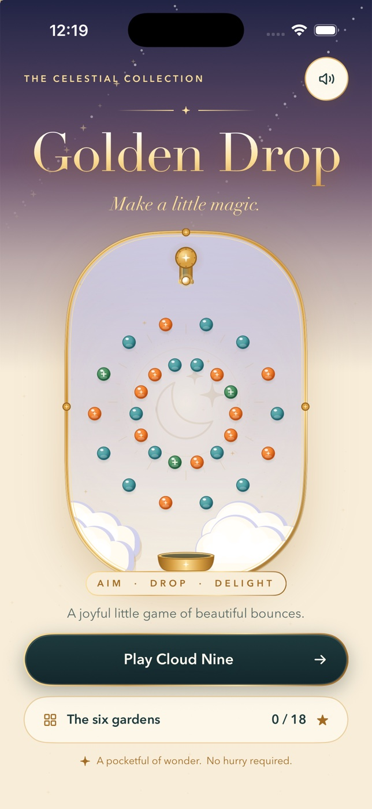

# Golden Drop



A native iPhone precision drop game: brass, glass and small celestial gardens.
Built with SwiftUI Canvas, original vector artwork and synthesized glass tones.
There are no external packages, ads, accounts or network services.

## Build and run

Requires macOS, Xcode 16+ (verified with Xcode 26.6), Swift 6 and XcodeGen.
Minimum deployment: iOS 17. Portrait iPhone layout.

```sh
cd ios-golden-drop
brew install xcodegen
xcodegen generate
xcodebuild -project GoldenDrop.xcodeproj -scheme GoldenDrop \
  -sdk iphonesimulator -configuration Debug \
  -derivedDataPath DerivedData CODE_SIGNING_ALLOWED=NO build
```

Open `GoldenDrop.xcodeproj`, select an iPhone Simulator and run GoldenDrop.
The generated Xcode project is included; `project.yml` is the source of truth.
Regenerate it after target changes. Device distribution/signing is not configured.

## Checks

```sh
swift test
xcrun swift-format lint --strict --recursive Sources Tests Scripts/GenerateArt.swift Package.swift
```

The deterministic rules suite exercises collision stability and shot settling,
single-award scoring, catch/refund and loss, combo removal, aim clamping,
final-hit slowdown and bonus, authored geometry, and all six boards' solvability
through normal simulated launches. This is separate from native UI testing.

To regenerate the original bundled art/audio:

```sh
swift Scripts/GenerateArt.swift Resources/Assets.xcassets/AppIcon.appiconset/AppIcon.png
python3 Scripts/generate_sounds.py
```

## Play

1. Start **Cloud Nine**, or select any of the six gardens.
2. Drag anywhere inside the theater to aim; the dotted line previews the first
   bounce. Use the **left / right chevrons** for fine adjustments (also available
   to VoiceOver).
3. Tap **Drop the ball**. Clear every orange/gold peg within your supply of balls.
4. Blue glass scores points. Green glass grants one extra ball per peg.
   A moving brass cup catches a ball for a refund and 500 points.
5. Hit pegs remain physical until the shot ends, then disappear. More hits in one
   shot multiply that shot's peg points. Clearing half the gold raises the peg
   multiplier to ×3; clearing 80% raises it to ×5.
6. The final gold hit enters slow motion and awards 2,500 sunlight points plus
   1,000 per unused ball. Earn one star for a clear, two with 3+ balls left,
   three with 7+ balls left. Replay immediately to improve.

Pause freezes the simulation; backgrounding automatically pauses. Resume from
the pause card. Sound respects the iPhone silent switch and has an in-app toggle.
Local best scores, stars, sound preference and onboarding completion persist
across launches. An active run stays in memory while backgrounded but does not
survive process termination. Share uses the native share sheet and the real score.

## Scope and constraints

Six authored boards, all selectable from the beginning. Local progress only.
Fixed-step circle collision physics with wall reflection and a bounded shot
lifetime (16 seconds) avoid indefinitely trapped balls. No real-money mechanics.
The UI uses no automatic decorative motion; the moving bucket, ball trails and
short collision/finale effects convey gameplay. Haptics require a physical iPhone.
Audio, device haptics, App Store signing and real-device performance require
physical-device validation before distribution. This is an original V1 inspired
by precision peg-drop games, not a reproduction of a commercial catalog.
