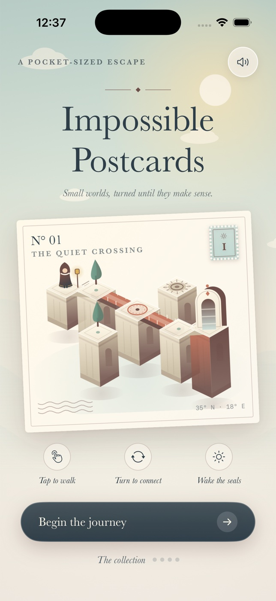

# Impossible Postcards



A native iOS collection of four small perspective puzzles. Turn bridges to align
walkable paths, carry a cloaked traveler to sun seals, and collect each world as
a postcard. Original procedural architecture, icon, character and synthesized
tones; SwiftUI and Core Graphics, no web view, service or external assets.

## Build and run

Requirements: Xcode 16 or newer with an iOS Simulator runtime, Swift 6, XcodeGen.
The deployment target is iOS 17. Tested development tool versions are recorded
in the PR evidence. No developer account is needed for Simulator builds.

```sh
brew install xcodegen swiftformat
cd ios-impossible-postcards
swift Scripts/GenerateIcon.swift
xcodegen generate
xcodebuild -project ImpossiblePostcards.xcodeproj \
  -scheme ImpossiblePostcards -sdk iphonesimulator \
  -configuration Debug -derivedDataPath build CODE_SIGNING_ALLOWED=NO build
```

Open the generated project, select an iPhone Simulator and press Run. The generated
Xcode project is included; `project.yml` is its source of truth. Regenerate after
changing target configuration. The asset generator recreates the original icon.

## Checks

```sh
swiftformat Sources Tests Scripts Package.swift --lint
swift test
xcodebuild -project ImpossiblePostcards.xcodeproj \
  -scheme ImpossiblePostcards \
  -destination 'platform=iOS Simulator,name=iPhone 17' \
  -derivedDataPath build CODE_SIGNING_ALLOWED=NO test
```

The deterministic rules suite checks authored solutions, changing connectivity,
four-turn identity, disconnected input, gate/switch rules, move counting, save
validation and that every reachable puzzle state can still finish.
Four native model tests cover input during bridge rotation, delayed arrival
effects, interruption persistence and cancellation across chapter restarts.
Substitute an installed iPhone Simulator name in the native test command.

## Controls and progression

- **Begin your journey** starts the current postcard. **The collection** opens
  all four chapters; explore in any order.
- Tap a landing to walk the shortest currently connected path. Every landing
  crossed counts as one move. Sun seals activate when stepped on.
- **Turn** rotates the indicated colored bridge clockwise by 90 degrees, at the
  cost of one move. Round bridge centers are safe places to ride a rotation.
  The upper bridges in chapters III and IV awaken after the first seal.
  Wait for the bridge to settle before walking. On two-bridge boards, I/II match
  the controls; the occupied bridge control is outlined.
- Wake all sun seals to open the final arch, then tap its landing to finish.
- Pause, resume, restart and guidance are available during play. Audio can be
  toggled on the cover, collection or pause card. The app respects silent mode.
- Completion records the real local best. A breadth-first rules search computes
  each chapter's minimum possible moves. Replays can improve the record.
- Current position, bridge orientations, activated seals, sound preference and
  best moves persist on this device. Backgrounding pauses movement; resume
  explicitly. Restarting a chapter keeps collected postcards and best moves.

## Design

I. **The Quiet Crossing** — ivory and seafoam; a straight bridge and one seal.

II. **Garden of Angles** — warm terracotta; a corner bridge and two seals.

III. **Two Skies** — lavender; two bridges, a rising stair and a seal-locked mechanism.

IV. **The Last Light** — evening rose; two bridge geometries and three seals.

The visual identity is stationery: perforated chapter stamps, circular
postmarks for move counts and collected postcards, cancellation lines, a
Baskerville display face, ivory postcard cards and custom turn dials whose arm
mirrors each bridge's alignment. Worlds are procedurally drawn in Canvas with
gradient stone, cornices, balustrades, gilded seals, lantern and cypress
details, an animated sky with drifting clouds and a warm, slow scene drift.

Architecture and bridge alignment are rendered isometrically, and the same
orientation state drives graph connectivity. Movement never teleports across
disconnected geometry. There is no timer or death state: an unreachable tap
provides feedback, and every reachable configuration remains solvable.

## Scope

This is a standalone four-chapter V1 inspired by perspective-path puzzles,
not a reproduction of a commercial game's artwork or level catalog. There is
no online leaderboard, cloud sync, account, in-app purchase or analytics.
Haptic feedback depends on physical device support. This delivery does not
include signing, App Store submission, or physical-device validation.

Screenshots, native computer-use recordings, the design iteration log and
Simulator verification results are linked from the PR instead of committed.
