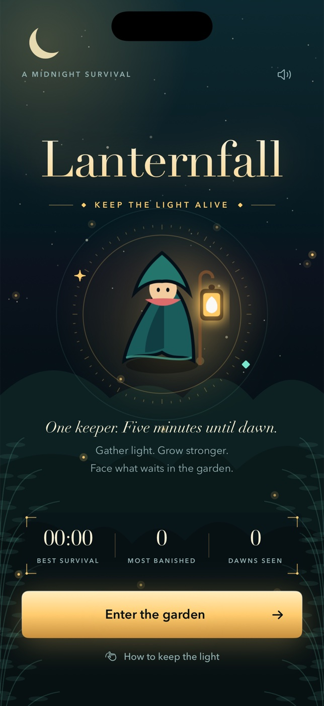

# Lanternfall



A native, portrait iPhone survival game about a lone lantern keeper in a haunted
midnight garden. SwiftUI presents the gate, HUD, gifts and results; SpriteKit
renders combat. Original procedural art and synthesized chimes require no assets
or services from the network.

## Play

Tap **Enter the garden**, then drag the lower-right movement stick. The lantern
automatically attacks nearby enemies. Kite in wide loops and return for turquoise
experience gems. Every level pauses the garden for one of three randomized gifts:
golden volleys, orbiting moonblades, a radial dawn bell, haste, vitality or a magnet.
Rose gems heal. Leave the rose-colored thorn rings before their 1.6-second warning
ends. Their cadence escalates as dawn approaches. Pause with the top-right button.

Survive **5:00** and defeat the **Hollow Gardener**, who appears at **4:00**, to win.
Health reaching zero, or reaching dawn with the boss still alive, ends the run.
Best survival, most banished, victories and audio preference persist locally.
Leaving the foreground pauses the run; runs remain in memory while the app is
alive, but are not checkpointed across termination. No accounts or leaderboards.

## Build and run

Requirements: macOS, Xcode with an iOS Simulator runtime, XcodeGen (`brew install
xcodegen`). Deployment target iOS 17.0; portrait iPhone. No third-party runtime
dependencies or signing required for Simulator.

```sh
cd ios-lanternfall
xcodegen generate
xcodebuild -project Lanternfall.xcodeproj -scheme Lanternfall \
  -sdk iphonesimulator -configuration Debug \
  -derivedDataPath DerivedData CODE_SIGNING_ALLOWED=NO build
```

Open the generated project in Xcode and run **Lanternfall** on an iPhone
Simulator. Alternatively install `DerivedData/Build/Products/Debug-iphonesimulator/Lanternfall.app`
with `xcrun simctl install booted ...` and launch `studio.lanternfall.game`.
Physical-device distribution requires your own Apple signing configuration.

The checked-in project is generated from `project.yml`. Regenerate it after
changing target configuration. Recreate the original icon with
`swift Scripts/MakeIcon.swift` from this directory.

## Checks

```sh
swift test
xcrun swift-format lint --strict --recursive App Core Tests Scripts Package.swift
```

Tests exercise paused time, movement normalization/bounds, deterministic fair
spawns, weapon upgrades, real projectile hits and experience collection, health
defeat, telegraphed thorn damage/escape, upgrade backlog pacing, one-time pickup
collection, boss spawning and dawn victory rules. Level costs increase quadratically,
and queued gifts allow eight seconds of gameplay between choices without discarding
earned experience. Production uses a fresh random seed
each run. Bolts query a spatial grid; active enemies are bounded at 140 regular
enemies plus the boss, distant enemies are culled, and terrain uses nearby tiles.
Rendering and rules use elapsed frame deltas capped at 50ms; UI modals stop
simulation. No invulnerability, injected scores or automatic play mode.

Accessibility: generous controls, named buttons, readable health/experience HUD,
scrollable modal content, system sharing, optional sound, and no nonessential
looping animations in menus. The real-time spatial combat requires visual
tracking and touch input; a full VoiceOver gameplay mode is outside this V1.

## Evidence

Native Simulator design review, final verification and recorded score challenge
are linked in the pull request once completed.
