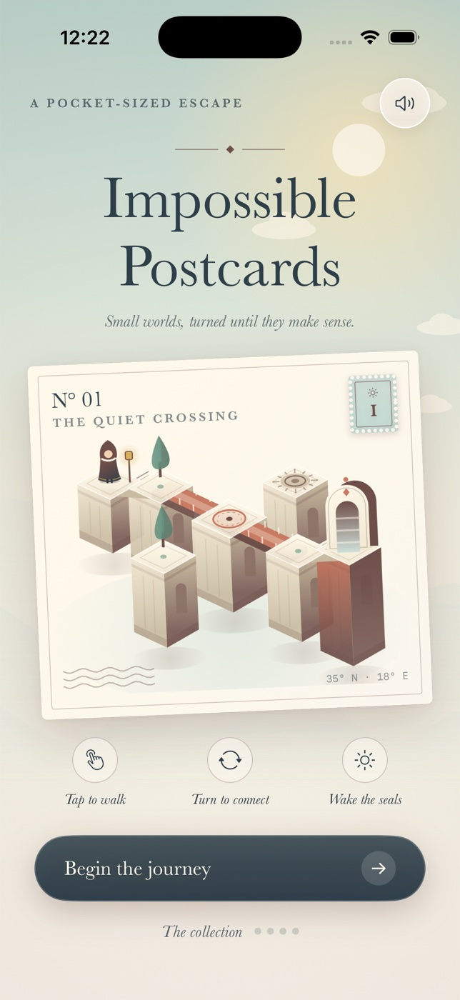

# Pocket Derby



A native, landscape car-soccer game for iPhone and iPad. Original toy cars compete on a miniature rooftop court: one player, one local CPU opponent, and 90 seconds to own the skyline.

## Build

Requires macOS, Xcode 16 or newer, and XcodeGen. No account, network connection, package dependencies, or signing credentials are needed for Simulator.

```sh
brew install xcodegen swiftformat
cd ios-pocket-derby
xcodegen generate
xcodebuild -project PocketDerby.xcodeproj -scheme PocketDerby \
  -sdk iphonesimulator -configuration Debug \
  -derivedDataPath build CODE_SIGNING_ALLOWED=NO build
```

Open the generated `PocketDerby.xcodeproj`, select an iPhone Simulator, and Run. Generated project metadata is ignored; `project.yml` is the source of truth. Minimum deployment target: iOS 17.0.

## Play

- Tap **Let’s play**. You are Skyline Blue, attacking the right goal.
- Drag the left joystick to steer and accelerate. Car heading turns gradually; grip and momentum determine your line.
- Alternatively, tap or drag **on the pitch** to set a drive destination. The crosshair marks your destination and clears on arrival. This is a normal, fully playable one-pointer control method; it uses the same steering, acceleration, collisions, and speed limits.
- Tap **Boost** for a short speed burst. Boost recharges automatically. **Brake** clears your steering target and slows the car.
- Get behind the ball and hit it toward the orange goal. Defend your blue goal on the left.
- Play 90 seconds of active match time. Goal celebrations and kickoff countdowns stop the clock. Draws are valid results.
- Pause freezes the match. Backgrounding always pauses; returning requires Resume.
- Rematch starts a fresh match. Completed match count, career wins, best goal difference and the last result persist locally. Ending an unfinished match does not count.
- Sound can be toggled in the clubhouse or pause screen. Haptics depend on the device. Reduce Motion disables trails and reduces celebration effects.

## Verification

```sh
swiftformat Sources Tests Scripts --lint
xcodebuild -project PocketDerby.xcodeproj -scheme PocketDerby \
  -destination 'platform=iOS Simulator,name=iPhone 17 Pro' \
  -derivedDataPath build CODE_SIGNING_ALLOWED=NO test
```

The 12 deterministic tests cover heading/momentum, car-ball impulses, goal boundaries, kickoff resets, clock expiry, paused physics, boost capacity, braking, AI attack, rounded-corner deflection, recovery from a pinned corner ball, and record serialization. Rendering uses SpriteKit; presentation uses SwiftUI. Physics run at a fixed 120 Hz with bounded frame catch-up.

Launching with the `-autostart` argument (`xcrun simctl launch <udid> games.pocketderby.rooftop -autostart`) skips the title and kicks off immediately, which is handy for gameplay screenshots; `-preview help|pause|results` opens a UI overlay for review without changing match rules. The look is 8/16-bit console style: every sprite is a runtime-painted pixel map magnified with nearest-neighbour filtering (`Sources/Paint.swift`, `Sources/ArenaScene.swift`), all text is a custom 5x7 bitmap font (`Sources/PixelFont.swift`, no system or serif fonts), and the palette/panels/buttons live in `Sources/Theme.swift`.

The original app icon is reproducible:

```sh
swift Scripts/generate-icon.swift Sources/Assets.xcassets/AppIcon.appiconset/AppIcon.png
```

## V1 scope

One rooftop court and one CPU difficulty. No online multiplayer, licensed assets, store purchases, global leaderboard or telemetry. Matches are saved at full time; in-progress matches survive backgrounding but not process termination. Sound uses system feedback tones. Publishing/signing for physical devices or App Store submission is outside this project.
