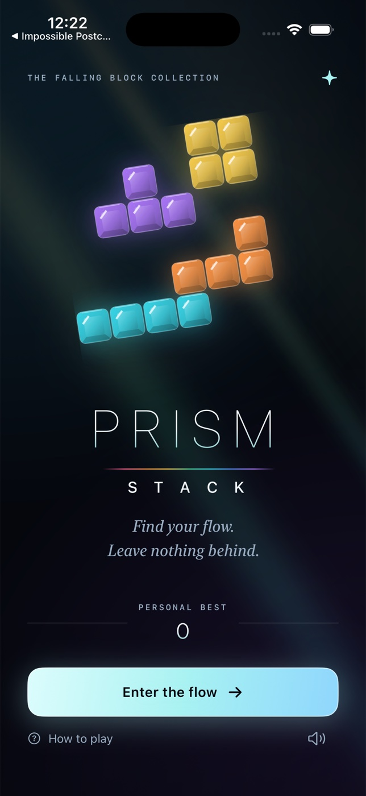

# Prism Stack



A native, offline falling-tetromino game for iPhone. Smoked glass, seven jewel
colors, quiet original tones, and a board-first portrait layout. Built with
SwiftUI Canvas and a deterministic Swift rules engine; no web content, backend,
third-party dependencies, account, or paid service.

## Build

Requires Xcode 16+ with an iOS SDK, Swift 6, and XcodeGen.
Deployment target: iOS 17.0. This project is scoped entirely to this directory.

```sh
brew install xcodegen # if needed
xcodegen generate
xcodebuild -project PrismStack.xcodeproj -scheme PrismStack \
  -sdk iphonesimulator -configuration Debug \
  -derivedDataPath DerivedData CODE_SIGNING_ALLOWED=NO build
```

Open `PrismStack.xcodeproj`, select an iPhone Simulator, and Run. No signing
credentials are needed for Simulator. A real device requires your own development
team in Xcode. The checked-in project is generated from `project.yml`.

To install from the command line after booting an iPhone Simulator:

```sh
xcrun simctl install booted DerivedData/Build/Products/Debug-iphonesimulator/PrismStack.app
xcrun simctl launch booted studio.prismstack.game
```

## Checks

```sh
swift test
xcrun swift-format lint --strict --recursive Sources Tests Scripts Package.swift
```

The Swift Testing suite checks seven-bag distribution, deterministic restoration,
wall/floor/stack collision, rotation cycles and SRS wall/floor kicks, rejected
rotation, hold restrictions, ghost landing, drop scoring, four-line clears,
back-to-back/combo scoring, compaction, level progression, lock delay/reset cap,
spawn collision, and randomized input invariants.

Regenerate original icon:

```sh
swift Scripts/GenerateIcon.swift
```

## Play

- Tap **Enter the flow**. **Continue your flow** restores an unfinished local run.
- Left/right move one cell; hold to repeat. Rotate turns clockwise with SRS kicks.
- Soft drop moves one row and awards one point. **DROP** places at the ghost
  outline and awards two points per descended row.
- Tap **HOLD** to save or swap, once per piece. The side rail previews three pieces.
- Complete rows to clear them: 100 / 300 / 500 / 800 × current level for
  one / two / three / four rows. Consecutive clears gain combo bonuses; consecutive
  four-line clears gain a 50% base bonus. Every ten rows advances the level.
- Pieces lock after 500 ms on the ground. Grounded moves/rotations reset this
  delay at most fifteen times per piece.
- Optional board gestures: drag sideways, tap to rotate, drag down to soft drop,
  flick down to hard drop, swipe up to hold. Enable in the guide or pause menu.
- Pause offers resume, controls, sound and gestures, or save and return home.
- Backgrounding automatically pauses. Best score, sound/gesture preferences, and
  unfinished runs persist locally. A completed game offers immediate replay.
- Hardware keyboard / Simulator: arrows move and soft-drop, Up or X rotates,
  Space hard-drops, C holds, Escape pauses/resumes. These use the same rules and
  actions as touch input.

## Product scope

Original name, icon, procedural glass art, synthesized audio, and UI. One endless
mode; no claim of commercial-reference parity. No T-spin scoring, competitive
leaderboards, ads, purchases, sharing, or online services. Portrait iPhone only.
Sound follows the device silent switch; haptics require supported hardware.
Reduce Motion disables the decorative line-clear wave. Gameplay remains animated.
The board is visual gameplay; control labels and score are accessible, but this
is not a fully nonvisual VoiceOver game. App Store submission is outside V1.
