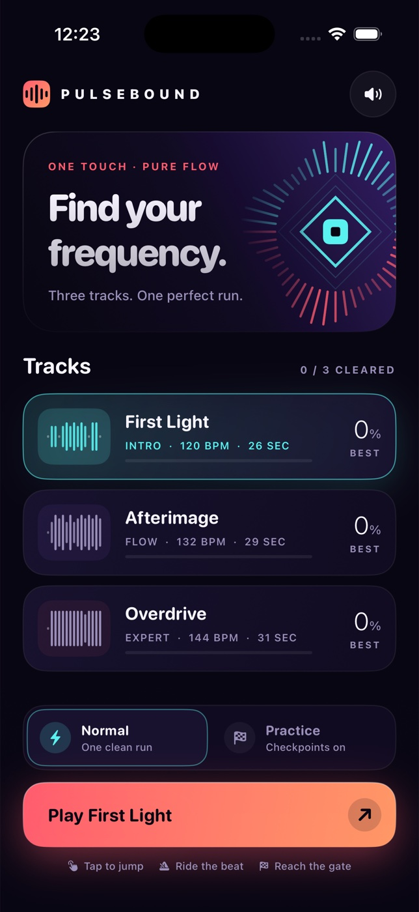

# Pulsebound



A native, one-touch rhythm platformer for iPhone. Follow a cyan cube through three
authored neon tracks: **First Light** (26s), **Afterimage** (29s), and **Overdrive**
(31s). Original SpriteKit vector scenery and a synthesized four-bar electronic
soundtrack; no assets, accounts, network access, or packages are needed to play.

## Build and run

Requires macOS, Xcode with an iOS Simulator runtime, and XcodeGen 2.45+.
The deployment target is iOS 17.0. The checked-in Xcode project is generated from
`project.yml`; regenerate it after changing targets or source membership.

```sh
brew install xcodegen
cd ios-pulsebound
xcodegen generate
xcodebuild -project Pulsebound.xcodeproj -scheme Pulsebound \
  -sdk iphonesimulator -configuration Debug \
  -derivedDataPath DerivedData CODE_SIGNING_ALLOWED=NO build
```

Open `Pulsebound.xcodeproj`, select an available iPhone Simulator, and Run.
Signing is disabled for this Simulator build; device distribution needs your own
Apple signing configuration. App Store submission is outside this project.

## Controls and rules

1. Choose a track and Normal or Practice, then tap Play.
2. Tap **LET’S GO** to start; tap the field or the large **TAP TO JUMP** pad to jump.
3. Clear coral spike groups and land on the cyan ground. No double jumps.
4. Pause in the top-right corner. Resume gives a three-beat count-in before motion;
   restart or return to tracks from the same menu.
5. On a collision, **Try again** starts immediately.

Space also starts/jumps with a connected hardware keyboard (including Simulator).
It invokes the same input action and uses the same physics as touch.
Both the field and jump pad trigger on touch-down, once per contact; holding and
releasing the pad does not produce another jump.

Normal mode requires one continuous clean run. Practice automatically saves at
three authored safe checkpoints within that session; retries start at the last
flag. Leaving the track starts a fresh practice session. Practice bests are
stored separately and never grant Normal completion badges. Local best progress,
normal clears, total attempts per track and sound preference persist across
launches using UserDefaults. No global leaderboard or fabricated scores.

The app pauses automatically when inactive. Audio uses the ambient session,
respects the silent switch, and can be toggled from the home, pause and results
screens. Reduce Motion suppresses particle bursts and motion trails.

## Checks

```sh
bash Scripts/check.sh
# Format if making changes:
xcrun swift-format format --in-place --recursive Sources Tests Scripts UITests
# UI regression (use an actual available device ID):
xcodebuild -project Pulsebound.xcodeproj -scheme Pulsebound \
  -destination 'platform=iOS Simulator,id=YOUR_DEVICE_ID' \
  -derivedDataPath DerivedData CODE_SIGNING_ALLOWED=NO test
```

The standalone deterministic engine suite covers real triangle collision
geometry, no-input failure, no double jump, pause/resume, retry/checkpoint
semantics, all three stages' legal solvability and frame-rate independence at
30/60/120 Hz. UI tests are a separate native Simulator layer.

To regenerate the original icon:

```sh
swift Scripts/generate-icon.swift
```

## Implementation

- `Engine.swift`: fixed 120 Hz simulation, buffered jumps and inset collision
  geometry. No random hazards or invulnerability paths.
- `Stage.swift`: obstacles quantized to the soundtrack's beat grid.
- `GameScene.swift`: native SpriteKit scene and original procedural effects.
- `Views.swift`: SwiftUI track selection, onboarding, HUD and results.
- `Audio.swift`: in-memory kick, bass, hi-hat and arpeggio synthesis synchronized
  to track position, including after pause and checkpoint resume.

V1 is portrait iPhone only. It has three short spike-pattern tracks, a constant
runner speed and escalating timing/group complexity. It is an original compact
game inspired by one-touch precision platformers, not exact reference parity.
Simulator cannot establish physical-device audio latency or haptic quality.
