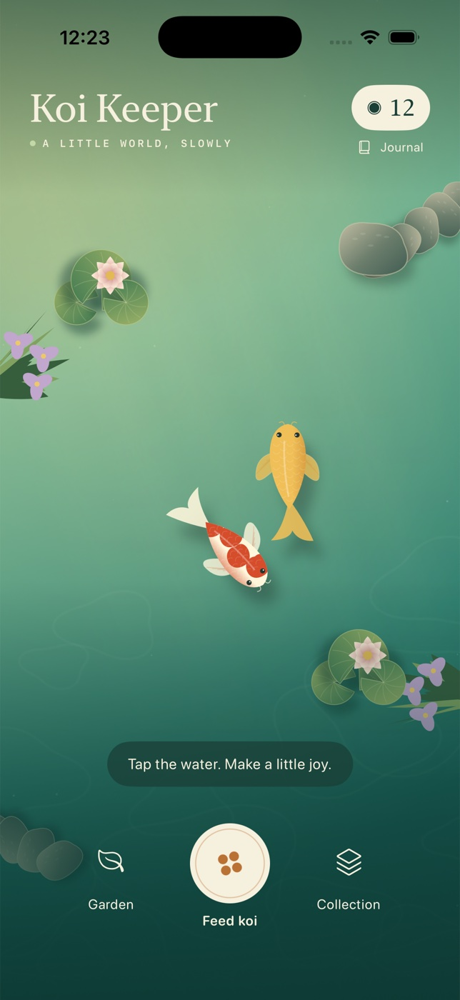

# Koi Keeper



A small native iPhone garden, seen from above. SwiftUI Canvas draws the jade
water, swimming koi, lily pads, stones and irises procedurally. No web view,
account, backend, network data or runtime package dependencies.

## Open and run

Open `KoiKeeper.xcodeproj`, choose the shared **KoiKeeper** scheme and an iPhone
simulator, then Run. Requires Xcode with iOS 17+ SDK support. The project targets
iOS 17 and portrait iPhone; the implementation was built with Xcode 26.6.

The committed project is ready to open. To regenerate it from `project.yml`:

```sh
brew install xcodegen
xcodegen generate
```

From this directory:

```sh
xcodebuild -project KoiKeeper.xcodeproj -scheme KoiKeeper \
  -sdk iphonesimulator -configuration Debug \
  -derivedDataPath ~/koi-keeper-build CODE_SIGNING_ALLOWED=NO build

xcodebuild -project KoiKeeper.xcodeproj -scheme KoiKeeper \
  -destination 'platform=iOS Simulator,name=iPhone 17 Pro' \
  -derivedDataPath ~/koi-keeper-build CODE_SIGNING_ALLOWED=NO test

xcrun swift-format lint --strict -r Sources Tests Scripts
```

The original icon can be regenerated with `swift Scripts/GenerateIcon.swift`.

## A pond of your own

- Tap open water, or **Feed koi**, to drop three grains. Independently steering
  fish seek the closest grain. Each eaten grain earns one care pearl.
- Eight grains can float at once. Uneaten food dissolves after 45 active seconds.
  Food is free, so you can always earn your way to a new addition.
- **Garden** offers lilies (8), stones (10) and irises (12 pearls). Choose one,
  then tap inside the dotted area to preview it. **Find a spot** cycles through
  available positions; **Place here** confirms and spends pearls. Invalid or
  cancelled previews cost nothing. Keep pieces apart. **Lift an item** removes
  it and refunds its purchase price; the garden also has a labeled lift list.
- **Collection** includes four koi varieties with distinct procedural markings.
  Tap a variety to read about it and welcome a fish. The pond holds six fish.
- Tap your pearl balance for the **Pond journal**, instructions, haptics and a
  confirmed reset. Starting content is two koi, three gifted garden pieces and
  12 pearls. No real-money purchases or timed rewards.

## State and accessibility

Fish, their meals, total care, pearls, garden positions and haptics are encoded
locally in UserDefaults after every meaningful action. No data leaves the device.
Invalid or incompatible saves fall back to the starter pond. Food and swimming
positions are transient; there is no offline feeding or background simulation.
Currency is bounded at 9,999; garden capacity is 16. Reset requires confirmation.

Text uses system semantic styles where practical; custom controls have labels.
The center feeding control provides an accessible alternative to coordinate taps.
Collection and garden artwork stack above text at accessibility sizes. Garden
placement has labeled preview and confirm controls, and its guide leaves room
for the editor. The home title scales up to 46 points to preserve the pond view.
Reduce Motion slows swimming and stops decorative water animation. Haptics are
optional. There is no sound, so all feedback is visual.

## Scope

V1 is a calm local sandbox with an achievable care loop, not a real-time pet
survival simulator. Koi do not become ill or die. Garden pieces are decorative,
not collision obstacles. Fish cannot be sold or removed individually. No iCloud
sync, landscape layout, physical-device validation or App Store signing is
included. Simulator testing does not establish App Store approval.
