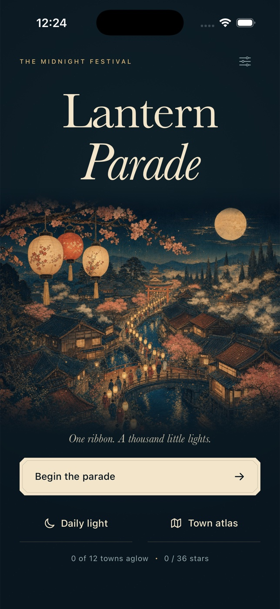

# Lantern Parade



A native iPhone path puzzle, made with SwiftUI, Canvas and UIKit. Guide a growing
procession through an indigo town: collect Amber → Rose → Jade, pass gates with
the matching light, then reach the festival square without crossing the ribbon.

## Build and run

Requires macOS and Xcode 26.6 (validated with iOS 26.5); deployment target iOS 17.
No third-party runtime packages, accounts or signing credentials are required.
Open `LanternParade.xcodeproj`, select the shared **LanternParade** scheme and an
iPhone simulator, then Run. Portrait iPhone layouts are supported.

From this directory:

```sh
xcodebuild -project LanternParade.xcodeproj -scheme LanternParade \
  -configuration Debug -sdk iphonesimulator -derivedDataPath build \
  CODE_SIGNING_ALLOWED=NO build
xcodebuild -project LanternParade.xcodeproj -scheme LanternParade \
  -configuration Release -sdk iphonesimulator -derivedDataPath build \
  CODE_SIGNING_ALLOWED=NO build
xcrun simctl list devices available
# Replace DEVICE_UUID with your simulator ID:
xcodebuild -project LanternParade.xcodeproj -scheme LanternParade \
  -destination 'platform=iOS Simulator,id=DEVICE_UUID' \
  -derivedDataPath build CODE_SIGNING_ALLOWED=NO test
xcrun swift-format lint --strict --recursive Sources Tests Scripts
```

The checked-in project is generated from `project.yml` with XcodeGen 2.46.0.
To regenerate: `brew install xcodegen && xcodegen generate`.
The app icon is original procedural art. Regenerate it with:
`swift Scripts/GenerateIcon.swift Resources/Assets.xcassets/AppIcon.appiconset/AppIcon.png`.
Build products and recordings are excluded from git.

## Visual direction

The midnight festival uses an ink-and-parchment palette, Baskerville typography,
engraved map frames and ticket-shaped actions. The bundled home illustration is
an original AI-generated woodblock-style image; it loads locally without a
network request. Gameplay architecture, foliage, lanterns, routes and procession
are drawn natively in Canvas. Result posters use the actual completed route,
rendered on a cream paper layout for native image sharing.

## Playing

- Drag from the flag along adjacent streets, or tap each neighboring junction.
- Numbered lanterns must join in order. A gate opens once its color is collected.
- The glowing square is the destination; all three colors must arrive.
- Moving back one junction undoes a step. **Undo** is free and also removes
  collected colors when you back past them. Crossing an earlier route junction
  tangles the ribbon; undo or restart immediately.
- **Clear** asks before restarting. **Guide** shows a possible complete route
  for five seconds and counts toward the star rating.
- Three stars: no guide, no missteps, at or under the authored par. Two stars:
  at most one guide and three missteps. Every other completion earns one star.
- All 12 authored towns are available in the atlas. Best stars never decrease.
- **Daily light** deterministically selects and reflects an authored town from
  the UTC calendar date; it does not claim an online leaderboard or a unique
  new map every day.
- Successful routes animate as a walking procession. Results can be shared as
  a native poster image and text through the iOS share sheet.

The current ribbon, best scores, tutorial state and haptic preference persist
in UserDefaults. Leaving the foreground pauses play. The app is intentionally
silent. Haptics use system feedback generators; physical feel cannot be checked
in the simulator. Reduced Motion skips the procession animation. Street buttons
have coordinate, lantern, gate and route accessibility labels and 44-point
minimum targets; color is reinforced by numbering and distinct symbols.

## Quality checks

Tests exercise all authored solutions, daily variants, color/gate ordering,
crossing rejection, undo, scoring, geometric hit mapping and saved best scores.
See `QA.md` for actual build/test commands, design reviews and evidence.

No App Store submission, signed device build, online service, audio playback,
multiplayer or physical-device validation is included.
