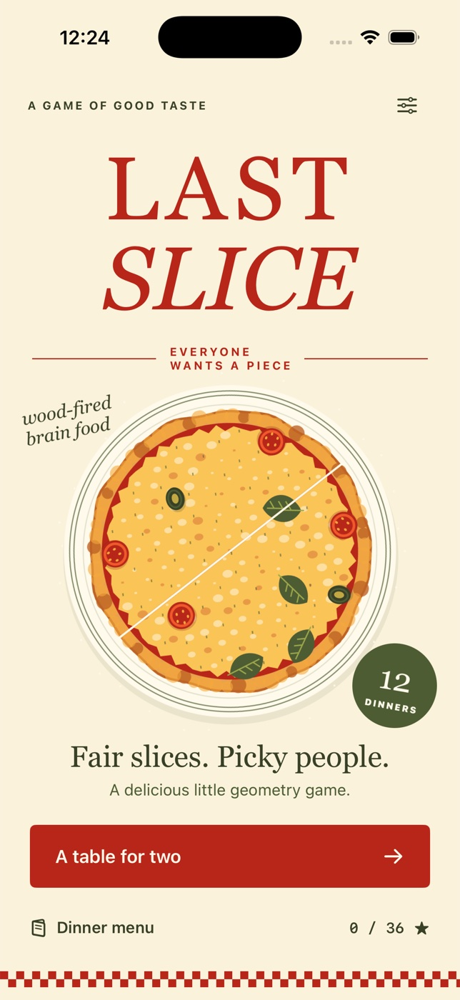

# Last Slice



A native SwiftUI geometry game in an editorial Italian pizzeria. Divide a pizza
with a limited number of straight cuts; satisfy each guest's appetite and exact
topping request. No packages, server, login or signing credentials are needed for
the simulator.

## Build and run

Requires macOS and Xcode 16 or later with an iOS 17+ simulator runtime. Developed
with Xcode 26.6 (17F113), iOS 26.5, on Apple silicon.

Open `LastSlice.xcodeproj`, choose the shared **LastSlice** scheme and an iPhone
simulator, then Run. The project is checked in; no generator is needed.

From this directory:

```sh
xcrun simctl list devices available
xcodebuild -project LastSlice.xcodeproj -scheme LastSlice \
  -configuration Debug -sdk iphonesimulator \
  -destination 'generic/platform=iOS Simulator' \
  -derivedDataPath build CODE_SIGNING_ALLOWED=NO build
xcodebuild -project LastSlice.xcodeproj -scheme LastSlice \
  -configuration Release -sdk iphonesimulator \
  -destination 'generic/platform=iOS Simulator' \
  -derivedDataPath build CODE_SIGNING_ALLOWED=NO build
```

Install the Debug app on a booted simulator:

```sh
xcrun simctl install booted build/Build/Products/Debug-iphonesimulator/LastSlice.app
xcrun simctl launch booted com.nader.lastslice
```

## Checks

Replace `SIMULATOR_UUID` with a device ID from `simctl list`.

```sh
xcrun swift-format lint --strict --recursive LastSlice LastSliceTests Tools
xcodebuild -project LastSlice.xcodeproj -scheme LastSlice \
  -configuration Debug -destination 'platform=iOS Simulator,id=SIMULATOR_UUID' \
  -derivedDataPath build CODE_SIGNING_ALLOWED=NO test
```

The builds typecheck all Swift. XCTest covers polygon area conservation, reversed
lines, degenerate/tangent/tiny cuts, topping boundary ownership, all twelve
solvable dinners, optimal guest assignment, tolerance, excess/missing portions,
UTC daily stability, undo/reset/budget, saved progress, result snapshots during
retry, topping separation and label clearance on different board sizes.

The icon is original AppKit vector artwork, reproducible with:

```sh
swift Tools/GenerateIcon.swift LastSlice/Assets.xcassets/AppIcon.appiconset/AppIcon.png
```

## At the table

- Drag across the pizza to preview an infinite straight cut; tap **Cut here** to
  commit. Drag again to replace an uncommitted preview.
- A legal cut crosses the crust, creates new portions and leaves every portion
  at least 1% of the pizza. A line cuts all portions it intersects.
- Match every requested area within **±5 percentage points**, with the **exact**
  requested topping count. Extra toppings of other kinds are welcome.
- Polygon area determines portions. A topping is assigned whole to the piece
  containing its center; a center exactly on a cut belongs to the first matching
  polygon, once only.
- Live labels show area and topping counts. Serving assigns portions to guests to
  maximize satisfied requests, then minimize mismatch. Every piece needs a guest.
- Percentage badges use clear space inside a portion and are omitted when there
  is no room without covering toppings. Guest feedback always shows the assigned
  percentage and requested topping count.
- Undo/reset cost nothing. **Chef's hint** draws the next line of a known solution;
  it does not perform the cut or change the score. After diverging from that
  solution, reset before following the full guide.
- Earn up to three stars for successful dinners: 99% precision earns three, 97%
  earns two, otherwise one. Precision is 100 minus mean absolute percentage-point
  area error. Best stars never decrease.
- Twelve dinners unlock sequentially. The daily special is available to everyone,
  uses the same order for the entire UTC day and rotates through the twelve
  dinners. Completion also records that dinner's best stars.
- Results explain each guest's area and toppings and support a native share sheet
  with a custom illustrated solution postcard. There is no online leaderboard.

## Accessibility, lifecycle and limits

Interactive controls have labels and identifiers. Typography supports bounded
Dynamic Type with scrolling at large sizes; the board requires spatial dragging
and is not a fully nonvisual VoiceOver game. Colors are supplemented by text and
symbols. Reduced Motion disables screen/particle transitions.

Best stars, last selected dinner, tutorial completion and haptic preference are
saved locally. Backgrounding pauses the active dinner and clears an uncommitted
preview; committed cuts remain while the process lives. An in-progress dinner
starts fresh after force quit. No audio is implemented. Simulator evidence cannot
validate physical haptics or device performance. Portrait iPhone is the supported
layout. No timed mode, purchases, backend or App Store upload.

All app files are isolated to this directory. Build products and recordings are
ignored and not checked into the repository.
