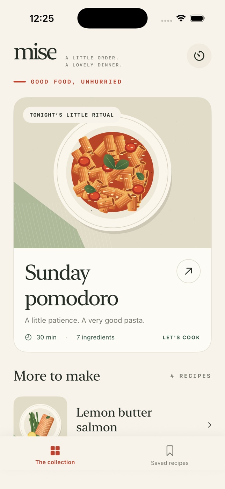

# Mise



A native iPhone cooking companion: a little order, a lovely dinner.

Warm paper, tomato red and basil green frame an editorial cookbook with original
procedural food illustrations. Five complete recipes open into adjustable ingredient
lists and a deliberately quiet, one-step-at-a-time cooking service.

## Prerequisites

- macOS with Xcode 26.6 and its command-line tools selected (`xcode-select -p`).
- iOS 26.5 iPhone Simulator runtime. Deployment target is iOS 18+.
- Swift 6 and `swift-format` bundled with Xcode.
- No package downloads, generator, server, account or signing credentials required.
- The run helper uses `rg` (ripgrep); alternatively use the `simctl` commands below.

## Build, check and run

From this directory:

```sh
./scripts/check.sh       # strict format lint, six logic tests, project validation, iOS build
./scripts/build.sh       # unsigned iPhone Simulator .app
xcrun simctl list devices available
./scripts/run.sh <IPHONE_SIMULATOR_UUID>
```

Or open `Mise.xcodeproj`, select the shared **Mise** scheme and an iPhone Simulator,
then Run. The project is checked in and needs no project generator.

The built app is at `DerivedData/Build/Products/Debug-iphonesimulator/Mise.app`.
To install manually:

```sh
xcrun simctl install booted DerivedData/Build/Products/Debug-iphonesimulator/Mise.app
xcrun simctl launch booted com.nader.mise
```

Simulator builds are for Apple Simulator only, not signed physical-device or App Store
releases. To make an artifact outside the repository:

```sh
ditto -c -k --sequesterRsrc --keepParent \
  DerivedData/Build/Products/Debug-iphonesimulator/Mise.app ~/Mise-Simulator.zip
```

## The collection

- Sunday pomodoro — tomato rigatoni, basil and Parmesan.
- Lemon butter salmon — pan-seared fish and green beans.
- Woodland risotto — mushrooms, thyme and Parmesan.
- Crispy chickpea harvest bowl — roasted vegetables, quinoa and tahini.
- Blueberry morning pancakes — buttermilk batter and maple.

All artwork is local SwiftUI Canvas drawing; no remote photos, font downloads or stock
asset licenses are needed. Every recipe has measured ingredients, five complete steps,
timing notes and practical substitutions.

## Controls and supported behavior

1. Open a recipe. Use **− / +** to choose 1–12 servings. Quantities scale from the
   base recipe, including fractional amounts.
2. Tap ingredient rows to prepare/unprepare them. **Reset** requires confirmation;
   **Undo reset** recovers the prior checklist.
3. Read **Method** or **Swaps**. Bookmark the recipe to add it to **Saved recipes**.
4. **Begin cooking** opens focused steps. Previous/next navigation never stops a timer.
5. Start a step timer, or open the kitchen timer board for named 15-second, 1-, 5- or
   10-minute timers. Multiple instances run independently. Pause, resume, restart or
   cancel each timer. Finished timers remain visible until dismissed.
6. **Use 15-second practice timer** is a real short countdown for testing. It does
   not change the recipe's food cooking instructions.
7. The cooking options menu can restart the method while preserving prep and timers.
   Finishing the method shows a dinner-served screen.
8. Favorites, servings, prep, step, completion, active recipe and timers restore on
   relaunch. A cooking session keeps the screen awake while the app is active.

## Persistence and export

State is atomically encoded as JSON in the app sandbox at
`Library/Application Support/Mise/kitchen.json`. A corrupt/unreadable save shows a
visible recovery notice and a fresh kitchen; a failed write shows a storage notice.

The recipe's share button exports actual plain text containing the currently scaled
ingredients and the full method through the native iOS share sheet. Destination is
chosen by the user (for example, Copy or Save to Files); Mise does not invent an
export path or upload data.

## Testing

```sh
swift test
xcrun swift-format lint --strict -r Sources Tests Package.swift
```

Logic coverage: scaling/fractions, servings and step bounds, independent timer
deadlines, pause/resume/restart, persistence round trip with elapsed deadlines,
malformed save errors, and recipe completeness.

Native UI acceptance: scale pomodoro, prepare ingredients, reset and undo, inspect a
swap, favorite, begin cooking, start two timers, navigate steps without losing them,
pause/resume, observe a short timer finishing, relaunch and verify restoration, then
reopen from Saved. Screenshots and annotated recordings are delivered as attachments,
not committed as source.

## Honest boundaries

- Timers use absolute device-clock deadlines, not background execution. They show
  completion in-app; this V1 has **no background notifications, audible alarms or
  Live Activities**. Keep Mise visible when you need a visual cue.
- Changing the device clock changes countdown behavior.
- Scaling is linear ingredient arithmetic, not a claim that cooking duration, pan
  size or heat should scale linearly. Steps keep their base cooking guidance.
- Fractional eggs should be beaten before dividing. Serving adjustments never
  round away real ingredient amounts.
- Recipes are bundled editorial content, not an editable recipe authoring system.
- iPhone portrait layout; scrolling handles smaller screens. No iPad-specific layout,
  camera, physical hardware, cloud sync or health/allergen certification.
- Food doneness takes precedence over a timer; the salmon recipe supplies a safe
  internal-temperature check.
