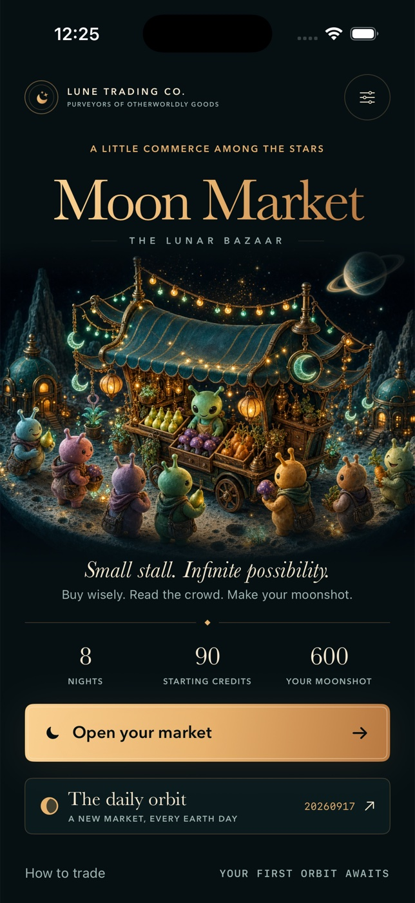

# Moon Market



A native, offline iPhone strategy game in SwiftUI. Run a tiny lunar produce stall
for eight nights. Original illustrated dioramas with native Canvas stardust, deterministic markets, transparent
transaction previews, persistent runs, illustrated receipt sharing and no dependencies.

## Build and run

Requirements: macOS with Xcode 26.6 (tested), iOS 26.5 simulator runtime.
Deployment target is iOS 17. No signing account is required for simulator builds.
The Xcode project and shared `MoonMarket` scheme are committed.

From this directory:

```sh
xcodebuild -project MoonMarket.xcodeproj -scheme MoonMarket \
  -configuration Debug -sdk iphonesimulator \
  -destination 'generic/platform=iOS Simulator' \
  -derivedDataPath DerivedData CODE_SIGNING_ALLOWED=NO build
xcodebuild -project MoonMarket.xcodeproj -scheme MoonMarket \
  -configuration Release -sdk iphonesimulator \
  -destination 'generic/platform=iOS Simulator' \
  -derivedDataPath DerivedData CODE_SIGNING_ALLOWED=NO build
xcrun simctl list devices available
# Substitute your simulator UUID below; boot it if necessary.
xcrun simctl boot SIMULATOR_UUID
open -a Simulator
xcrun simctl install SIMULATOR_UUID DerivedData/Build/Products/Debug-iphonesimulator/MoonMarket.app
xcrun simctl launch SIMULATOR_UUID ai.devin.nativegames.moonmarket
```

Optional project regeneration: `brew install xcodegen` then `xcodegen generate`
(verified with 2.46.0). Icon regeneration: `swift Tools/GenerateIcon.swift`.

## Visual identity

The bazaar and produce use bundled, original AI-generated miniature illustrations:
aged brass, striped teal cloth, glazed alien produce and warm lantern light.
Separate quiet/thriving artwork reflects the 600-credit milestone. SwiftUI supplies
the controls, trade states, copper rules, orbital progress and engraved moon seal;
Canvas animates ambient stardust and draws receipt paper grain. Baskerville and
Avenir Next are system fonts. No asset downloads or services are needed at runtime.
The shared receipt includes the bazaar and the actual eight-night trading history.

## Checks

```sh
xcrun swift-format lint --strict --recursive MoonMarket MoonMarketTests Tools
xcodebuild -project MoonMarket.xcodeproj -scheme MoonMarket \
  -configuration Debug -destination 'platform=iOS Simulator,id=SIMULATOR_UUID' \
  -derivedDataPath DerivedData CODE_SIGNING_ALLOWED=NO test
```

The build typechecks Swift. Unit tests cover deterministic days and UTC rollover,
budget/capacity enforcement, carry-over stock, previews versus actual settlement,
clearance, eight-round failure, reachable wins across 60 seeds, persistence and
exactly-once awards.

## Play

- Begin with **90 credits**, **12 crate spaces**, and a goal of **600 credits**.
- Each produce tag shows **Buy** and **Sell** prices. `Want` is exactly how many customers
  will buy tonight. Tap **+ / −** to edit the order before committing.
- **Open market** buys the order, sells held and purchased stock up to demand,
  and pays 5 credits rent. The preview includes all three, and orders always
  reserve rent. Insufficient funds and a full crate disable additional orders.
- Unsold stock carries into the next night. Tomorrow's queue is deterministic
  and visible; current prices change each night. Clear carried stock at half
  the current buy price if you need cash or space. Remaining stock automatically
  clears after night eight.
- Transparent rivals: Pip reduces one queue by two, Mox discounts one buy price
  by three, Ora improves one sell price by four. All displayed values already
  include the change.
- Finish at 600+ to transform your cart into a glowing stall. 800+ earns Lunar
  Legend; 90–599 is Rising Merchant; below 90 is Stardust Apprentice. An empty
  night still costs rent, capped by available cash. There is no timer.
- Daily orbit uses `YYYYMMDD` in UTC as its seed. Replay uses exactly the same
  market. Free play picks a local random seed; there is no online leaderboard.
- Pause offers restart, resume and save/home. Orders, settlement, best score,
  completed runs and daily bests save locally after every action.
- Share opens the native activity sheet with a rendered receipt image and text.

## Accessibility and limitations

Portrait iPhone UI respects safe areas, uses scrollable content and explicit
interactive accessibility labels/identifiers. Animations honor Reduce Motion.
The game is intentionally silent; optional haptic selection/settlement feedback
can be disabled in Settings. There are no timers to pause on backgrounding;
state saves on each action and on scene transitions.

Simulator evidence does not validate physical haptics, device performance,
AirDrop delivery or App Store submission. No signing/publishing is performed.
UserDefaults progress is local only and is removed by uninstalling the app.
