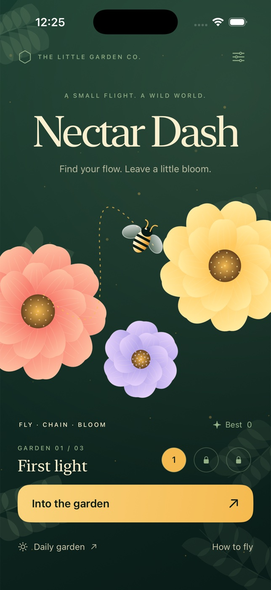

# Nectar Dash



A native SwiftUI botanical arcade game. Trace short flights between numbered,
color-sequenced flowers, carry pollen, and return to the hive before the sun sets.
All artwork is procedural Canvas/AppKit vector drawing; no dependencies or network.

## Open and run

Open `NectarDash.xcodeproj`, select the shared **NectarDash** scheme, choose an
iPhone Simulator, and run. The project is committed; regeneration is optional:

```sh
brew install xcodegen
xcodegen generate
```

Built with Xcode 26.6 / Swift 6.3 toolchain, Swift 5 language mode. Minimum iOS 17.
Simulator signing is disabled in the project. Physical-device deployment requires
your own signing configuration; this repository does not include credentials.

## Reproducible checks

Run from this directory. Substitute a locally available simulator UUID from
`xcrun simctl list devices available` for `$DEVICE`.

```sh
xcrun swift-format lint --strict --recursive Sources Tests Tools
xcodebuild -project NectarDash.xcodeproj -scheme NectarDash \
  -configuration Debug -sdk iphonesimulator -destination 'generic/platform=iOS Simulator' \
  -derivedDataPath build/Debug CODE_SIGNING_ALLOWED=NO build
xcodebuild -project NectarDash.xcodeproj -scheme NectarDash \
  -configuration Release -sdk iphonesimulator -destination 'generic/platform=iOS Simulator' \
  -derivedDataPath build/Release CODE_SIGNING_ALLOWED=NO build
xcodebuild -project NectarDash.xcodeproj -scheme NectarDash \
  -configuration Debug -destination "platform=iOS Simulator,id=$DEVICE" \
  -derivedDataPath build/Tests CODE_SIGNING_ALLOWED=NO test
```

The build is the typecheck. XCTest covers sequencing, banking, capacity, combo
bonuses, segment/web intersection, detours, wind cycles, timeouts, cooldowns,
daily determinism, and persistence/unlocks.

To regenerate the icon:

```sh
swift Tools/GenerateIcon.swift Assets.xcassets/AppIcon.appiconset/AppIcon.png
```

## How to play

- Draw from the bee to one flower. The preview follows your finger; release to fly.
  Tap any flower for a direct flight. Longer drawn detours avoid hazards.
- Repeat **Gold 1 → Rose 2 → Iris 3**. Numbers supplement color cues.
- Each of the first three blooms gives 10 honey; the next three give 20 each.
  Six blooms trigger a garden-wide blossom wave and a 30-honey bonus: 120 total.
- Your satchel holds six blooms. Tap the hive any time to bank. Only banked honey
  counts toward a goal or record; returning resets the sequence to Gold.
- A web costs a life and all carried pollen. Three tangles end the run. Wind
  interrupts a flight and costs five seconds; its five-second gust has a
  four-second lull. Wrong colors cost three seconds.
- Flowers recover after nine seconds. Three authored gardens have increasing
  targets and hazards. Winning unlocks the next. Daily garden uses a UTC date seed,
  endlessly renewing flowers, and a 90-second high-score run.
- Pause supports resume, restart, and home. Backgrounding pauses immediately.
  Best harvest, daily best, unlocked gardens, tutorial and settings persist locally.
- Results share a native image and text through the iOS activity sheet, including
  the actual flight route. No online leaderboard or account.

## Accessibility and limitations

Controls have labels and stable identifiers, 44pt minimum targets, and flowers
have VoiceOver direct-flight actions. Color cues also use numbers. System Reduce
Motion and the Calm motion setting still drifting artwork; essential bee travel
remains. Haptics can be disabled. The game deliberately has no audio.

Portrait iPhone is the designed form factor. UI validation and haptic trigger
checks are simulator-only; physical touch latency, haptic sensation, device energy
use, and App Store signing/submission are outside this deliverable. Timed arcade
play and complex freehand routes are not a fully nonvisual game experience.
