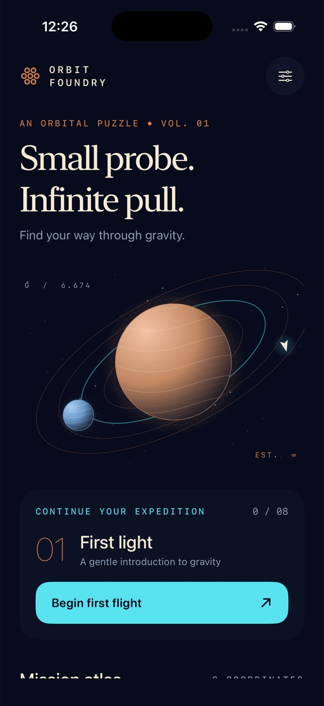

# Orbit Foundry



A native, offline iPhone gravity puzzle, built in SwiftUI with original procedural astronomical artwork.

## Play

Eight sequential missions introduce gentle gravity, binary fields, narrow passages and deep slingshots. Drag from the probe's copper aim ring toward the desired direction: the dotted cyan arc uses the same fixed-step physics as the flight. Releasing keeps the aim; **Launch probe** ignites it. Bearing and thrust sliders also support precise adjustment and accessibility.

Collect every cyan beacon before reaching the ivory station. Avoid planet surfaces and the flight boundary. Restart or abort at any time. **Flight guide** aligns a tested solution, marks the run guided, and explains the mission; it remains available on every mission. The first mission includes a flight-school tutorial and an aligned starting course.

Three stars: one launch. Two stars: up to three launches. One star: four or more. Best scores prefer fewer launches, then shorter flight time. Every completed mission unlocks the next. Scores, lifetime launch count, and haptic preferences persist locally in UserDefaults. Replaying a completed flight starts a fresh attempt counter; retries after failure retain it. Leaving a mission abandons its attempt counter; the lifetime count remains. Settings can erase the flight log after confirmation.

After a flight, **Review trajectory** reveals the path behind the result card. At accessibility text sizes, the playfield and controls scroll vertically; **Back to trajectory** returns to the field. Start aiming inside the copper ring so swipes elsewhere can scroll. Flight guide has a persistent close button and scrollable content.

## Open and build

Requirements: Xcode 26.6 (verified), iOS 17+ deployment target. No external runtime dependencies, accounts, keys, or network access.

Open `OrbitFoundry.xcodeproj`, select the shared **OrbitFoundry** scheme, and run on an iPhone simulator. The generated project is committed, so XcodeGen is optional.

```sh
# From this directory, if regenerating the project:
brew install xcodegen
xcodegen generate

# Compile for Simulator:
xcodebuild -project OrbitFoundry.xcodeproj -scheme OrbitFoundry \
  -sdk iphonesimulator -configuration Debug \
  -derivedDataPath build CODE_SIGNING_ALLOWED=NO build

# Discover this machine's simulator UUIDs:
xcrun simctl list devices available

# Model tests (replace the destination ID with an available iPhone):
xcodebuild -project OrbitFoundry.xcodeproj -scheme OrbitFoundry \
  -destination 'platform=iOS Simulator,id=YOUR_DEVICE_UUID' \
  -derivedDataPath build CODE_SIGNING_ALLOWED=NO test

# Swift formatting and lint:
xcrun swift-format format --in-place --recursive Sources Tests Tools
xcrun swift-format lint --strict --recursive Sources Tests Tools

# Regenerate the original app icon:
swift Tools/GenerateIcon.swift
```

## Implementation

The softened gravity integrator runs at 120 fixed steps per simulated second. The preview and gameplay share the same integration and collision rules. Planet layouts, reference velocities, beacon coordinates, and docks are fixed, authored mission data; XCTest verifies all eight have complete solutions. Tests also cover numerical stability, collision/missing-beacon failures, reset, launch protection, progression, best scores, serialization, and corrupt-save fallback.

Canvas renders planet shading and contours, star fields, engraved rulers, trails, beacons, station and probe. Captures emit a brief expanding ring and particles. The observatory animates orbital artwork; Reduce Motion pauses decorative animation and disables capture bursts. Flight simulation pauses when the app is inactive. Standard controls have VoiceOver labels. Haptics are optional. There is no audio.

## Scope and limitations

Portrait iPhone V1. iPad and landscape layouts, cloud sync, custom level editing, and App Store submission are outside this release. Physics is a deliberately scaled puzzle model, not an astrophysical simulator. Best records and accessibility labels are local; uninstalling removes data. Simulator builds disable signing; physical-device installation requires selecting a development team and enabling signing in Xcode.
