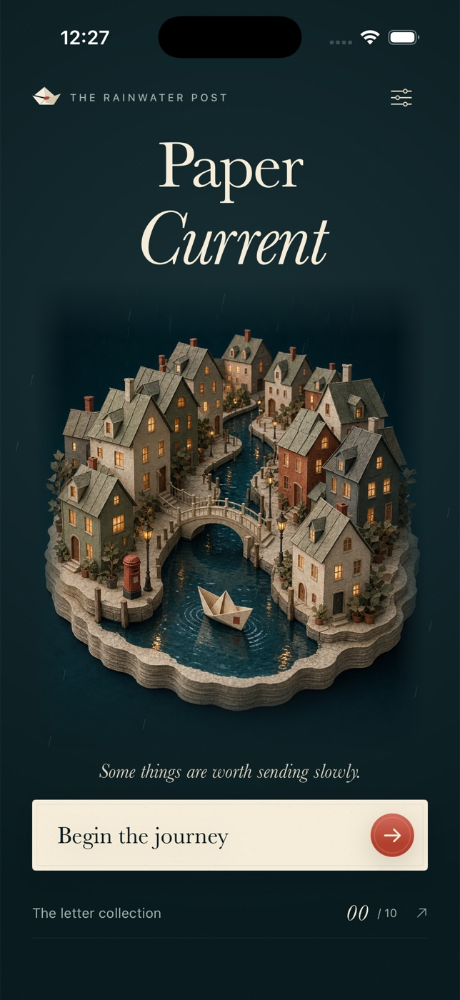

# Paper Current



A native iPhone water-routing puzzle in a rain-soaked paper city. Ten handcrafted
letters introduce rotating canals, operable locks and one-way currents. Every
route has three stamps and a postbox dock.

## Build and run

Requires Xcode 26.6 (tested), an iOS 26.5 Simulator runtime and macOS. Deployment
target is iOS 17. No dependencies, accounts, signing credentials or network needed.

Open `PaperCurrent.xcodeproj`, select the shared **PaperCurrent** scheme and an
iPhone simulator, then Run. The committed project is ready to use; regeneration
is optional with XcodeGen 2.46.0: `xcodegen generate`.

From this directory:

```sh
xcodebuild -project PaperCurrent.xcodeproj -scheme PaperCurrent \
  -configuration Debug -sdk iphonesimulator -destination 'generic/platform=iOS Simulator' \
  -derivedDataPath build CODE_SIGNING_ALLOWED=NO build
xcodebuild -project PaperCurrent.xcodeproj -scheme PaperCurrent \
  -configuration Release -sdk iphonesimulator -destination 'generic/platform=iOS Simulator' \
  -derivedDataPath build CODE_SIGNING_ALLOWED=NO build
xcrun simctl list devices available
# Substitute an available device UUID:
xcodebuild -project PaperCurrent.xcodeproj -scheme PaperCurrent \
  -destination 'platform=iOS Simulator,id=DEVICE_UUID' \
  -derivedDataPath build CODE_SIGNING_ALLOWED=NO test
xcrun swift-format lint --strict -r Sources Tests Tools
```

To install manually after booting a Simulator:

```sh
xcrun simctl install booted build/Build/Products/Debug-iphonesimulator/PaperCurrent.app
xcrun simctl launch booted com.paperstudio.PaperCurrent
```

## Play

- Tap a canal to rotate clockwise. The pale current previews connected water.
- Tap the separate lock latch in a tile's top-right corner to open or close it.
- One-way arrows must point in the direction the boat travels.
- Collect all three amber envelope stamps before reaching the red postbox.
- Release the boat when ready. Planning has no time limit; the tide advances per
  sailing step and stops loops. Disconnects, closed locks and wrong currents fail.
- Undo reverses the last edit. Reset restores the original puzzle. Hint repairs
  one piece and reduces the result's seal rating. Every puzzle is solvable without
  hints. Three seals require no hints and a move count at or below par.
- A failed sailing keeps the plan for immediate correction. Replay can improve
  your locally saved best move count. Deliveries unlock the next letter.
- Share produces a native image postcard of the solved route plus text.

The app pauses sailing on backgrounding. Accessibility Reduce Motion stops
ambient rain/bobbing and boat interpolation. Sound effects are opt-in; haptics
default on. All interactive controls have VoiceOver labels, with canal ports
announced and stable test identifiers.

## Verification

Unit tests validate all ten route geometries and stamp collection, unsolved
starting boards, hint solvability, distinct lock/current failures, undo and
persistent best/unlocking. Builds provide Swift typechecking. No external Swift
packages are used. The playable town, canals, boat, stamps and postbox are
native SwiftUI/Canvas artwork. The home uses an original generated papercraft
harbor illustration, bundled locally as `Assets.xcassets/Harbor.imageset/Harbor.jpg`,
with a native rain overlay; no remote images are fetched. Its art direction is
cotton-paper canal architecture, warm windows, a cream origami boat and restrained
vermilion details against dusk-blue water. The icon can be
regenerated with `swift Tools/GenerateIcon.swift Assets.xcassets/AppIcon.appiconset/AppIcon.png`.

See `QA.md` for observed simulator design iterations and evidence.

## Limitations

Portrait iPhone V1. Best deliveries and completed letters persist locally;
unfinished plans restart after terminating the app. No cloud sync or daily mode.
Simulator evidence does not validate physical-device haptics, audio output,
App Store signing, or delivery to third-party share destinations.
