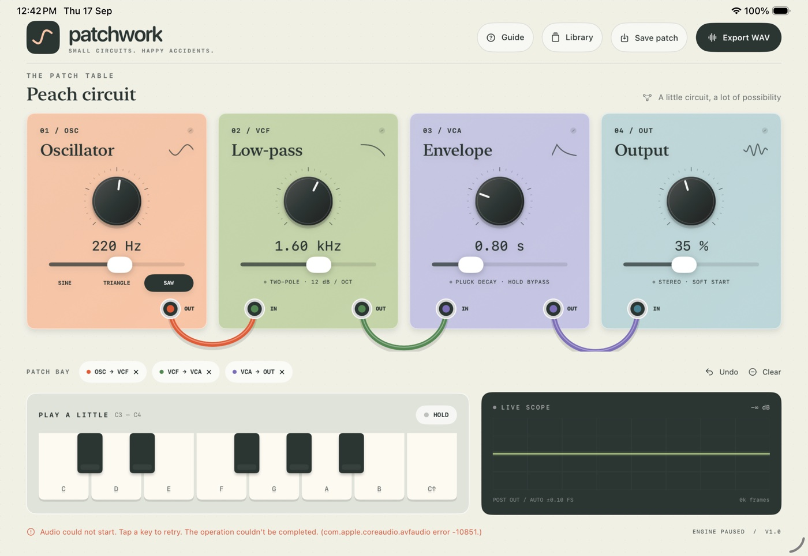

# Patchwork



A native, landscape-first iPad modular synthesizer. Four pastel modules sit on a pale aluminum patch table. Connect sockets, play notes, shape a sound, and watch the actual output samples move across the scope.

## Prerequisites

- macOS with Xcode 26.6 (tested), Command Line Tools selected for that Xcode.
- An installed iOS Simulator runtime; tested with iOS 26.5 on iPad.
- No network, account, paid dependencies, XcodeGen, or signing credentials.

The checked-in Xcode project is ready to open. The app supports iPad on iOS 17+; this unsigned build is for the Simulator, not an installable App Store/iPhone release.

## Build and run

From this directory:

```sh
./scripts/build.sh
xcrun simctl list devices available
./scripts/run.sh YOUR_IPAD_SIMULATOR_UUID
```

Use an iPad, preferably an 11- or 13-inch model. If Simulator opens portrait, use **Device → Rotate Left**. The app supports both landscape orientations and scales its instrument to smaller windows. Native library, help and save sheets adapt to the available window.

The app is built at `.derived/Build/Products/Debug-iphonesimulator/Patchwork.app`.

## Play

- **Sockets:** tap an OUT, then an IN. Tap the same OUT again to cancel. The input must be empty. Click a connection's × in the patch bay to remove it.
- **Routing:** oscillator is a source, output is a sink. Filter and envelope may be reordered or bypassed. One cable per input, no self-connections or feedback cycles. Dangling chains produce silence.
- **Tuning:** sliders move the precise illustrated knobs. Frequency is logarithmic from 40–1000 Hz, cutoff from 80–12000 Hz, decay from 0.1–3 s, and volume from 0–80%.
- **Keyboard:** tap any of 13 chromatic notes from C3 to C4. Each tap starts a note. **Hold** sustains sound while you edit; tap again to release. Without an envelope in the chain a note lasts 0.75 s.
- **Waveforms:** select sine, triangle or saw below the oscillator.
- **Recovery:** Undo keeps the last 30 edits in memory, including cable removal, parameter drags, preset changes, and Clear. Clear loads an empty patch.
- **Library:** Peach circuit, Glass garden, Velvet current and Open canvas are bundled editable presets. Save a named copy; saving the same name updates it. Preset originals remain available.
- **Persistence:** the current graph and settings save on edits and backgrounding; named patches persist too. Sound intentionally does not restart automatically after relaunch.
- **Export WAV:** renders the current circuit as a three-second held tone at 48 kHz, mono Float32 WAV, with 10 ms edge fades. The native share sheet offers Save to Files. A disconnected circuit shows a useful error.
- **Guide:** a short in-app tutorial covers the full flow.

## Audio and modeling

`AVAudioEngine` runs a stereo `AVAudioSourceNode`. It uses the same tested `SynthKernel` as WAV export. The signal graph is deliberately bounded to these four modules; no microphone permission or input hardware is needed. A sine oscillator, triangle, and polyBLEP saw feed a two-pole low-pass made from cascaded one-pole sections. This is a stable educational digital filter, not an analog resonant circuit model. The envelope applies exponential decay with a smoothed attack; Hold bypasses decay. Frequency, cutoff and volume changes are smoothed.

The oscilloscope and dB readout come from real callback samples after routing and gain. The frame counter is published by that callback, not a UI animation. The scope auto-scales its vertical range to keep peaks visible; its footer labels that range in full-scale (FS) units. Preview samples are an untriggered window, so their phase moves naturally. The UI reads telemetry at 20 Hz. This compact demo uses a short lock to exchange controls and a bounded sample array per audio buffer; it is not a production hard-real-time host, a polyphonic synthesizer, MIDI controller, or an Audio Unit. The two output channels carry the same mono signal.

On headless macOS VMs, `system_profiler SPAudioDataType` must list an output device. This session provisioned BlackHole 2ch with `brew install --cask blackhole-2ch`, refreshed Core Audio, and restarted Simulator. Without an output the Simulator may report Core Audio `-10851`. Resolve Simulator's native audio permission prompt before recording. Physical Macs with working output do not need this virtual driver.

## Files

The app's Documents directory contains:

- `Patchwork-library.json`: validated, Codable current patch and named patch library; atomic writes.
- `Patchwork-render.wav`: most recent actual export, overwritten by the next export.

Both are available via Files / Finder file sharing. In Simulator:

```sh
DATA="$(xcrun simctl get_app_container YOUR_IPAD_SIMULATOR_UUID ai.devin.patchwork data)"
ls "$DATA/Documents"
```

Invalid persisted graphs/parameters are rejected on launch with a visible recovery notice and a usable starter patch. No credentials or user data leave the device.

## Verification

```sh
./scripts/check.sh
./scripts/build.sh
```

The check command uses Xcode's `swift-format lint --strict`, `plutil`, and `swift test`. Tests cover graph cycles and occupied ports, preset and serialization validation, pitch accuracy, filter attenuation, envelope decay, all waveform bounds, disconnect/zero-volume silence, and **actual AVAudioEngine offline rendering** that must produce nonzero output and then silence after disconnect.

The macOS Swift package is a logic/audio test harness. The product itself is the native iPad app. UI testing additionally uses real Simulator mouse input for sockets, sliders, notes, save/load, relaunch, undo, visible invalid-connection handling, and WAV export. Recordings, screenshots, test reports and Simulator binaries are distributed as session attachments rather than committed to the repository.
