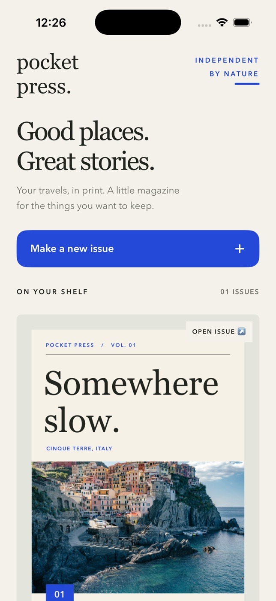

# Pocket Press



A native iPhone studio for tiny travel magazines. Turn a place into a beautifully
typeset issue, with warm paper, confident editorial typography, photographs and
small observations. Every page shown in the editor is drawn by the same UIKit
layout engine that writes the PDF.

## Prerequisites

- Native macOS with Xcode 26.6, Command Line Tools selected, and an iOS Simulator runtime.
  Developed with the iOS 26.5 runtime on Apple Silicon. Deployment target is iOS 17.
- No package downloads, account, backend, signing credentials, camera or physical phone.
- Python 3.9+ only if **regenerating** the checked-in Xcode project. Normal builds do
  not require Python, XcodeGen, CocoaPods or third-party packages.

## Build and run

From this directory:

```sh
./scripts/build.sh
xcrun simctl list devices available
./scripts/run.sh <your-iPhone-Simulator-UUID>
```

Or open `PocketPress.xcodeproj`, choose the **PocketPress** scheme and an **iPhone**
Simulator, then Run. The app is a portrait-first iPhone app, not an iPad layout.
Build output: `build/Build/Products/Debug-iphonesimulator/PocketPress.app`.
The `.app` is **Simulator-only**, unsigned and not an installable iPhone/App Store release.

To regenerate the native project after adding source files:

```sh
python3 scripts/generate_project.py
```

## A two-minute issue

1. Tap **Make a new issue → Use this template**. A new independent issue is added
   to the shelf; the bundled issue remains available.
2. In **Studio**, tap the printed page or **Edit page**. Change the title, place
   or caption, then **Save**. Text validation is inline and invalid drafts cannot
   overwrite saved pages. **Cancel** discards the draft.
3. Open **Pages → Add a page**, then choose **Photo essay**, **Story** or **Field
   notes**. All are editable. Move pages with the up/down controls; the cover
   always stays first. The minus control deletes an interior page.
4. In **Studio**, choose a theme: **Riviera**, **Terracotta** or **Nocturne**.
   Typography, paper, ink and accent change cohesively throughout the issue.
5. Choose **Read**. Swipe or use the arrows to preview every page. Tap **Export
   print-ready PDF** to write a real multipage PDF and reopen it from disk in PDFKit.
6. In the PDF reader, swipe, use page arrows, pinch to zoom or select text. **Share
   PDF** opens the native share sheet. Close it, then use **Studio → … → Reopen
   last PDF** to reopen the saved export independently of the live issue.

Undo is the curved arrow at the top of the editor. Up to 40 complete library
snapshots are retained **during the current session**. **Studio → … → Restore
template** asks for confirmation and is undoable. Delete an issue using its shelf
options. An empty shelf has an undo-deletion action.

## Features and content

- Persistent projects with atomic JSON writes after each committed change.
- Four page types: editorial cover, image-led photo essay, long-form story and
  numbered field notes. Add up to 24 pages total.
- An editable four-page Cinque Terre journal with original sample prose and two
  bundled, credited Unsplash photographs. See `Resources/Photography.md`.
- Two offline photo choices, plus the native Photos picker for personal images.
  Imported images are normalized to JPEG, at most 2,048 pixels on their longest edge.
- Three visual themes; app UI keeps a readable cream/cobalt palette.
- Editable live previews and real PDFKit reading, sharing and reopening.
- Semantic button labels, sufficiently sized controls and native keyboard editing.

## Persistence and export

Everything stays in the app's Documents directory:

```text
Documents/PocketPress/library.json
Documents/PocketPress/import-<UUID>.jpg
Documents/PocketPress/Exports/<sanitized-title>-<issue-ID-prefix>.pdf
```

Exports and the library are visible in **Files → On My iPhone → Pocket Press →
PocketPress**. Exporting the same issue/title replaces its previous PDF atomically.
Renaming an issue produces a new filename. The last-export shortcut lasts for
the editor's current presentation; Files retains all exports after relaunch.

Simulator documents can also be inspected without modifying state:

```sh
xcrun simctl get_app_container <device-UUID> com.pocketpress.native data
```

Unreadable or unsupported library files are preserved and the app displays an
error rather than overwriting them. Copy the original library out through Files
before repairing it or reinstalling. Export/write/import failures are reported.

## Checks

```sh
./scripts/check.sh
./scripts/build.sh
```

`check.sh` runs Xcode's native `swift-format` strict lint, ten Swift Testing model
tests, and property-list validation. Model tests cover layout invariants, bounded
page counts, text limits, page identity through reordering, cover protection,
snapshot recovery, Unicode serialization, invalid library rejection and safe
export filenames. Simulator build typechecks all native rendering and UI code.

Format Swift sources when contributing:

```sh
xcrun swift-format format --in-place --recursive \
  --configuration .swift-format Core PocketPress Tests scripts/make_icon.swift Package.swift
```

UI verification requires interacting with the actual iPhone Simulator. The demo
scenario includes creation, title/caption changes, adding and reordering pages,
themes, reading all pages, PDF export/reopen, undo and relaunch persistence.
Recordings, screenshots, test report and sample PDF are delivered as session
attachments, not committed build artifacts.

## Deliberate V1 limits

- Fixed 420 × 594 point portrait pages (approximately A5); no bleeds, crop marks,
  CMYK conversion, imposition or printer color profiles. “Print-ready” means a
  real RGB PDF with selectable vector text and embedded raster photos.
- Titles/captions fit by reducing type within bounded layouts. Titles are capped
  at 48 characters, captions at 150, place labels at 42, stories at 850 characters
  and 20 lines. Field notes allow six entries of up to 150 characters each.
  Text stays on its chosen page; automatic flowing into additional pages is not supported.
- Centered aspect-fill photograph crop; no crop editor, rotation or image filters.
- Fixed editorial canvas typography does not expand with Dynamic Type. The
  PDF reader supports zoom; navigation and form controls have accessibility labels.
- Photos import is optional. The full demo works offline with bundled assets.
  Unused imported files and old exports remain until removed through Files.
- Undo does not survive app termination. Saved issue changes do.
- English/LTR layout; no collaboration, cloud sync, font marketplace or arbitrary
  desktop-publishing layout tools.
