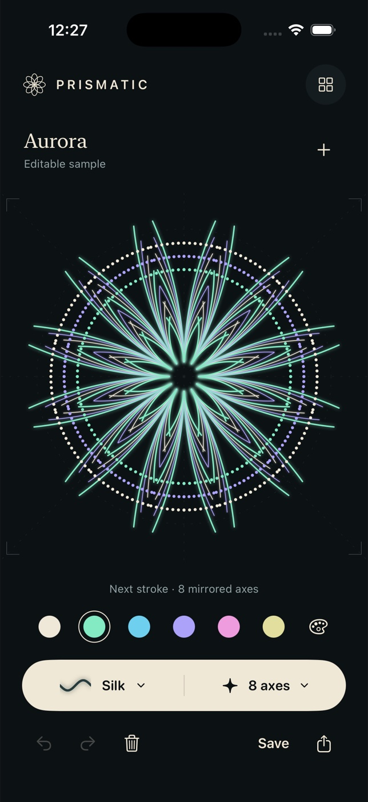

# Prismatic



A native SwiftUI / UIKit generative drawing atelier. Draw once; every mark repeats around a center with 1–24 radial axes and optional reflection. No account, network, or runtime packages.

## Studio

- Silk, Ink, and Stardust brushes with adjustable weight and original live previews.
- Aurora, Ember, and Mineral pigment collections.
- Symmetry and guide controls affect the **next** stroke. Existing strokes retain their original brush, pigment, and geometry.
- Undo / redo (80 operations, this session), undoable clear with confirmation, and new canvas with a save-first choice.
- Local named gallery with actual rendered thumbnails, reopen, rename by saving, and confirmed deletion.
- Real opaque 2048 × 2048 PNG through the native iOS share sheet, including Save to Files.
- Aurora and Solstice are original, clearly marked, editable sample pieces. First launch opens Aurora; use `+` for a blank canvas.
- Draft, settings, and saved pieces persist atomically in the app's Documents directory. No cloud sync. Uninstalling deletes this data.

## Build and test

Requires macOS and Xcode with an iOS 17+ SDK. Verified tool/device results are in the delivered QA report. Open `Prismatic.xcodeproj` and select the shared **Prismatic** scheme. Simulator signing is disabled by default; set signing/team yourself for a physical device.

```sh
cd prismatic
xcodebuild -project Prismatic.xcodeproj -scheme Prismatic \
  -destination 'platform=iOS Simulator,name=iPhone 17 Pro' \
  -derivedDataPath build build CODE_SIGNING_ALLOWED=NO
xcodebuild -project Prismatic.xcodeproj -scheme Prismatic \
  -destination 'platform=iOS Simulator,name=iPhone 17 Pro' \
  -parallel-testing-enabled NO -derivedDataPath build test CODE_SIGNING_ALLOWED=NO
xcrun swift-format lint --strict --recursive Prismatic PrismaticTests Scripts
```

Project generation is optional because the generated project is included:

```sh
brew install xcodegen
xcodegen generate
swift Scripts/GenerateIcon.swift Prismatic/Assets.xcassets/AppIcon.appiconset/AppIcon.png
```

The iOS 17 deployment target enables Observation and the modern SwiftUI state/change APIs. Rendering and touch coalescing use UIKit/Core Graphics; export uses exactly the same stroke renderer as the canvas and thumbnails.

## Controls and accessibility

Draw with a finger or pointer on the square canvas. The ivory tool capsule opens brush and symmetry controls. Color wells select pigments; the palette icon opens palettes. Gallery is at top right; `+` starts a blank study. Undo, redo, clear, save, and PNG share are along the bottom. Exports use your artwork title as the filename.

UI text uses Dynamic Type where appropriate. At accessibility sizes the canvas becomes more compact and the tools stack in a separately scrollable area, preserving direct drawing without a competing scroll gesture. Brush rows and gallery grids adapt, and sheet close controls remain pinned. Controls have VoiceOver labels and selected states; canvas announces stroke count and axes. Drawing itself is spatial and requires a touch gesture. Haptics supplement visible feedback. There are no essential animations or audio, so Reduce Motion does not remove information.

## Limits

V1 is a square, opaque black canvas. It does not include layers, zoom/pan, pressure-sensitive width, transparent export, cloud sync, or import of external images. Gallery saves editable vectors internally; PNG exports are flattened. Undo history resets on reopening a piece or relaunching the app. Very complex work may take longer to render/export. Sample previews are procedural artwork, never network images.

This is a simulator-tested V1, not an App Store submission or a claim of physical-device validation.
