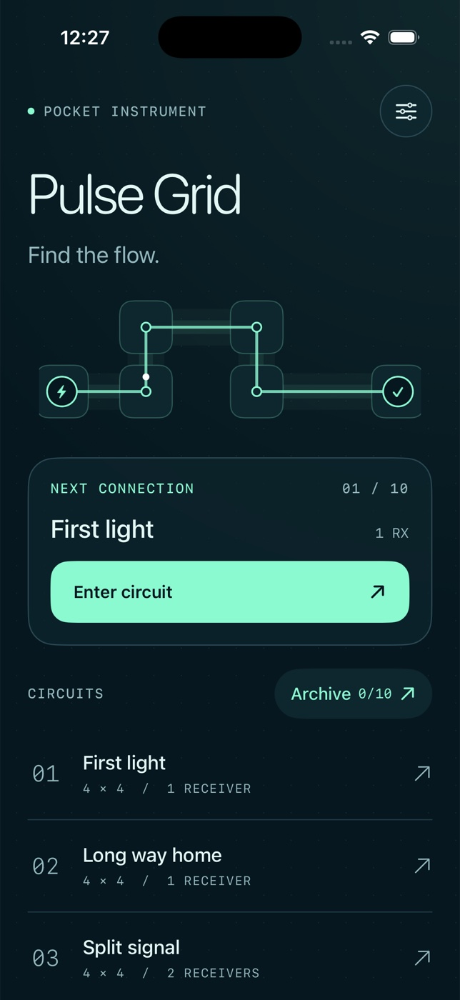

# Pulse Grid



A native SwiftUI light-circuit puzzle for iPhone. Rotate frosted circuit tiles,
connect a mint source to every coral receiver, and follow the live current.
Ten handcrafted circuits introduce bends, branches, blocked cells and loops.
No network, account, ads, third-party runtime dependencies or API keys.

## Open and run

Open `PulseGrid.xcodeproj`, choose the shared **PulseGrid** scheme and an iPhone
simulator, then Run. Requires Xcode with the iOS 17 SDK or newer. The deployment
target is iOS 17; the interface uses SwiftUI Canvas, TimelineView and SF Symbols.
The app is designed for portrait iPhone. Simulator signing is disabled in the
project; set your own development team and enable signing for a physical device.

To regenerate the committed project after editing `project.yml`:

```sh
brew install xcodegen
xcodegen generate
```

From this directory:

```sh
xcodebuild -project PulseGrid.xcodeproj -scheme PulseGrid \
  -sdk iphonesimulator -configuration Debug \
  -destination 'platform=iOS Simulator,name=iPhone 17 Pro' \
  -derivedDataPath "$HOME/pulse-grid-build" CODE_SIGNING_ALLOWED=NO build

xcodebuild -project PulseGrid.xcodeproj -scheme PulseGrid \
  -destination 'platform=iOS Simulator,name=iPhone 17 Pro' \
  -derivedDataPath "$HOME/pulse-grid-build" CODE_SIGNING_ALLOWED=NO test

xcrun swift-format lint --strict --recursive PulseGrid Tests Tools
```

`Tools/GenerateIcon.swift` generates the original app icon using AppKit:
`swift Tools/GenerateIcon.swift`.

## Controls and behavior

- Enter a circuit from the home screen. All ten are available from the start.
- Tap a tile to rotate clockwise by 90 degrees. Source and receiver terminals
  stay fixed. Power flows only when adjacent ports match in both directions.
- Reach **all** receivers to complete a circuit. Loops and spare branches are
  allowed; every tile need not be powered if all receivers are connected.
- **Hint** aligns one tile to the authored solution, following distance from the
  source. It is optional and counted separately from player rotations.
- **Reset** and **Replay** ask for confirmation and restore the exact starting
  arrangement. Cancel keeps the current state. Completion records remain.
- The signal archive shows completed circuits and best runs, ranked by fewer
  hints first, then fewer rotations. There is no claimed optimal move count.
- The guide explains play and toggles haptics. The home guide also offers
  confirmed progress erasure; the in-game guide cannot erase an active session.

## Data and accessibility

Every interaction saves locally in UserDefaults: per-level rotations, moves,
hints, completion records and haptic preference. Relaunch restores a circuit when
you enter it again. No sample completions or invented progress are preloaded.
Deleting the app or erasing progress removes local data. No cloud sync.

Tiles announce row, column, fixed status, power state and port directions to
VoiceOver. Text uses Dynamic Type; monospaced instrument labels cap at XXXL, and
the decorative archive numeral stays fixed. At accessibility sizes, navigation
and action groups stack and the home illustration gives way to the circuit list.
Large-text completion controls scroll below the board instead of covering it.
Sheet dismissal controls remain pinned while scrolling. Reduce Motion disables
traveling pulses and rotation springs. Color is reinforced by terminal shapes,
checkmarks, receiver counts and text. Audio is not needed or used.

## Validation and scope

Unit tests cover reciprocal connectivity, boundaries, loops and branches, all
handcrafted solutions, hints, rotations, terminal locking, reset, persistence,
best-run ranking and invalid saved data. The compiler performs type checking.
See the PR for actual simulator QA and design iteration evidence.

This is an offline V1 with ten authored puzzles, not an infinite level generator.
App Store submission, production signing and physical-device validation are
outside this project. There is no audio track.
