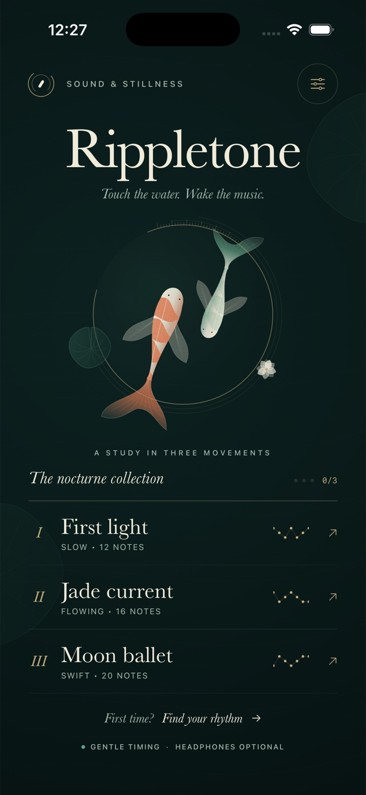

# Rippletone



A native SwiftUI rhythm game set on an ink-black koi pond. No dependencies,
network, accounts, signing credentials, or generated web content.

## Build and run

Requirements: Xcode 15+ with an iOS 17+ simulator. Verified environment and exact
QA commands are recorded in `QA.md`. Open `Rippletone.xcodeproj`, select the shared
**Rippletone** scheme and an iPhone simulator, then Run. Signing is disabled for
simulator builds.

```sh
xcodebuild -project Rippletone.xcodeproj -scheme Rippletone \
  -configuration Debug -sdk iphonesimulator \
  -destination 'generic/platform=iOS Simulator' \
  -derivedDataPath .build CODE_SIGNING_ALLOWED=NO build
xcodebuild -project Rippletone.xcodeproj -scheme Rippletone \
  -configuration Release -sdk iphonesimulator \
  -destination 'generic/platform=iOS Simulator' \
  -derivedDataPath .build CODE_SIGNING_ALLOWED=NO build
xcrun simctl list devices available
# Replace DEVICE_UUID with your available iPhone simulator UUID:
xcodebuild -project Rippletone.xcodeproj -scheme Rippletone \
  -destination 'platform=iOS Simulator,id=DEVICE_UUID' \
  -derivedDataPath .build CODE_SIGNING_ALLOWED=NO test
xcrun swift-format lint --strict --recursive Rippletone Tests Tools
```

The checked-in project needs no generator. To regenerate after changing targets,
install XcodeGen (`brew install xcodegen`) and run `xcodegen generate`.
Regenerate the original opaque 1024px icon with
the same SwiftUI illustration used in the app:

```sh
mkdir -p .build
xcrun swiftc -parse-as-library Rippletone/Rhythm.swift Rippletone/PondArt.swift \
  Tools/GenerateIcon.swift -o .build/generate-icon
.build/generate-icon
```

Build outputs are ignored.

## Play

Choose one of three original compositions: **First light**, **Jade current**, or
**Moon ballet**. Tap a lily when its expanding inner ring meets the gold outer
edge. Every cue is visual. The three notes produce original synthesized plucks.
The tutorial holds each target at the edge so you can learn without a timer.

- Gentle mode (default): Perfect within ±0.36s, Lovely within ±0.85s.
- Precise mode: Perfect within ±0.16s, Lovely within ±0.32s.
- Perfect = 100, Lovely = 70, missed = 0. Accuracy is their average.
- Bloom by catching at least 70% of notes with at least 60% accuracy.
- Four consecutive Perfect notes release a synchronized luminous koi school.
- Missing breaks the combo. Out-of-window and duplicate taps cannot score.
- Pause freezes song time; backgrounding pauses automatically. Continue, restart
  or return home. Results offer immediate replay and a native performance share sheet.
- Best accuracy/combo and bloom progress persist separately for each timing mode.
  Audio, haptics and timing preferences also persist.

## Accessibility and scope

Portrait iPhone layout, safe areas, ≥44pt controls, labelled interactive elements,
optional audio/haptics, reduced-motion ambient art, and readable visual timing.
Gentle timing is intended for more relaxed play. This is a visual rhythm game;
it does not claim full nonvisual VoiceOver play or switch-control support.
Fixed display typography preserves playfield geometry at larger system text
sizes. iPad, landscape, cloud sync and a daily challenge are outside this V1.
Physical-device audio/haptics, interruptions from calls and App Store signing
are not established by simulator tests.
