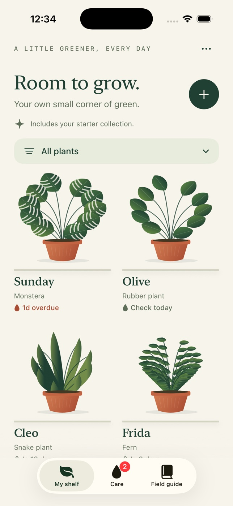

# Sprout



A small, native iPhone plant-care companion. SwiftUI, original procedural botanical
illustrations, local storage, and no runtime dependencies. iOS 17 or newer.

## Your shelf

- A shelf of plants, filtered by room, with clearly labeled sample plants on first launch.
- Add and edit names, rooms, botanical illustration, photo, notes and 1–90 day soil-check intervals.
- An actual-date care queue separates due/overdue plants from upcoming checks.
- Log one watering per day, undo it, edit history dates, or delete a log.
- An offline four-species field guide gives conservative light, watering and safety guidance.
- Remove samples in shelf settings; delete an individual plant in its detail menu.

Watering reminders are prompts to check the soil, not instructions to water.
Intervals are personal preferences, not recommendations for a species.

## Build & run

Open `Sprout.xcodeproj`, select the shared **Sprout** scheme and an iPhone simulator,
then Run. The generated project is committed so XcodeGen is optional.

Verified toolchain: Xcode 26.6 (17F113), macOS 26.5.2, iOS 26.5 Simulator.

```sh
# Optional, only to regenerate the project:
brew install xcodegen
xcodegen generate

# Discover a simulator ID:
xcrun simctl list devices available

xcodebuild -project Sprout.xcodeproj -scheme Sprout \
  -destination 'platform=iOS Simulator,name=iPhone 17 Pro' \
  -derivedDataPath "$HOME/SproutDerivedData" CODE_SIGNING_ALLOWED=NO build

xcodebuild -project Sprout.xcodeproj -scheme Sprout \
  -destination 'platform=iOS Simulator,name=iPhone 17 Pro' \
  -derivedDataPath "$HOME/SproutDerivedData" CODE_SIGNING_ALLOWED=NO test

xcrun swift format lint --strict --recursive Sprout SproutTests Tools
```

The compiler performs type checking. XCTest covers calendar-day calculations,
daylight saving and year boundaries, interval changes, history ordering/editing,
duplicates, input bounds, starter removal, persistence, undo, deletion and
protection against overwriting unreadable saved data.

To regenerate the original icon:

```sh
swift Tools/GenerateIcon.swift Sprout/Assets.xcassets/AppIcon.appiconset/AppIcon.png
```

## Data & controls

Everything is stored in an atomic JSON file in the app’s Application Support
directory. Photos are selected using the system photo picker, resized to a maximum
1200-pixel edge, and stored locally as JPEGs. No camera, account, analytics, network
requests, notification permission, cloud service or secret API key is required.
Deleting the app deletes its data; there is no export or device-to-device sync.
Empty shelves stay empty across launches; samples are seeded only when no file exists.
An unreadable saved file is preserved and new writes are blocked; there is no
in-app data recovery tool.

Tap a plant to see its journal. Use the top-right menu to edit or delete it.
Tap a watering entry to adjust its date. Dates cannot be in the future.
The latest history date anchors scheduling; with no history, the chosen start date
is used. Scheduling uses the current calendar and local timezone, at day precision.

Standard controls support VoiceOver and Dynamic Type; decorative artwork is
hidden from accessibility. Accessibility text sizes use a single-column shelf.
Reduce Motion disables the plant’s gentle watering movement.

## Scope

An offline V1, validated in simulators. Physical device testing, production signing
and App Store submission are not included. There are no push/local notifications,
species recognition, weather data or diagnoses. Four illustrations can represent
any personal plant; the guide applies only to the named species.
