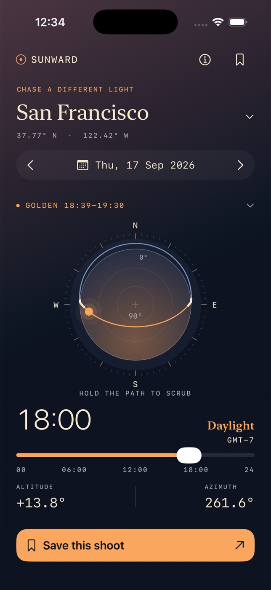

# Sunward



A native, offline iPhone field companion for photographers. Explore the sun's
path, find golden light, and save the moments worth returning to.

## Run

Open `Sunward.xcodeproj`, select the shared **Sunward** scheme and an iPhone
simulator, then Run. No accounts, API keys or runtime dependencies.

Requires Xcode 26.6 / Swift 6 (verified), targets iOS 17+. The committed project
works immediately. To regenerate it: `brew install xcodegen && xcodegen generate`
(verified with XcodeGen 2.46.0). The original procedural icon is reproducible
with `swift Tools/GenerateIcon.swift`.

```sh
xcodebuild -project Sunward.xcodeproj -scheme Sunward \
  -destination 'platform=iOS Simulator,name=iPhone 17 Pro' \
  -derivedDataPath ~/sunward-build build CODE_SIGNING_ALLOWED=NO
xcodebuild -project Sunward.xcodeproj -scheme Sunward \
  -destination 'platform=iOS Simulator,name=iPhone 17 Pro' \
  -derivedDataPath ~/sunward-build test CODE_SIGNING_ALLOWED=NO
xcrun swift format lint --strict --recursive Sources Tests Tools
```

## Use

- Tap the location heading to choose a world city or enter coordinates and
  an explicit IANA civil time zone. No GPS permission is needed.
- Choose a calendar date or move one day with the arrows.
- Hold near the sky path, then drag; or move the time slider to explore the day.
  A ring, caption and light haptic confirm active scrubbing. Ordinary vertical
  swipes scroll the page. North is at the top; east is right. Center is zenith,
  inner disk rim is the horizon. The outer blue band compresses below-horizon
  positions to keep the sun visible throughout the entire day.
- Tap the golden/polar summary above the dial to reveal the daily windows.
- Tap a golden window to move to its midpoint. Altitude and azimuth are
  recomputed for the selected instant.
- Save a shoot with a name and field notes. The bookmark opens saved shoots;
  tap to restore the location, date and time, swipe to edit/delete.
- The field guide explains the diagram, model and limitations.

## Astronomy

Implements [NOAA's solar calculation equations](https://gml.noaa.gov/grad/solcalc/calcdetails.html):
Julian centuries, geometric mean longitude/anomaly, eccentricity, equation of
center, apparent longitude, corrected obliquity, solar declination and equation
of time. UTC and longitude determine local solar hour angle; spherical
trigonometry gives geometric center altitude and azimuth clockwise from true
north. Civil time formatting uses Foundation IANA time zones with DST.

Event times are obtained by sampling the actual civil day every five minutes,
then bisecting threshold crossings 16 times. Sunrise/sunset use −0.833°;
golden windows use −4° to +6°. Blue hour is −6° to −4°. Windows are clipped at
civil midnight, including polar windows; a clipped end is shown as 24:00.
DST days have 23 or 25 hours, with timeline labels derived from actual civil time.
Polar day/night is detected from whether the sun ever crosses the sunrise
threshold; missing events remain absent rather than invented.

## Data and accessibility

The selected plan and user-created shoots persist as Codable data in
UserDefaults. No sample shoots, networking, analytics, GPS or permissions.
Deleting the app removes local data. VoiceOver names controls and provides
15-minute adjustable dial actions. Native text fields, date selection and
slider remain usable without gestures. The app has no essential animation.

## Scope and limitations

An unobstructed sea-level horizon is assumed. Terrain, weather, refraction
variation and observer elevation are not modeled. Planning dates are offered
from 1900–2100; astronomical estimates are not navigation-grade. Very short
grazing events near polar transitions can be missed by five-minute sampling.
There is no map, GPS, cloud sync, export or notification system in V1.
Simulator signing is disabled; physical device signing and App Store
submission require the owner's Apple developer configuration.

## Verification

XCTest covers approximate sun times in both hemispheres and across time zones,
polar day/night, midnight windows, DST day lengths, invalid coordinates, finite
pole calculations, and persistence/edit/delete/date-retention behavior.
Native simulator UI and design iteration evidence is attached to the PR.
