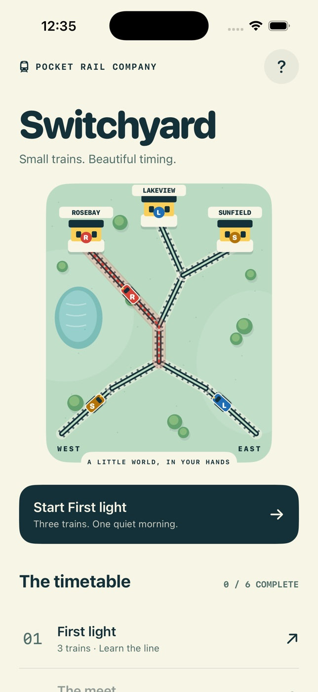

# Switchyard



A native SwiftUI miniature railway dispatch puzzle. Route color-and-letter-coded trains to three stations across six authored shifts. Tap switches A and B, hold/release entrance signals, pause to plan, change speed, and retry. Correct deliveries earn 100 points; completing a shift unlocks the next.

## Run

Requires macOS and Xcode with an iOS 17+ SDK/runtime. No accounts, network, packages or runtime dependencies.

Open `Switchyard.xcodeproj`, select the shared **Switchyard** scheme and an iPhone simulator, then Run.

The committed project is generated from `project.yml`. To regenerate:

```sh
brew install xcodegen
xcodegen generate
```

From this directory:

```sh
xcodebuild -project Switchyard.xcodeproj -scheme Switchyard -sdk iphonesimulator -configuration Debug -derivedDataPath build build CODE_SIGNING_ALLOWED=NO
xcodebuild -project Switchyard.xcodeproj -scheme Switchyard -destination 'platform=iOS Simulator,name=iPhone 17 Pro' -derivedDataPath build test CODE_SIGNING_ALLOWED=NO
xcrun swift-format lint --strict --recursive Sources Tests Scripts
```

Original icon generation: `swift Scripts/GenerateIcon.swift Assets.xcassets/AppIcon.appiconset/AppIcon.png`.

## Controls and data

- **A:** Rosebay (R) or onward to B. **B:** Lakeview (L) or Sunfield (S).
- Dotted, color-coded preview shows the selected route.
- **West / East signals:** stop at the signal, or proceed through the shared merge. East starts on hold.
- Signal queues maintain spacing; trains from opposing entrances can collide at the merge.
- Set switches before a train passes them. Routing is committed at each junction.
- Dispatch guidance identifies committed trains and prepares the next route.
- Home continues the next incomplete shift. Success receipts show each station's deliveries and open the next shift directly.
- Pause allows planning and switch/signal changes. Backgrounding automatically pauses.
- Restart and exit ask for confirmation; cancel leaves the shift safely paused.
- Scores, unlocks and tactile-control preference persist in UserDefaults. Active shifts are session-only.
- The field guide explains play and includes a destructive, confirmed progress reset.

## Accessibility

Native controls have VoiceOver labels and values; trains and stations share letter codes as well as colors. HUD, instructions and navigation support Dynamic Type in scrollable layouts. The compact illustrated board uses fixed geometry with at least 44-point controls. There is no decorative motion, flashing or required audio; essential train motion follows the simulation. iPhone portrait is the focused V1 layout.

Pause and speed stay docked while the board scrolls. At XXXL and accessibility sizes, dispatch guidance moves above the board and the arrivals strip prioritizes the next arrival to avoid compressed captions.

## Scope

Simulator-tested V1; App Store submission, distribution signing, physical-device validation, landscape, iPad-specific layout, and restoration of an unfinished shift are outside this version. Gameplay is visual and requires monitoring train positions; full nonvisual gameplay is not provided.
