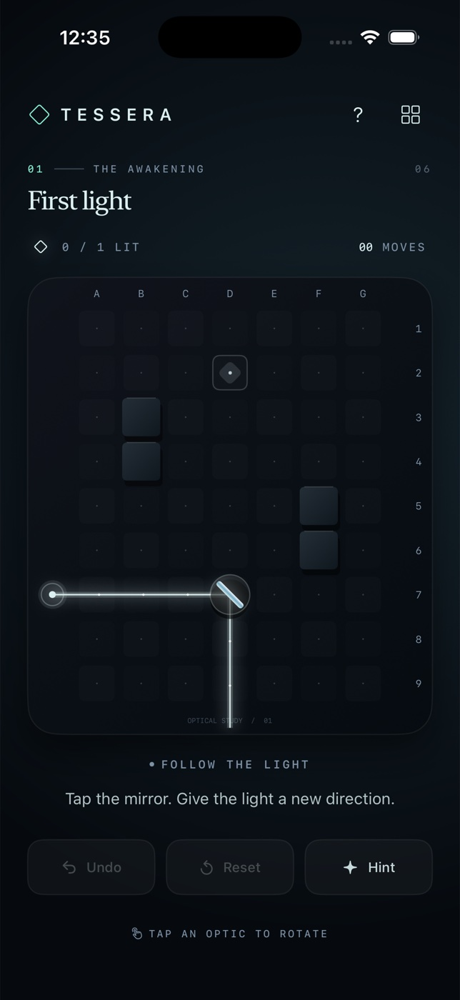

# Tessera



A native iPhone optical puzzle game. Six obsidian chambers become luminous
architectural drawings as you route pearl light through mirrors and RGB prisms.
All artwork is rendered locally with SwiftUI shapes and Canvas; no network,
account, external package, camera, or signing credential is required.

## Build and run

Prerequisites: macOS with full Xcode 26.6 (tested), its command-line tools selected,
and an installed iOS Simulator runtime. The app targets iOS 17+ and iPhone portrait.
Logic tests use the Swift 6 toolchain and run natively on macOS.

```sh
cd tessera
bash scripts/check.sh
bash scripts/build.sh
xcrun simctl list devices available
bash scripts/run.sh <YOUR-IPHONE-SIMULATOR-UDID>
```

Or open `Tessera.xcodeproj`, select the Tessera scheme and an iPhone Simulator,
and Run. The project is already generated and has no generator dependency.
Build output: `build/Build/Products/Debug-iphonesimulator/Tessera.app`.
This is an unsigned **Simulator-only** app, not an App Store/physical-device release.
No repository hooks or shared build configuration are required.

## Play

- Tap a circular mirror pedestal to switch between `/` and `\`.
- Tap a triangular prism to rotate its arrow clockwise through four directions.
- Mirrors reflect all colors through a right angle.
- A prism accepts a ray only when its arrow matches the ray's travel direction.
  Pearl splits into **coral straight**, **jade left**, **azure right**, relative to
  the incoming ray. An already colored ray takes only its matching branch.
- Receivers absorb rays and power only for their exact color. Crossed rays pass
  through one another; walls block them. Power every receiver to clear a chamber.
- **Undo** restores the preceding arrangement. **Reset** restores the initial
  arrangement and is itself undoable. Moves count arrangement edits, including Reset.
- **Hint** explains a route without moving anything. The board's column/row
  coordinates match the hint text.
- The `?` button opens a rules guide. The collection button opens all six chambers;
  clearing a chamber unlocks the next. Cleared chambers can be freely replayed.
- There is no timer or failure penalty; the first two chambers teach reflection
  before the prism and multi-route challenges.

## Bundled chambers

1. **First light** — a single reflection.
2. **Quiet corners** — two reflections around an architectural obstacle.
3. **A hidden spectrum** — directional RGB dispersion.
4. **Chromatic garden** — independently redirect colored branches.
5. **The long way home** — four reflections and a prism.
6. **A perfect resonance** — seven optics and winding color routes.

## Persistence and recovery

The app atomically writes `Documents/tessera-progress.json` in its private sandbox
after each move, undo, reset or navigation. It stores the current chamber, completed
chambers, arrangements and undo history. Invalid JSON falls back to a fresh game;
out-of-range orientations and levels are normalized. Saved history is limited to
the latest 500 entries when loading. Save failures present a retry alert.

There is no export feature in this bounded puzzle V1. The JSON file is a local
save, not a public document. For a completely fresh demo, uninstall and reinstall
the Simulator app (this deletes progress); Reset only resets the current arrangement.

## Verification

```sh
bash scripts/check.sh       # Apple swift-format strict lint, project lint, logic tests
bash scripts/build.sh       # full native iOS Simulator build/typecheck
```

To format edits before checking:

```sh
xcrun swift-format format --in-place --recursive App Sources Tests Package.swift
```

The dependency-free XCTest suite verifies all six exact level solutions, every
essential optic's contribution, prism intake/color separation, reversible reflection,
wrong-color receivers, wall absorption, rotate/undo/reset, save round-trips and
corrupt/out-of-range save recovery. No solution injects a win state: success is
computed from traced rays.

Native UI demo: solve chamber 1, undo to visibly misdirect the beam, restore the
solution, then solve chamber 2 with both mirrors. Open chamber 3, inspect its hint,
rotate its prism to split the beam, and verify collection progress and arrangement
after terminating/relaunching the app. Exercise Reset and Undo on a later chamber.
UI evidence and a report are attached to the PR/session, not committed as binaries.

## Modeling and accessibility scope

The ray tracer is a deterministic, finite, cardinal grid model, not a physical
wave-optics simulation. RGB dispersion is an explicit puzzle rule, not a refractive
index calculation. Mirrors have two orientations, prisms four, and pedestals are
fixed (there is no drag placement). Beam loops terminate via visited ray states.
There is no interference, intensity falloff, mixing, audio, or cloud sync.

Optics and controls have native accessibility labels and identifiers. Receiver
labels include color and powered state; lit receivers also show a checkmark.
The guide explains color rules in text. Reduce Motion pauses traveling beam particles
and removes chamber transitions. Compact iPhone layouts are supported; the game is
portrait-only, and the board itself uses fixed spatial typography.
