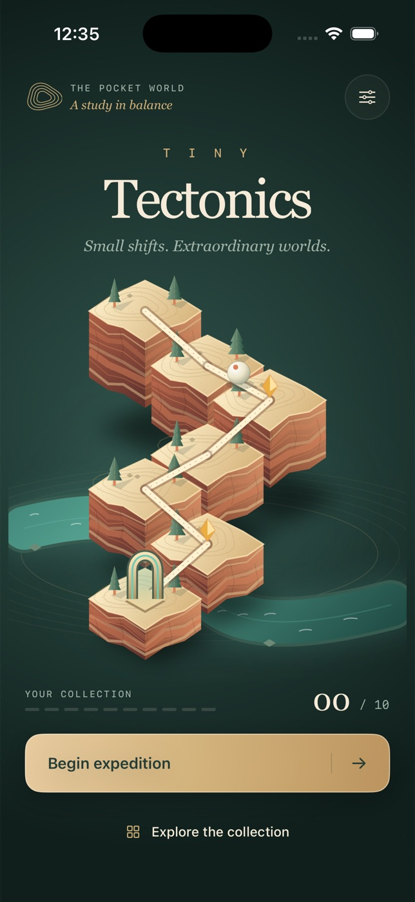

# Tiny Tectonics



A native, offline iPhone game about shaping miniature landscapes. SwiftUI renders
procedural 2.5D terracotta islands, layered cliffs, topographic contours, pines and
turquoise rivers. A midnight-green mineral gallery, brass instruments and engraved
collection cards frame the illuminated landscapes. No web views, accounts,
dependencies or signing credentials.

## Open and run

Open `TinyTectonics.xcodeproj`, choose the shared **TinyTectonics** scheme and an
iPhone simulator, then Run. The checked-in project is ready to use.

Tested toolchain: Xcode 26.6 (17F113), iOS 26.5 runtime, macOS arm64.
Minimum iOS: 17. Portrait iPhone only.

```sh
cd tiny-tectonics
xcodebuild -project TinyTectonics.xcodeproj -scheme TinyTectonics \
  -configuration Debug -sdk iphonesimulator \
  -derivedDataPath DerivedData CODE_SIGNING_ALLOWED=YES CODE_SIGN_IDENTITY=- build
xcodebuild -project TinyTectonics.xcodeproj -scheme TinyTectonics \
  -configuration Release -sdk iphonesimulator \
  -derivedDataPath DerivedData CODE_SIGNING_ALLOWED=YES CODE_SIGN_IDENTITY=- build
xcrun simctl list devices available
xcodebuild -project TinyTectonics.xcodeproj -scheme TinyTectonics \
  -destination 'platform=iOS Simulator,id=YOUR_DEVICE_UUID' \
  -derivedDataPath DerivedData CODE_SIGNING_ALLOWED=YES CODE_SIGN_IDENTITY=- test
xcrun swift-format lint --strict --recursive Sources Tests Tools
```

Simulator builds use a local ad-hoc signature (`-`), which needs no Apple account,
certificate or provisioning profile. This seals the launch storyboard resources
so iOS 26.5 can display the native launch screen. Completely unsigned builds also
compile, but that runtime rejects their launch snapshot resource validation and
shows a black launch transition.

The project can be regenerated with XcodeGen 2.46.0: `xcodegen generate`.
The procedural icon can be regenerated with:

```sh
swift Tools/MakeIcon.swift Assets.xcassets/AppIcon.appiconset/AppIcon.png
```

## Play

Tap a numbered terrain plate, then **Lift** or **Lower**. Every change costs a
move. The ends and occasional interior plates are anchored. Heights range from
0 to 5. The ivory explorer follows the pale trail automatically; it can travel
on level ground or down exactly one layer, never uphill or down a taller cliff.
Copper dotted links and `!` markers indicate unsafe connections.

**Let it roll** simulates the current terrain. Pause/resume or return to editing
at any time. A failed attempt explains the first unsafe link. Retry is free,
undo refunds the last move, and reset restores the puzzle. Level one includes
a contextual one-move tutorial.

Restore all ten authored landscapes in order. Collect amber along the route.
Three stars require the mathematically shortest solution, two permit one extra
shift and one permits two. A dynamic program computes the minimum adjustment
cost under the anchored-height constraints. Best stars and unlocked landscapes
persist in UserDefaults. Native sharing produces a 1200 × 1440 landscape card.

## Accessibility and lifecycle

Interactive controls have labels and stable accessibility identifiers. The
layout respects iPhone safe areas; both smaller and larger phones are reviewed.
Plate lifts respect Reduce Motion. Essential explorer movement remains visible.
Backgrounding pauses a running simulation; returning requires explicit resume.
Closing the app preserves completed progress and haptic preference, not an
unfinished puzzle. The field guide explains rules and permits disabling haptics.

## Scope and limitations

- Deterministic route/slope simulation, not a freeform rigid-body sandbox.
- No audio, daily mode, online services, purchases or leaderboard.
- Haptics require a physical iPhone; simulator testing does not validate their feel.
- Device signing and App Store submission are outside this project.
- No VoiceOver spatial puzzle solver or alternate nonvisual puzzle mode.
- Build outputs and evidence stay outside version control.
