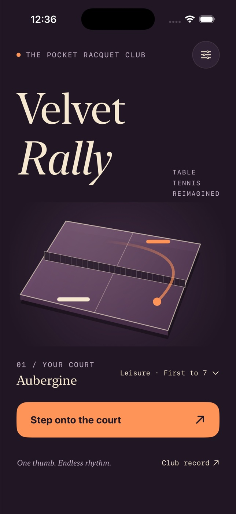

# Velvet Rally



A native, offline iPhone table-tennis arcade, built with SwiftUI and a deterministic Swift physics engine. A cream paddle, a tangerine ball, and two courts under the lights.

## Play

- Choose **Aubergine** or **Clay**, and **Leisure**, **Club**, or **Pro**.
- Classic matches are first to **7**, with no deuce; Sprint is first to **3**.
- Tap **Step onto the court**, then **Serve the first ball**.
- Drag anywhere on the court to move the near cream paddle. Contact near its edges angles your return. Side rails rebound the ball; missing an end awards a point.
- Tap to serve between points. Pause, resume, restart, or leave a match from the top-right control.
- Finished matches save automatically. Retry or inspect **Club record**.

The opponent follows the current ball with a bounded speed, reaction delay and small aiming error. It does not predict the landing point. Rally speed rises gradually to a fixed cap.

## Build and test

Requires macOS and Xcode 15+ (iOS 17+ SDK). Developed with Xcode 26.6 and iOS 26.5 simulators. No runtime dependencies, account, network, or API keys.

Open `VelvetRally.xcodeproj`, choose the shared **VelvetRally** scheme and an iPhone simulator, then Run. Code signing is not required for simulator builds.

```sh
# From velvet-rally
xcodebuild -project VelvetRally.xcodeproj -scheme VelvetRally \
  -destination 'platform=iOS Simulator,name=iPhone 17 Pro' \
  -derivedDataPath build CODE_SIGNING_ALLOWED=NO build

xcodebuild -project VelvetRally.xcodeproj -scheme VelvetRally \
  -destination 'platform=iOS Simulator,name=iPhone 17 Pro' \
  -parallel-testing-enabled NO -derivedDataPath build CODE_SIGNING_ALLOWED=NO test

xcrun swift-format lint --strict --recursive VelvetRally VelvetRallyTests Tools
```

The generated Xcode project is committed. To regenerate it after editing `project.yml`, install XcodeGen (`brew install xcodegen`) then run `xcodegen generate`.

## Data & accessibility

Settings and the most recent 50 completed matches persist locally in UserDefaults. No sample results, analytics, cloud sync, or network data. Unfinished matches are not saved across termination; entering the background pauses the current match. Clearing history requires confirmation and preserves settings.

Controls have VoiceOver labels; text uses scalable system styles where space permits. Reduce Motion removes the moving ball trail. Haptics can be disabled. Essential state is conveyed visually; there is no audio requirement.

At accessibility text sizes, court and match-length options become full-width stacked choices. Both iPhone 17 Pro and the smaller iPhone 17e are included in simulator QA. XCTest should run separately from interactive simulator testing to avoid competing for the same device.

## Scope

Portrait iPhone V1. Arcade side-wall rebounds are intentional, not regulation table tennis. Real-time tracking gameplay requires vision and motor input; menu accessibility does not make this a fully nonvisual game. No multiplayer, audio soundtrack, production signing, physical-device validation, or App Store submission is included.
