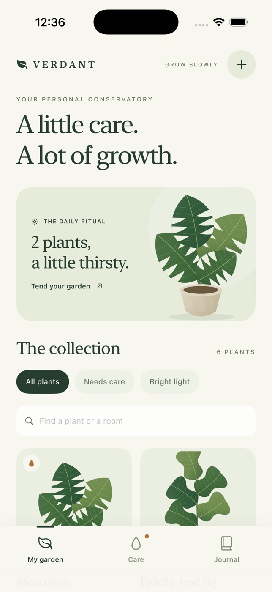

# Verdant



A native iPhone greenhouse journal. Six bespoke, procedural botanical illustrations live in a quiet conservatory of warm paper, olive ink, sage panels, and serif typography. The first launch includes a small established collection with two plants ready for care.

## Prerequisites

- Native macOS with full Xcode selected (`xcode-select -p`).
- Verified with macOS 26.5.2, Xcode 26.6 (17F113), Swift 6.3.3, and the iOS 26.5 iPhone 17 Simulator.
- The app targets iOS 18 or later, **iPhone, portrait**. This V1 is not a tablet layout.
- No package downloads, server, account, camera, signing identity, or project generator.
- Apple's bundled `swift-format`, `simctl`, `plutil`, `xmllint`, and system Ruby are used by the scripts.

All commands below run from `verdant`.

## Build and run

```sh
./scripts/check.sh
./scripts/build.sh
./scripts/run.sh
```

`run.sh` discovers the local iPhone 17 UUID; it does not assume a UUID from another machine. To select another local iPhone Simulator:

```sh
xcrun simctl list devices available
./scripts/run.sh YOUR_IPHONE_SIMULATOR_UUID
```

Or open `Verdant.xcodeproj`, select the shared **Verdant** scheme and an iPhone Simulator, and run. The build product is `build/Build/Products/Debug-iphonesimulator/Verdant.app`. The delivered archive is an **unsigned Simulator-only app**, not an installable iPhone or App Store release.

## Your garden

- **My garden:** all plants, needs-care and bright-light filters; search names, species, or rooms. Tap an illustrated card to open its specimen study.
- **Add (+):** choose one of six species, name your plant, set location/light, choose a 1–60 day watering rhythm, and record the last actual watering date. Swipe the species row to reveal the complete library. Save adds a timeline entry.
- **Care:** due plants ordered by due date, then upcoming reminders. Tap a droplet to water, or a row to open details.
- **Specimen study:** original vector plant art, location, Latin name, light and cadence, contextual care advice, watering, and the growth diary.
- **Edit care plan:** the sliders button changes name, room, light and interval. It does not fabricate a watering event.
- **Water:** records a timestamp and recalculates the next reminder. A second same-day watering is prevented.
- **Undo:** the bottom confirmation bar restores the entire previous change, including due dates and timeline entries. One undo is available and survives a relaunch. After undo, you can repeat the action.
- **Growth diary:** add a real observation of up to 1,000 characters. Blank notes and invalid names/locations cannot be saved.
- **Journal:** a chronological record of watering, arrivals, notes and care-plan changes. The export button writes Markdown and opens the native share sheet.

All six species include distinct artwork and bundled care guidance: Monstera deliciosa, Ficus lyrata, Dracaena trifasciata, Goeppertia orbifolia, Epipremnum aureum and Ficus elastica. The sample timeline is demonstration content, initialized relative to first launch. The samples remain editable and use the same model as new plants.

## Storage and exports

State is atomically saved to the app's `Documents/Verdant/garden.json` after every mutation. The UI commits changes only after a successful write. A read failure preserves the existing file and blocks new writes instead of silently replacing it. This demo does not provide automatic repair of externally corrupted files.

The journal export is a real UTF-8 Markdown file at `Documents/Verdant/verdant-journal.md`. Export it from the Journal share button; Files/Finder document sharing is enabled. Export includes the collection, care settings and actual recorded timeline.

Locate the files on a running Simulator:

```sh
xcrun simctl get_app_container booted ai.devin.demos.verdant data
```

To start over intentionally, uninstall Verdant from the Simulator and reinstall. This deletes the local collection. Routine use should use **Undo** rather than resetting.

## Checks

`scripts/check.sh` runs strict Apple `swift-format` lint, Xcode project plist validation, scheme XML validation, shell syntax checks, and seven dependency-free Swift Testing tests against the production Foundation model. Tests cover:

1. Six species and exactly two initial due plants.
2. Water → due-date change → duplicate prevention → exact undo → repeat.
3. Interval edits that recalculate due state without inventing waterings.
4. Blank/oversized notes, invalid intervals and missing-plant rejection.
5. Add/note/JSON round-trip, persisted undo and Markdown contents.
6. Calendar-day scheduling across daylight-saving boundaries.
7. Corrupt-file detection without overwriting the file.

The native app build typechecks the SwiftUI views and artwork as well as the model.

To format changes before checking:

```sh
xcrun swift-format format --in-place --recursive Sources Tests Package.swift
```

### Native UI acceptance scenario

Use the actual iPhone Simulator with computer input:

1. Explore the initial collection and filters; inspect the six illustrations.
2. Add a named plant, then open it and change room, light and watering interval.
3. Water a due plant; undo and verify its due state and watering history revert; water again.
4. Add an observation, verify the timeline, and verify an empty note cannot be saved.
5. Terminate and relaunch the app; verify the new plant, schedule, note and due state persist.
6. Export the garden journal and verify the actual Markdown contents.

## Modeling boundaries

Care is a configurable **calendar-day reminder**, not a moisture sensor or diagnosis. Defaults are illustrative starting points; soil, pot size, season and local conditions matter. Due status is based on the device's current calendar/time zone. There are no push notifications, cloud sync, photo capture, automatic growth measurements or horticultural guarantees. Changing light does not automatically change cadence. Plant art is a bespoke vector interpretation, not a measured botanical rendering. The interface uses generous touch targets and labels; larger accessibility text sizes and VoiceOver have not been certified.

All app code, tests, scripts and configuration stay inside this directory. Build output, personal Xcode state, screenshots and recordings are intentionally untracked.
