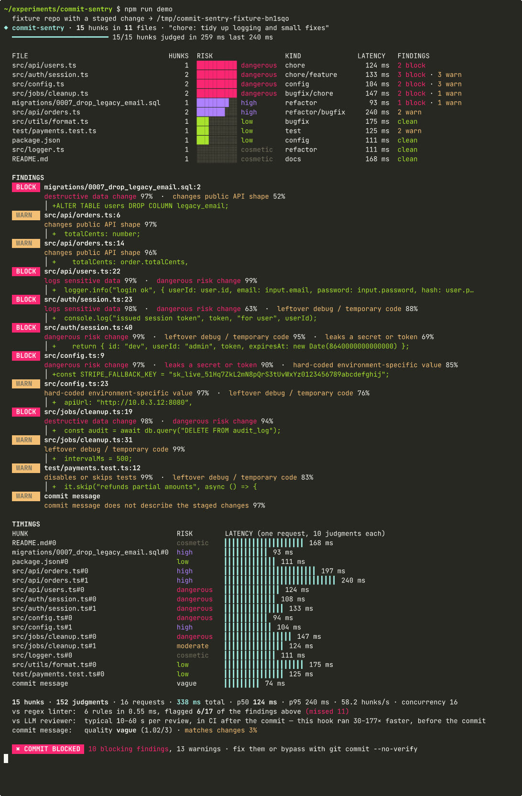

# Commit Sentry

Semantic pre-commit checks that finish in under half a second. Every staged hunk is judged by
[TypeSafe Jev](https://docs.typesafe.ai) in one ~120 ms request, all hunks in parallel, so the hook
can **block** a leaked key, a `DROP COLUMN`, an auth bypass or an unfiltered `DELETE` — and **warn**
about skipped tests, API-shape changes, debug leftovers, hard-coded IPs and a commit message that
doesn't describe the diff — *before* the commit exists.


## The problem

Pre-commit hooks have to be fast or developers `--no-verify` them into oblivion. Linters are fast
but only see syntax: a regex can catch `sk_live_…`, it cannot tell that
`console.log("issued session token", token)` leaks a credential, that `if (token === "letmein")`
bypasses authentication, that renaming `total` → `totalCents` in `OrderResponse` breaks every
client, or that "chore: tidy up logging" is a dishonest description of a schema drop.

LLM code reviewers understand all of that, but they take 10–60 s and run in CI, after the commit
is already on the branch. Jev sits in between: it returns *typed judgments with probabilities*
(no prose to parse), each request answers ten questions about one hunk at once, and the whole
staged diff is judged in roughly one round-trip.

## Measured run (real API, `npm run demo`)

The run recorded above, on a Linux VM, `jev-latest`, concurrency 16:

| Metric | Value |
| --- | --- |
| Staged hunks / files | 15 hunks in 11 files |
| Jev requests | 16 (one per hunk + one for the commit message) |
| Judgments returned | 152 (10 per hunk, 2 for the message) |
| **Total hook time** | **338 ms** (hunk phase 259 ms + message 74 ms + parse/policy) |
| Per-request latency | p50 **124 ms** · p95 240 ms · max 240 ms |
| Throughput | 58 hunks/s |
| Regex "linter" baseline | 6 rules, 0.55 ms — flagged **6 of the 17** findings Jev raised |
| Typical LLM review | 10–60 s, in CI after the commit → **30–177× slower** |

Verdict on the fixture: **COMMIT BLOCKED** — 10 blocking findings, 13 warnings, commit message
"matches changes 3%". The benign hunks (README, dependency bump, local rename, off-by-one fix) came
back `clean` at cosmetic/low risk. Every number on screen is measured with `performance.now()`
around the real request; nothing is simulated (mock mode is labelled in yellow when used).



## How Jev is used

All TypeSafe calls live in [`src/jev.ts`](src/jev.ts). Parsing, thresholds, policy and rendering
are plain code; Jev only supplies the semantic judgment.

**Per hunk — one `systemOne` request**, state `{file, language, change_type, hunk, added_lines}`,
ten independent questions fanned out inside the request:

| id | type | asks |
| --- | --- | --- |
| `risk` | score | cosmetic / low / moderate / high / dangerous — "how much damage if this ships as written" |
| `leaks_secret_or_token` | noul | literal API key / token / password / private key added |
| `logs_sensitive_data` | noul | tokens, passwords, card numbers, personal data written to logs |
| `disables_or_skips_tests` | noul | `it.skip`, `xit`, commented-out or vacuous assertions |
| `destructive_data_change` | noul | `DROP`, `TRUNCATE`, unfiltered `DELETE`/`UPDATE`, irreversible migration |
| `changes_public_api_shape` | noul | renamed/removed response field, changed exported signature or schema |
| `leftover_debug_or_temp` | noul | debug prints, `debugger`, "TODO remove before merge", forced flags |
| `hardcoded_env_specific_value` | noul | internal IP, localhost/staging host, local path, account id |
| `kind` | choice | feature / bugfix / refactor / test / docs / config / chore |
| `offending_line` | choice | which added line (`L1…L12`) is the most concerning, or `none` — used to quote it |

**Then one request for the commit message**, state `{commit_message, changes[]}` where `changes`
is the code-built summary of each hunk (file, Jev's `kind` and `risk`, first added/removed lines):

| id | type | asks |
| --- | --- | --- |
| `message_matches_changes` | noul | does the message honestly and completely describe these changes |
| `message_quality` | score | placeholder / vague / adequate / excellent |

Requests run through `mapWithConcurrency(hunks, 16, …)`; 429/529/5xx get exponential backoff
(honouring `retry-after`). A missing `TYPESAFE_API_KEY` prints a one-line explanation and exits 2.

### Policy (code, [`src/policy.ts`](src/policy.ts))

| finding | reported at | blocks at |
| --- | --- | --- |
| leaks secret / destructive data change | ≥ 50 % | ≥ 70 % |
| logs sensitive data | ≥ 50 % | ≥ 80 % |
| skipped tests, API shape, debug leftovers, hard-coded values | ≥ 50 % | warn only |
| risk score (0–4) | ≥ 2.5 warns | ≥ 3.5 blocks |
| commit message matches changes | < 35 % warns | — |

`--strict` blocks on any finding ≥ 60 %, on high risk (≥ 2.5) and on a mismatched message.

## Run it

```sh
cd commit-sentry
npm ci
export TYPESAFE_API_KEY=...   # never committed; read from process.env only
npm run demo                  # builds the fixture repo in a temp dir, judges it, exits 1 (blocked)
npm run demo -- --strict      # stricter thresholds
npm run demo -- --report      # also writes commit-sentry-report.json
npm run demo:mock             # replays mock/recording.json — labelled MOCK, no API calls
```

Install as hooks in any repository:

```sh
npm run build
cd /path/to/your/repo
npx /path/to/experiments/commit-sentry install          # writes .git/hooks/pre-commit + commit-msg
npx /path/to/experiments/commit-sentry install --strict --command "node /path/to/experiments/commit-sentry/dist/cli.js"
git commit                                              # blocked / warned / allowed in ~300 ms
```

`pre-commit` runs `commit-sentry check --no-message` on the staged diff; `commit-msg` re-runs with
`--message-file` so the message is judged against the same hunks. Bypass with `git commit --no-verify`.

Other commands: `commit-sentry check --cwd <repo> [-m "message"] [--report file]`, `commit-sentry help`.

## The fixture

`npm run demo` programmatically creates a git repo ("ledgerline", 11 files) with a base commit and
a staged change of 15 hunks, all under the message *"chore: tidy up logging and small fixes"*:

- `src/auth/session.ts` — `console.log` of the session token; `if (token === "letmein")` admin bypass
- `src/config.ts` — literal `sk_live_…` Stripe key; `apiUrl: "http://10.0.3.12:8080"`
- `migrations/0007_drop_legacy_email.sql` — new file, `ALTER TABLE users DROP COLUMN legacy_email`
- `src/jobs/cleanup.ts` — `DELETE FROM audit_log` with the `WHERE` removed; `TODO remove before merge` + `intervalMs = 500` + debug print
- `src/api/users.ts` — logs `email`, `password` and `password_hash`
- `src/api/orders.ts` — `OrderResponse.total` → `totalCents`, `currency` removed (2 hunks)
- `test/payments.test.ts` — `it.skip("refunds partial amounts")` "temporarily"
- benign: `README.md` docs, `package.json` version bump, `src/logger.ts` local refactor, `src/utils/format.ts` off-by-one fix

## Development

```sh
npm run typecheck   # tsc --noEmit
npm run lint        # oxlint --deny-warnings src test
npm test            # vitest: diff parser, policy, Jev client (mocked fetch), fixture
npm run build       # tsc → dist/ (the `commit-sentry` bin)
```

Layout: `src/diff.ts` unified-diff parser · `src/jev.ts` TypeSafe client + question builders ·
`src/policy.ts` thresholds & verdict · `src/baseline.ts` regex comparison · `src/run.ts`
orchestration & timing · `src/render.ts` terminal output · `src/fixture.ts` demo repo ·
`src/install.ts` hook writer · `src/mock.ts` labelled replay · `src/cli.ts` entry point.
