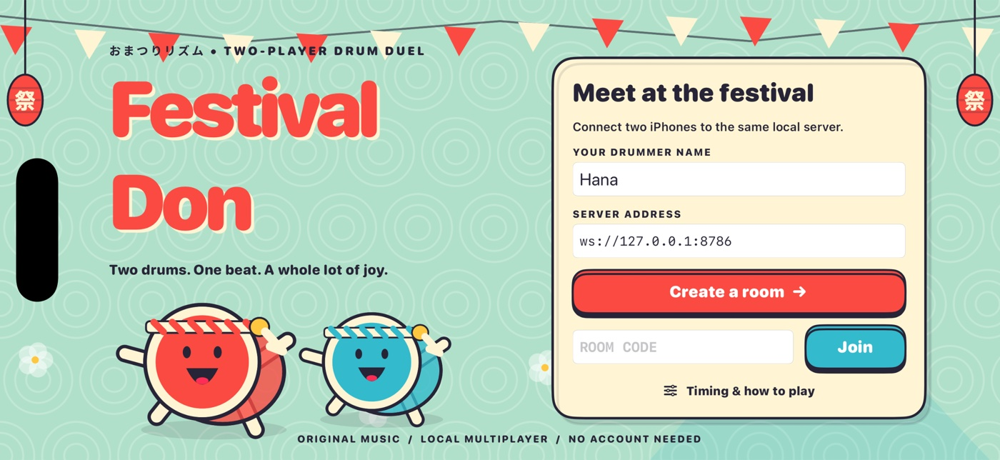

# Festival Don



A native landscape iPhone drum duel: two guests, one shared song clock, red center notes, blue rim notes, two-hand accents and rolling festival percussion. The interface is drawn natively with animated vector drum mascots, patterned festival scenery, two scrolling staffs, a soul gauge, live rival scores and a confetti result screen.

**Bundle ID:** `ai.devin.festivaldon.rhythm`

**Platform:** iOS 17+, landscape iPhone (also scales to iPad).

**Reference:** [Taiko no Tatsujin](docs/REFERENCE.md); original artwork, music, charts and app identity. No ROMs or licensed game assets.

## Build

Validated tooling: macOS 26.5, Xcode 26.6 / iOS 26.5 simulator SDK, XcodeGen 2.46.0, SwiftLint 0.65.1, Node 22+.

```sh
cd festival-don
brew install xcodegen swiftlint  # if missing
npm ci --ignore-scripts
xcodegen generate
xcodebuild -project FestivalDon.xcodeproj -scheme FestivalDon \
  -sdk iphonesimulator -configuration Debug -derivedDataPath build \
  CODE_SIGNING_ALLOWED=NO build
```

The generated Xcode project and all runtime WAV/JSON resources are checked in. You can also open `FestivalDon.xcodeproj` and run on an iPhone simulator without an Apple developer account. A physical device needs your own signing team and provisioning; those are not needed for the simulator.

## Local server and two-device play

```sh
npm start                         # ws://127.0.0.1:8786, binds 0.0.0.0
curl http://127.0.0.1:8786/health
xcrun simctl list devices available
xcrun simctl boot <FIRST_IPHONE_UDID>
xcrun simctl boot <SECOND_IPHONE_UDID>
xcrun simctl install <FIRST_IPHONE_UDID> build/Build/Products/Debug-iphonesimulator/FestivalDon.app
xcrun simctl install <SECOND_IPHONE_UDID> build/Build/Products/Debug-iphonesimulator/FestivalDon.app
xcrun simctl launch <FIRST_IPHONE_UDID> ai.devin.festivaldon.rhythm
xcrun simctl launch <SECOND_IPHONE_UDID> ai.devin.festivaldon.rhythm
open -a Simulator
```

1. Use different guest names. Both simulators use `ws://127.0.0.1:8786`. For physical devices on your LAN, edit the address to `ws://<Mac-LAN-IP>:8786`; permit local-network access when prompted.
2. First player chooses **Create a room**. Enter its six-character code on the other device and choose **Join**. Each connection has its own server-issued player ID.
3. Host chooses **Lantern Parade** (112 BPM, 38 s) or **Moonlit Matsuri** (136 BPM, 46 s), and **Easy** or **Festival**. The preview plays the real bundled song.
4. Both tap **Ready**. A five-second shared countdown schedules both audio players against the same server epoch.
5. Play through the complete chart. The server publishes both scores and a single winner. Both choose **One more song** to rematch, or the host returns to song selection.

### Controls

- Tap either cream **DON** drum center for a red note.
- Tap either blue **KA** rim for a blue note.
- For a big note, tap matching regions on the two drums together (within 75 ms). One hand still awards normal points; a valid pair doubles the award.
- Roll either center or rim during a yellow bar. Each accepted roll strike awards 120 points, with a 35 ms rate floor.
- **GOOD:** ±45 ms. **OK:** ±100 ms. Wrong color / 101–140 ms: BAD. Unplayed notes become MISS after the window plus a network grace period.
- **Timing** opens a saved ±120 ms offset slider and audible eight-tap median calibration. Positive offsets compensate late taps.
- The circular-arrow control reconnects the current guest. Transport interruptions automatically retry; the server preserves identity, score and song clock for rejoining clients.

## Repeatable automation (clearly labelled in the app)

The automated driver emits ordinary `GameClient.hit` inputs, exactly like the UIKit touch surface. It cannot set scores, consume notes, change health or force a result. Hana plays mostly GOOD; Sora deliberately uses later taps and occasional omissions. This is a test input driver, not an opponent AI.

```sh
xcrun simctl launch <FIRST_IPHONE_UDID> ai.devin.festivaldon.rhythm \
  --name Hana --server ws://127.0.0.1:8786 --create --autoplay --auto-ready
# Read the room code shown on the first iPhone (or the JSON "join" server log).
xcrun simctl launch <SECOND_IPHONE_UDID> ai.devin.festivaldon.rhythm \
  --name Sora --server ws://127.0.0.1:8786 --join <CODE> --autoplay --auto-ready
```

Tap the visible **AUTOMATED INPUT DRIVER** banner to pause and validate actual manual touch regions. Launch without `--autoplay` for normal play. Rematches always require both ready actions. `--auto-ready` only readies on initial lobby join.

Capture both simulators **simultaneously**, then compose the complete device displays side by side. Never combine unrelated matches. `simctl io <UDID> recordVideo` captures a device video; it does not capture audio. Preserve the common room/round, server JSON log and each app's `Documents/evidence.jsonl` for machine-readable assertions. A system capture with audio can supplement the device streams.

### External computer-use test (autoplay disabled)

[`scripts/computer_use.py`](scripts/computer_use.py) drives both visible native Simulator windows through Devin's programmatic `tools.computer` API. It clicks Create, Join, Easy, Ready, center/rim drums and rematch. It reads the chart and server log for scheduling and assertions; it sends no WebSocket gameplay inputs itself. Both app instances must launch **without** `--autoplay`, `--auto-ready`, `--create` or `--join`.

This driver requires **Devin's injected `scripted_tools` runtime** with the `computer` and `exec` tools. It is not an ordinary Python command; `devin_tools` is provided only inside that runtime. To reproduce:

1. Build and install the app on two distinct simulators using the commands above. Launch Hana and Sora with only `--name` and `--server`; leave both on Welcome with empty room-code fields.
2. Set `ROOT` to this checkout and `OUT` to a new evidence directory in the script. Create that directory, then start a fresh server whose stdout goes to `OUT/server.log`, for example `npm start > build/computer-use-fb15df3/server.log 2>&1` from this game directory. Do not reuse an active room or truncate a log while the driver runs.
3. Use a 1600×1200 desktop with both Simulator windows in landscape. In the computer tool's **1024×768** space, Hana's content occupies approximately x=14–568/y=77–333; Sora's occupies x=14–568/y=438–696. Confirm each target in `COORDS` with a screenshot and adjust coordinates if the layout differs. The tested devices were iPhone 17 Pro and iPhone 17. The `revision` in the preflight event identifies the recorded app build; update it when testing a different build.
4. Start concurrent device/desktop and live-audio recording if evidence is needed. Paste the **entire script contents inline** into one `scripted_tools` call with `timeout_secs=220`. Do not import or execute this file through another script: the tool broker needs to see its literal SDK calls. Let it finish without competing pointer input or messages to the calling agent; an unsolicited agent message cancelled one recorded attempt.
5. Inspect `sdk-summary.json` and `sdk-actions.jsonl`. `complete: true` or process exit 0 means the procedure completed, **not** that assertions passed. The verdict is `allRequiredChecksPassed`; individual checks retain failed thresholds. Compare delivered inputs against both apps' `manualHit` evidence and shared results.

The completed external test on app revision `fb15df3` used room `974579`, 29 computer calls and two full rounds in 105 seconds. Both real peers scored through UIKit with autoplay disabled: 1500–2000, then 500–1500. **Both round-one scoring thresholds failed** (at least five positive judgments and 2500 points per peer). Each round delivered eight scheduled inputs and skipped six targets; all misses remain in the results. Full computer calls took longer than the spacing between some selected notes. This proves the external input route and shared match/rematch, not accurate full-chart play or 75 ms paired BIG hits.

The evidence bundle linked from the PR preserves the exact recorded script, raw action/native/server logs, failed attempts and report. The committed driver differs from that recorded copy only in comments/docstrings. Its thresholds and executable logic are unchanged.

### Live audio on a macOS VM

Establish a host audio endpoint **before booting the simulators**. This VM initially had no audio devices; the following setup restored real music and drum output without a VM reboot:

```sh
brew install --cask blackhole-2ch
system_profiler SPAudioDataType
# Only if the installed endpoint is still absent, restart CoreAudio once:
sudo -n killall coreaudiod
system_profiler SPAudioDataType
ffmpeg -f avfoundation -list_devices true -i ""
```

Confirm BlackHole 2ch is the default input, output and system output at 48 kHz. If passwordless administration is unavailable, stop and ask the machine owner; do not retry with an interactive password prompt. Shut down and boot only the two target simulators if they started before the endpoint existed. Wait for `xcrun simctl bootstatus <UDID> -b` before launching the app. Accept the visible Simulator/recorder microphone permission prompts when capturing loopback input.

Capture actual loopback PCM concurrently with both device videos. The verified native recorder used an `AVAudioEngine` input tap with `AVAudioTime.hostTime`, `sampleTime`, stored-frame offsets and a host-to-wall-clock anchor. Preserve those timestamps when muxing; a process launch time alone does not locate a video's first frame. Verify each peer independently with the other silent, then record the shared match. Music files may serve as correlation references, never as replacement soundtracks.

Verify both buffer continuity **and the finalized file's stored sample count**. Our raw recorder lost 2,432 termination-tail frames (50.67 ms), although buffer timestamps were contiguous. The complete published match ended 5.20 seconds before stored EOF; nothing was padded or dubbed. Full-decode every final video with `ffmpeg -v error -i <VIDEO> -f null -`; use full decoding/trim for timestamp inspection because fast seeking returned stale frames in the native recordings.

The audio follow-up tested unchanged gameplay revision `df7fea4`: two complete Moon/Easy rounds, independent music from both peers, actual UIKit taps and shared rematch results. Captured music starts were 2.58–13.97 ms after the server epochs (±12 ms measurement uncertainty), and manual percussion followed native input timestamps by 22.56–23.30 ms. The delivered AAC correlated with the actual captured PCM. This establishes real progressing audio and measured rhythm timing, not subjective listening quality or physical-speaker latency.

The recording also exposed transient visual lag: a 180–220 ms rematch countdown delay caught up before playable notes; later sparse samples estimated 106/178 ms lag with ±70 ms video uncertainty. Consistently smooth or frame-perfect visual timing is not established. Recorder teardown timeouts, raw timestamp warnings and the missing raw-audio tail remain documented failures; all published videos fully decode.

## Checks

```sh
npm test                         # timing boundaries, pairs, rolls, anti-replay, misses,
                                 # charts, real socket room/start/rejoin/rematch
npm run lint                     # Node syntax checks
npm audit
swiftlint lint --strict --quiet
xcodebuild -project FestivalDon.xcodeproj -scheme FestivalDon \
  -destination 'platform=iOS Simulator,id=<UDID>' -derivedDataPath build \
  CODE_SIGNING_ALLOWED=NO test
```

UI tests cover welcome validation and calibration controls. The mandatory complete two-iPhone recorded duel is a separate end-to-end run; a build or a protocol test does not establish that result.

Lint the external driver without importing its injected SDK:

```sh
python3 -m venv build/lint-venv
build/lint-venv/bin/python -m pip install --disable-pip-version-check ruff==0.11.13
build/lint-venv/bin/ruff check scripts/computer_use.py
```

`npm run assets` deterministically regenerates the two original music WAVs, center/rim samples, result fanfare and four charts. The fixed bar/phrase chart source is in `server/game.mjs`; the pentatonic melody, bass, taiko accents and shaker arrangement are in `scripts/compose.mjs`.

## Architecture

- **SwiftUI + Canvas:** native layouts, hit feedback, drum-face notes, lane animation, festival print motifs and dancing mascots.
- **UIKit:** independent multi-touch capture for left/right center and rim.
- **AVAudioPlayer:** preloaded effect pools and song playback scheduled using `deviceCurrentTime`, with phase-correct seeking on reconnect.
- **URLSessionWebSocketTask:** guest lifecycle, ping clock samples, ordered input sequence and room snapshots.
- **Node + pinned ws 8.21.3:** authoritative 20 Hz state, deterministic charts, scoring, anti-replay, room capacity, host controls, heartbeat and 120-second empty-room retention. See [protocol](docs/PROTOCOL.md).

## Known boundaries

This is a reference-inspired original game, not a literal pixel-identical arcade port. Exact 2006 cabinet software, score formulas, timing and licensed music were inaccessible; the research document distinguishes observed design from authored choices. Physical hardware latency and two-phone LAN play require device testing beyond simulators. Bluetooth audio is not automatically compensated. Resume tokens live in app memory, so transport reconnect works while a terminated app must join a new room. Server restart loses ephemeral rooms. The guest protocol assumes trusted local play and is not a ranked anti-cheat system or public service. A match continues if a rival disconnects; they can reconnect to the same timeline, and any unplayed notes remain misses. Large Dynamic Type and full nonvisual rhythm gameplay are not implemented.
