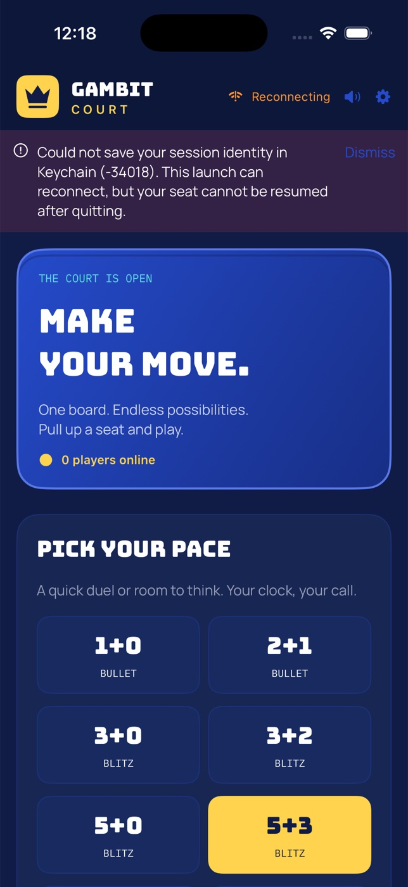

# Gambit Court



Gambit Court is an original online chess game with native SwiftUI applications
for **macOS 14+** and **iOS/iPadOS 17+**. iPhone and iPad share the iOS target
(device families 1 and 2). SwiftUI Canvas draws the original ceramic vector
pieces; there is no Flutter runtime, Dart UI, browser or embedded web content.
The existing pure Dart server and rules/engine package remain authoritative.

```text
gambit-court/
├── apple/
│   ├── GambitCourt.xcodeproj/      checked-in project and shared schemes
│   ├── project.yml                XcodeGen source of truth
│   ├── Sources/CourtApp/           SwiftUI views, Canvas pieces, sound/haptics, Keychain
│   ├── Sources/CourtCore/          Codable protocol, URLSession transport, chess/PGN, state
│   ├── Tests/CourtCoreTests/       model and real-server integration tests
│   ├── Resources/                 original artwork, fonts, OFL licenses, SFX and icons
│   ├── Tools/                     original asset generators
│   └── verify.sh                  native builds, lint and all active tests
├── packages/gambit_court_core/     Dart rules, SAN, PGN, engine and protocol types
├── server/                        authoritative WebSocket server, bots and clocks
├── test/multiplayer-e2e.sh         real backend with native Swift client stores
├── test/historical-flutter/        archived documentation/recording harness
└── PROTOCOL.md                    JSON WebSocket protocol v1
```

## Play

The lobby supports quick pairing (optional bot fallback), public/private rooms,
six-character invite codes, spectators, and four server bot strengths: Novice,
Club, Expert and Master. Choose white, black or random; use bullet, blitz,
rapid or classical presets, a custom clock/increment, or no clock.

Tap a piece then its destination, or drag with mouse/touch. Legal targets,
captures, last move, check, selected squares and queued premoves are shown.
Promotion opens a piece picker. Both players see captured material and clocks.
The first move per side is untimed; the server owns clock deductions,
increments and timeout results. Clients send UCI intent and **do not apply
moves optimistically**. All authoritative FIDE results, including repetition,
insufficient material and the fifty-move rule, remain server responsibilities.

In a game, offer/accept/decline draws or takebacks, resign, review the move list,
export PGN, or rematch with swapped colors in the same room. Import a PGN from
text or file into offline review mode; save, copy or share exported PGN.
The native parser supports FEN starts, SAN, castling, underpromotion, comments
and variations (mainline replay only), and reports the first illegal token.

**Keyboard:** focus the board, then Left/Right browse history; Home/Up go to the
start; End/Down return to live; F flips; Escape clears selection/premove.
macOS also has a Court menu with Command-based equivalents and PGN copy.
Views adapt to resizable desktop windows, iPad multitasking, and iPhone
portrait/landscape with system safe areas and scrollable compact layouts.

Settings retain name, theme, sound, haptics, clock, side, bot level and server URL.
Session identity is stored in the device Keychain with a device-only accessibility
class. Reconnect uses that same identity and the server’s 45-second seat grace;
one transport and one retry timer are active at a time. Retries back off and stop
after six failed attempts. Fatal duplicate-session errors stop reconnecting.
Connection failures, malformed snapshots and rejected intents are visible.

## Build and run

Prerequisites: macOS with Xcode 15+ and Swift 5.9+ for the native clients;
standalone Dart 3.13+ for the backend. Verification here used Xcode 26.6 and Dart
3.13.4. No CocoaPods, Flutter, Node or external Swift packages are needed.
XcodeGen 2.42+ is only needed to regenerate the checked-in project;
SwiftFormat is used for source formatting.

### Server

```sh
cd gambit-court/server
dart pub get
dart run bin/server.dart --host 0.0.0.0 --port 8765
```

Default endpoint: `ws://127.0.0.1:8765/ws`. For a physical iPhone/iPad, enter
`ws://YOUR_MAC_LAN_IP:8765/ws` in Settings and allow local-network access.
Use `wss://` for internet servers. The projects declare local-network purpose
strings and permit arbitrary ATS loads because the endpoint is user-configurable
and development servers use cleartext WebSockets. For a production-only endpoint,
tighten this policy in `project.yml`. The macOS app enables the sandbox, outgoing
networking and user-selected file access.

### macOS

From `gambit-court/apple`:

```sh
open GambitCourt.xcodeproj
# Select GambitCourt-macOS and Run.

xcodebuild -project GambitCourt.xcodeproj -scheme GambitCourt-macOS \
  -configuration Debug -destination 'platform=macOS' \
  -derivedDataPath build/macOS CODE_SIGNING_ALLOWED=NO build
open build/macOS/Build/Products/Debug/GambitCourt.app
```

The unsigned command above validates compilation without an Apple account.
For normal development signing, select your team in Xcode. Distribution and
device deployment require your own Apple signing configuration.

### iPhone and iPad Simulator

```sh
xcodebuild -project GambitCourt.xcodeproj -scheme GambitCourt-iOS \
  -configuration Debug -destination 'generic/platform=iOS Simulator' \
  -derivedDataPath build/iOS CODE_SIGNING_ALLOWED=NO build
```

Select an iPhone or iPad destination with the `GambitCourt-iOS` scheme and Run in
Xcode. To install a built app on an already booted simulator:

```sh
xcrun simctl install booted build/iOS/Build/Products/Debug-iphonesimulator/GambitCourt.app
xcrun simctl launch booted dev.gambitcourt.gambitCourt
```

Both platforms preserve bundle ID `dev.gambitcourt.gambitCourt`. Font registration
and resource loading are native; no Flutter build phases or plugins remain.
After changing `project.yml`, run `xcodegen generate` in `apple/` and commit its
generated project, plists and entitlements together.

### Launch configuration

Native launch arguments or environment variables replace Dart compile-time
defines. Arguments take precedence, then environment, then saved/default values:

| Name | Purpose |
| --- | --- |
| `GC_SERVER` | WebSocket URL |
| `GC_NAME` | Display name |
| `GC_CLIENT_ID` | Optional development identity override; never reuse on live clients |
| `GC_THEME` | `dark`, `light` or `system` |
| `GC_AUTOMATION` | `true` enables the protocol state-report bridge; off by default |

Examples: `--GC_SERVER ws://192.168.1.10:8765/ws --GC_NAME Ada`, or
`--GC_SERVER=ws://192.168.1.10:8765/ws`. Use scheme arguments/environment in Xcode.
For simulator environment injection use `SIMCTL_CHILD_GC_SERVER=... xcrun simctl
launch ...`. The retired web query parameters have no native equivalent.

## Checks

From `gambit-court`:

```sh
# All active checks, including both native builds and a real server:
apple/verify.sh

# Only native model tests (live-server cases explicitly skip without an endpoint):
(cd apple && swift test)

# Starts a separate deterministic Dart server and runs all native tests:
test/multiplayer-e2e.sh
# Override if needed:
# DART=/path/to/dart SERVER_PORT=18766 test/multiplayer-e2e.sh

# Independent backend verification:
(cd packages/gambit_court_core && dart pub get && dart test && dart analyze && dart format --output=none --set-exit-if-changed .)
(cd server && dart pub get && dart test && dart analyze && dart format --output=none --set-exit-if-changed .)

# Native compiler and formatting:
(cd apple && swift build -Xswiftc -strict-concurrency=complete)
(cd apple && swiftformat Sources Tests Package.swift --lint)
```

Native tests cover legal-move reference counts, special moves, SAN/PGN, clock
extrapolation, malformed data, stale snapshot filtering, endpoint validation,
and real multiplayer. Four native client stores replay the complete Opera Game
against the Dart server, checking per-ply convergence, the original expected
SAN/FEN and checkmate, spectator rejection, and PGN round-trip. Other live tests
cover queue/cancel/pair, invalid rooms, server-echo authority, premove, takeback,
resume, draw, rematch, resignation, bots and fatal duplicate identity handling.
The 27 Dart core tests and six server tests are retained unchanged.

**Verification boundary:** compiler/model/protocol tests do not exercise native
mouse/touch hit testing, layout/visual parity, VoiceOver, audible sound, physical
haptics or distribution signing. Those require a separate native UI/device run;
this migration does not claim they were tested. Old Flutter screenshots and the
archived harness are historical evidence only, not proof of native parity.

## Original assets and licenses

The cobalt/midnight palette, sunshine actions, crown, original crown launcher
icons, arena illustration, ceramic piece geometry, WAV effects and Bungee /
Manrope / IBM Plex Mono typography are retained. Fonts and all four SIL OFL
license files (including Fraunces) live in `apple/Resources/fonts/`.
The arena at `apple/Resources/art/arena.png` was generated for this application
and contains no licensed game characters or branding.

The asset generators remain available (generated resources are already checked in):

```sh
python3 apple/Tools/make_sfx.py
# Requires Pillow:
python3 apple/Tools/make_icons.py
```
