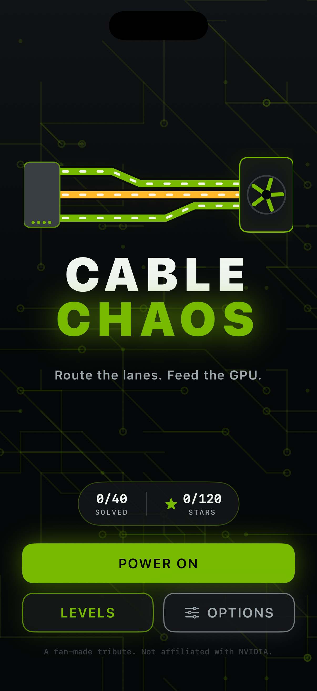
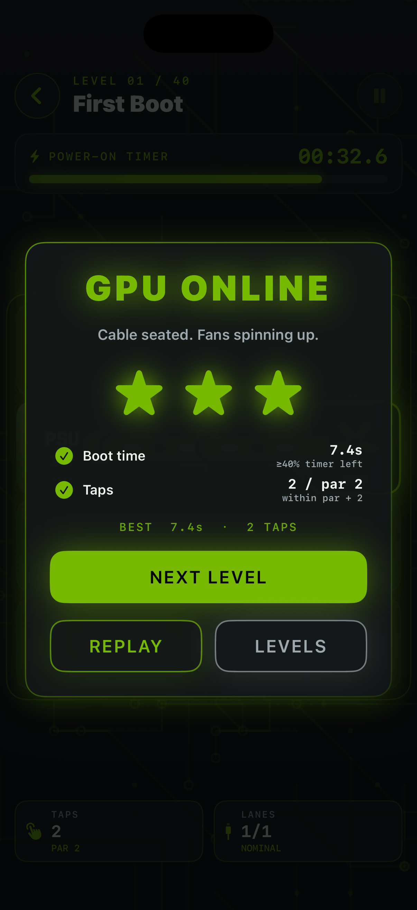
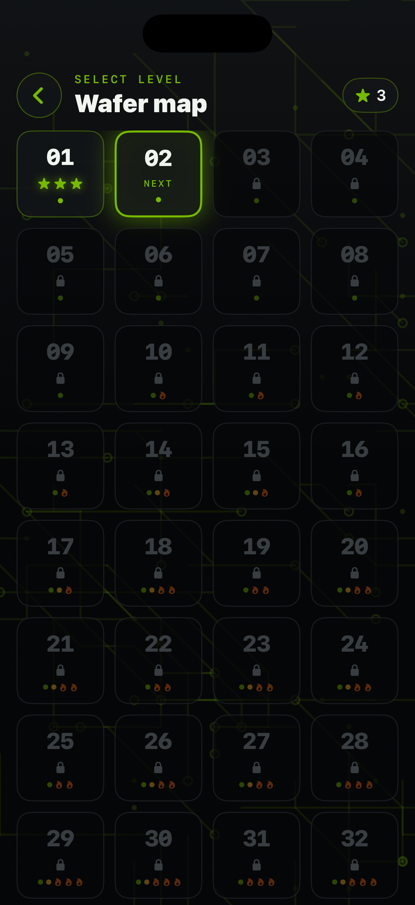
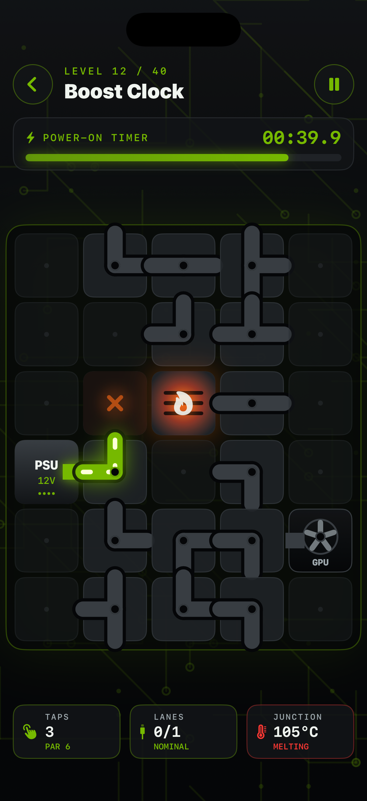
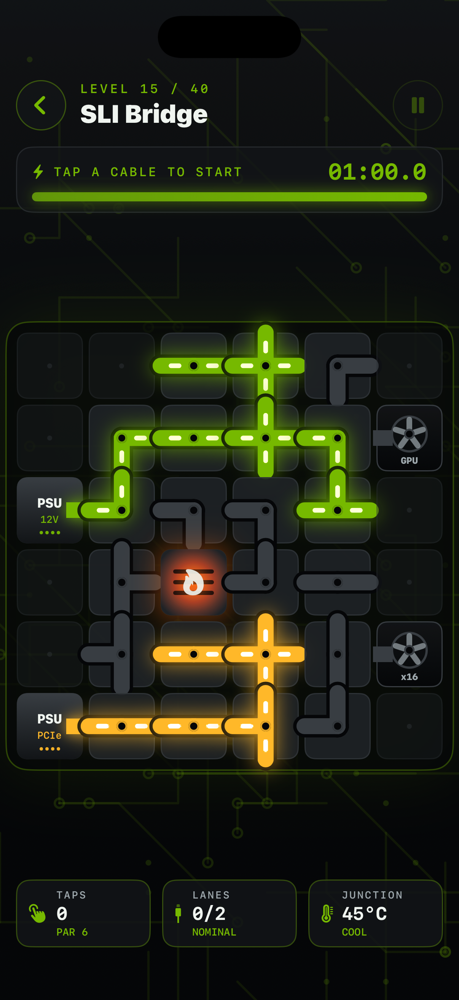
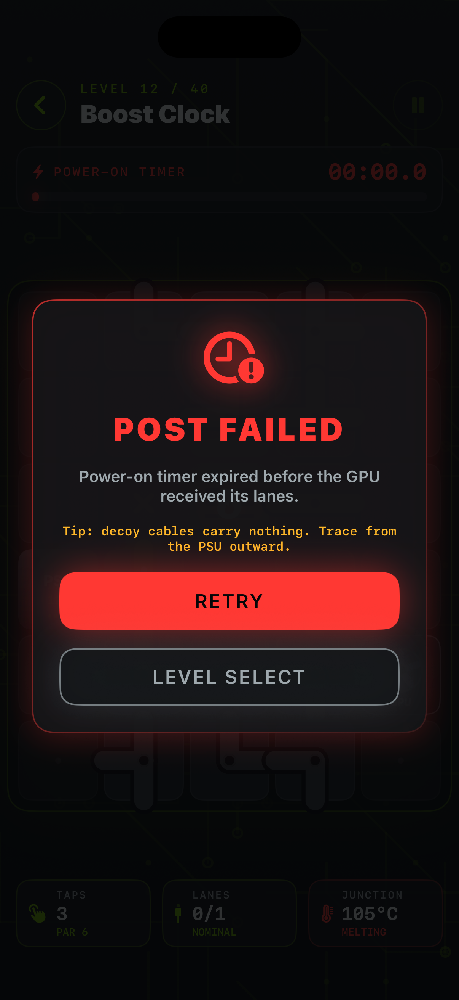

# Cable Chaos

A native, portrait iPhone puzzle game about wiring up a very hungry GPU. Rotate
cable tiles to route **12V power** (green) and **PCIe lanes** (amber) from the PSU
terminals to the GPU before the power-on timer hits zero. Later boards add hot
chips: a powered cable sitting next to one heats up, glows orange, and melts into
slag unless you reroute. Forty levels (eight hand-designed, thirty-two seeded
procedural), three-star ratings, a synthesized boot chime, spinning GPU fans,
haptics and local progress. NVIDIA-*inspired* look — green on charcoal, PCB
traces, CUDA/RTX/DLSS/wafer in-jokes — with no logos, marks or likenesses.
Everything is original procedural art and AVAudioEngine-synthesized sound; the
app makes no network calls and has no third-party dependencies.

## Play

Tap **Power on** to jump into the next unsolved level, or open **Levels** (the
wafer map) to replay any unlocked board for more stars. Tap any cable tile to
rotate it a quarter turn clockwise. Power flows live from every **PSU** terminal
through connected openings; a lane is complete when its **GPU** port lights up
and the fan spins. The first tap starts the power-on timer.

- **Two nets.** Green power and amber PCIe must reach their own GPU ports. A tile
  carrying both nets shorts out (red) and blocks power until you fix it.
- **Heat.** Powered cable next to a hot chip heats up (watch the junction
  temperature in the footer). At 100% it melts into dead slag for the rest of the
  run. Unpowered cable cools down, so lift power off a stressed lane to save it.
- **Stars.** One for booting the GPU, one for finishing with time to spare, one
  for finishing within a couple of taps of par. Best time and taps per level persist, along with
  sound and haptics preferences, in Application Support.
- **Fail states.** Timer at zero, or a melt that severs every remaining route
  to the GPU, ends the run; retry instantly.

Pause with the top-right button. The **Options** sheet on the title screen holds
sound, haptics, a how-to-play card and a confirmed progress reset.

## Build and run

Requirements: macOS, Xcode with an iOS Simulator runtime, XcodeGen (`brew install
xcodegen`). Deployment target iOS 17.0; portrait iPhone. No third-party runtime
dependencies or signing required for Simulator.

```sh
cd ios-cable-chaos
xcodegen generate
xcodebuild -project CableChaos.xcodeproj -scheme CableChaos \
  -sdk iphonesimulator -configuration Debug \
  -derivedDataPath DerivedData CODE_SIGNING_ALLOWED=NO build
```

Open the generated project in Xcode and run **CableChaos** on an iPhone
Simulator. Alternatively install `DerivedData/Build/Products/Debug-iphonesimulator/CableChaos.app`
with `xcrun simctl install booted ...` and launch `studio.cablechaos.game`.
Physical-device distribution requires your own Apple signing configuration.

The checked-in project is generated from `project.yml`. Regenerate it after
changing target configuration. Recreate the original icon with
`swift Scripts/MakeIcon.swift` from this directory.

## Checks

```sh
swift test
xcrun swift-format lint --strict --recursive App Core Tests Scripts Package.swift
```

`Core/` is a pure-Swift package (`CableChaosCore`) with no UIKit or SwiftUI
imports: tile geometry and rotation, board flow tracing with short detection,
heat accumulation/cooling/melting, timer and fail states, a BFS route solver that
derives par, the seeded level generator (self-avoiding random routes, decoys,
hot chips, then scrambled so no net starts pre-routed) and Codable progress.
Tests cover rotation math, deterministic RNG, every catalog level being
deterministic, solvable and not pre-solved, the solver's own route actually
solving generated boards, shorts, timeouts, heat/melt/cool, star scoring and
progress merging. The SwiftUI app renders at 60fps via `TimelineView`, plays
runtime-synthesized cues (click, connect, short, melt, boot chime) and uses
UIKit haptics; the Simulator may log harmless AVAudioEngine device warnings.

## Screenshots

| Title | Solved | Wafer map |
| --- | --- | --- |
|  |  |  |

| Heat | Two nets | Failed |
| --- | --- | --- |
|  |  |  |

Fan-made tribute. Not affiliated with or endorsed by NVIDIA.
