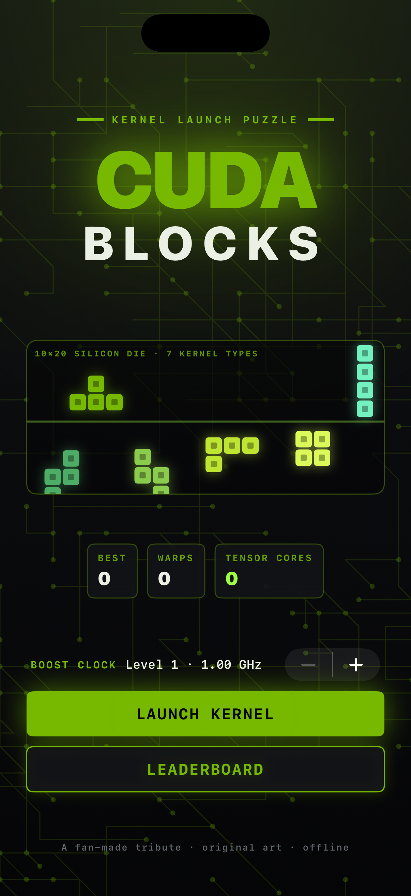
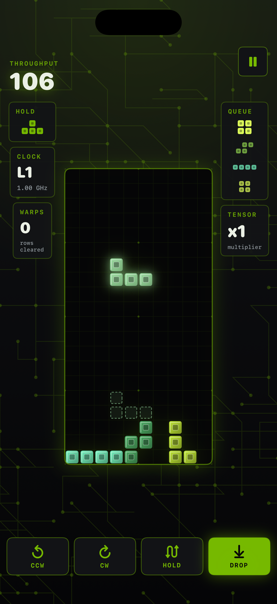
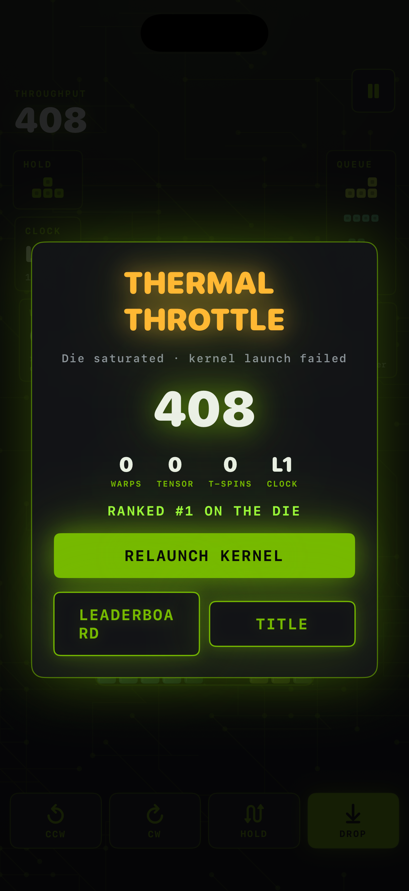
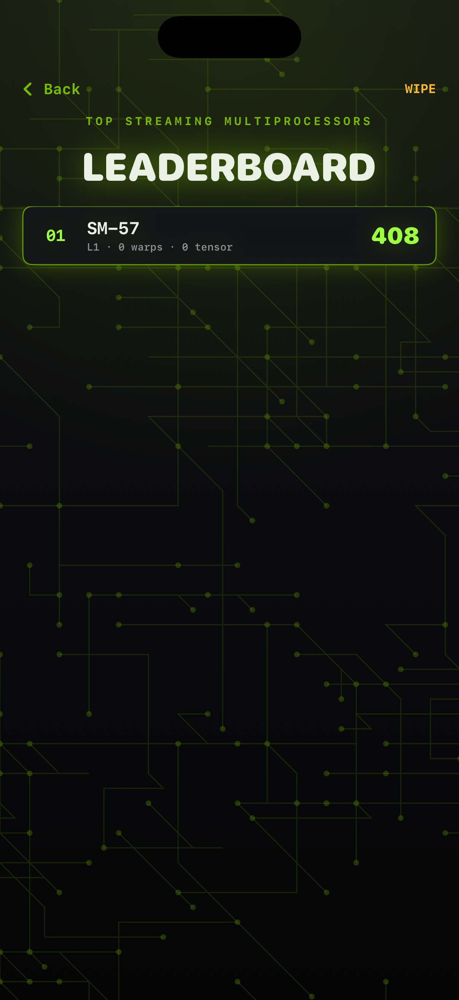

# CUDA Blocks

A native, portrait iPhone falling-block puzzle set on a GPU die. Pack seven
"kernel" tetrominoes into a 10x20 silicon grid; every full row you clear
"dispatches a warp", and clearing four rows at once fires a **Tensor Core**
chain: a green shockwave rips across the die and your score multiplier doubles.
SwiftUI drives the UI, a `Canvas` renders the board and effects at the display's
native refresh rate, and every sound is synthesized live with `AVAudioEngine`.

An NVIDIA-*inspired* fan tribute: signature green (`#76B900`) on black, PCB
traces, neon glow and CUDA/RTX/tensor/fab vocabulary. All art is original and
procedural; no logos, trademarks, likenesses, network calls, accounts or
third-party dependencies.

## Play

Tap **LAUNCH KERNEL**. Set your **BOOST CLOCK** (starting level) first if you
want a faster die.

| Input | Action |
| --- | --- |
| Tap the die | Rotate clockwise |
| Drag left / right | Move the kernel (drag distance = cells) |
| Drag down slowly | Soft drop |
| Flick down | Hard drop |
| Flick up | Hold / swap kernel |
| Buttons | CCW · CW · HOLD · DROP |

Rules follow modern guideline conventions: seven-bag randomizer, SRS rotation
with wall kicks, a dashed **ghost** showing where the kernel lands, a hold slot,
a five-piece queue, lock delay with move resets, and level-up every 10 warps.

Scoring: 1/2/3/4 rows = 100/300/500/800 x level. **T-spins** (full and mini) are
detected from the T's corners and score extra; consecutive difficult clears earn
a back-to-back bonus; combos chain. A four-row **Tensor Core** clear doubles the
multiplier (up to x16); any smaller clear resets it. Emptying the die entirely is
a **Perfect Clear** worth 3000 x level. Topping out is a **Thermal Throttle**.

Persistence: the current run is checkpointed so you can resume after leaving
the app, a local top-10 leaderboard keeps your best Streaming Multiprocessors,
and lifetime warps / Tensor Cores show on the title screen. Sound and haptics
toggle from the pause menu.

## Build and run

Requirements: macOS, Xcode with an iOS Simulator runtime, XcodeGen
(`brew install xcodegen`). Deployment target iOS 17.0; portrait iPhone. No
third-party runtime dependencies or signing required for Simulator.

```sh
cd ios-cuda-blocks
xcodegen generate
xcodebuild -project CudaBlocks.xcodeproj -scheme CudaBlocks \
  -sdk iphonesimulator -configuration Debug \
  -derivedDataPath DerivedData CODE_SIGNING_ALLOWED=NO build
xcrun simctl install booted DerivedData/Build/Products/Debug-iphonesimulator/CudaBlocks.app
xcrun simctl launch booted studio.cudablocks.game
```

`Scripts/run.sh` does all of the above against the booted Simulator. The
checked-in project is generated from `project.yml`; regenerate it after changing
target configuration. Recreate the original icon with `swift Scripts/MakeIcon.swift`
from this directory.

## Checks

```sh
swift test
xcrun swift-format lint --strict --recursive App Core Tests Scripts Package.swift
```

The pure-Swift `Core` module (`CudaBlocksCore`) has no UIKit dependency and is
covered by 28 tests: tetromino geometry and rotation, board bounds/locking/row
clearing, deterministic seeded seven-bag, gravity and lock delay, wall kicks,
ghost placement, hold rules, scoring for singles, Tensor Cores, T-spins,
back-to-back, combos and perfect clears, level progression, game over, state
round-tripping through `Codable`, and leaderboard ranking / qualification.

## Screenshots

| Title | Gameplay | Thermal Throttle | Leaderboard |
| --- | --- | --- | --- |
|  |  |  |  |
