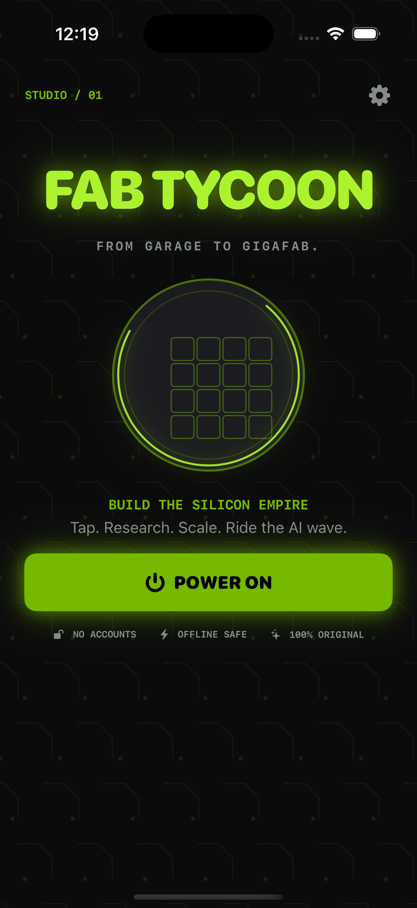
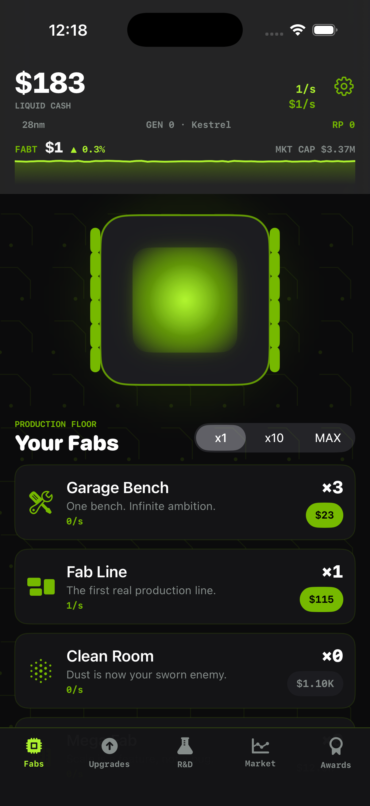
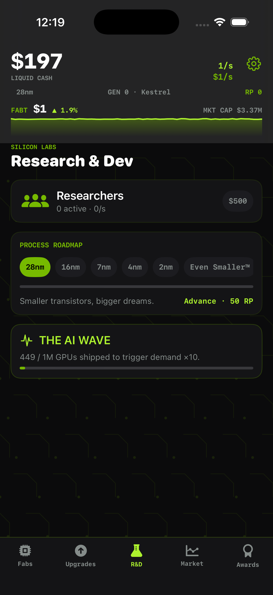
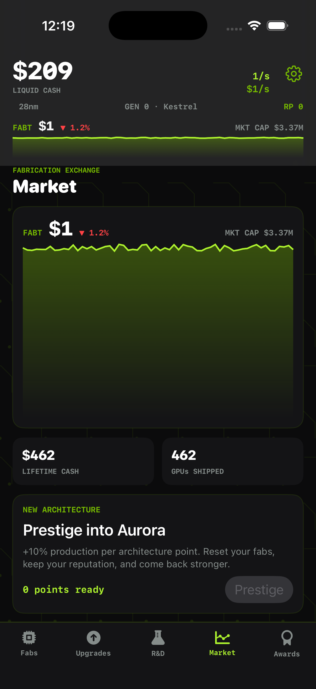
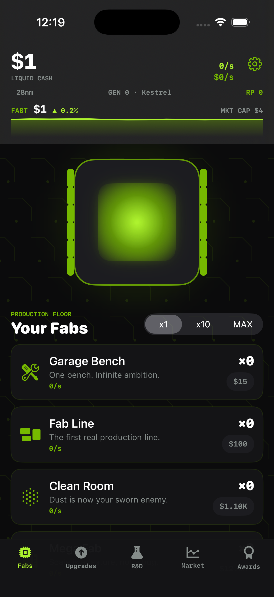
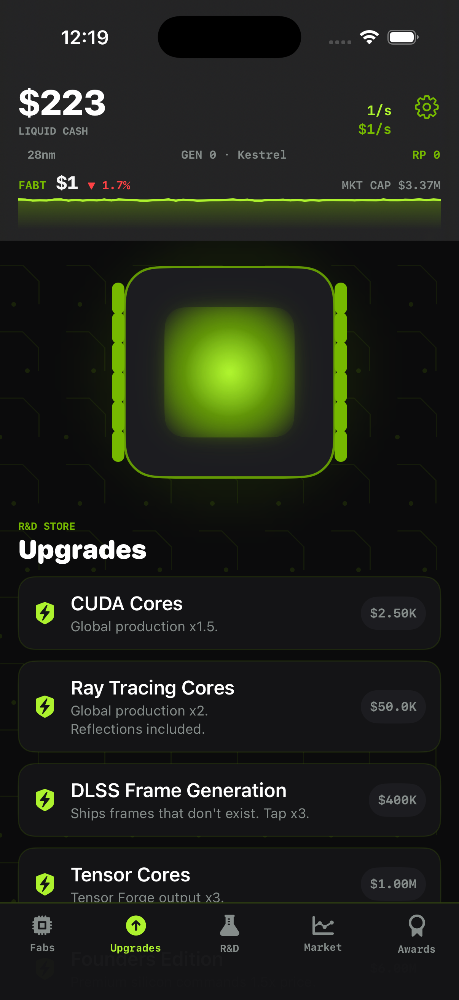

# Fab Tycoon

A polished native idle/clicker game about building a silicon empire from one
garage bench to an orbital foundry. Tap GPUs, automate production, research
smaller process nodes, ride the AI wave, and prestige into a new architecture.
SwiftUI renders the neon fab floor and procedural PCB texture; the rules engine
is a pure Foundation module with deterministic tests. No accounts, network
services, third-party dependencies, bundled audio, or bundled artwork.

## Play

Tap the glowing die to ship GPUs and earn cash. Buy fabs to automate production,
then invest in upgrades, researchers, and process nodes. Batch-buy production
with x10 or MAX while geometric fab costs climb. The HUD ticker shows FABT's
live price, movement, sparkline, and market cap while your fabs run.

Research smaller process nodes from 28nm to Even Smaller™, then ship one million
GPUs to trigger **THE AI WAVE**, which multiplies demand by ten. The Market tab
tracks FABT and offers **New Architecture** prestige runs: reset your floor for
lasting architecture points and a stronger production multiplier. Leave the app
for at least ten seconds and offline earnings return at 50% efficiency, capped
at eight hours. Awards celebrate taps, shipments, buildings, research, market
cap, the AI wave, and prestige.

## Build and run

Requirements: macOS, Xcode with an iOS 17 Simulator runtime, and XcodeGen
(`brew install xcodegen`). The game is portrait-only and needs no signing for
Simulator builds.

```sh
cd ios-fab-tycoon
swift Scripts/MakeIcon.swift
xcodegen generate
xcodebuild -project FabTycoon.xcodeproj -scheme FabTycoon \
  -sdk iphonesimulator -configuration Debug \
  -derivedDataPath DerivedData CODE_SIGNING_ALLOWED=NO build
```

Install the resulting `DerivedData/Build/Products/Debug-iphonesimulator/FabTycoon.app`
on a booted iPhone Simulator, or open `FabTycoon.xcodeproj` in Xcode. The
generated project is checked in and comes from `project.yml`.

## Checks

```sh
swift test
xcrun swift-format lint --strict --recursive App Core Tests Scripts Package.swift
```

The core tests cover formatting, compounding and batch costs, tapping,
production, upgrade effects, researchers, research nodes, the AI wave, prestige
resets and persistence, offline earnings and caps, achievements, stock history
bounds, deterministic market noise, and Codable saves.

## Screenshots












