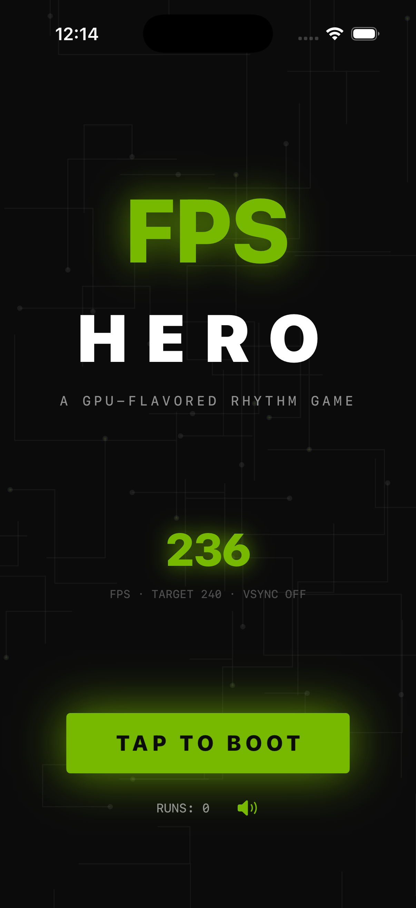
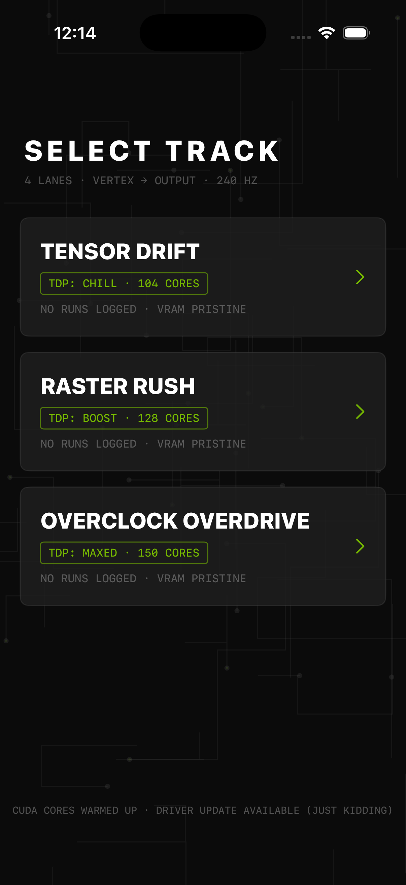
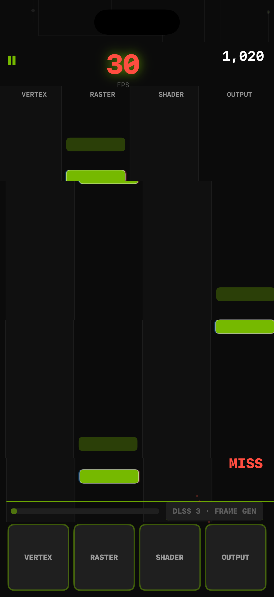
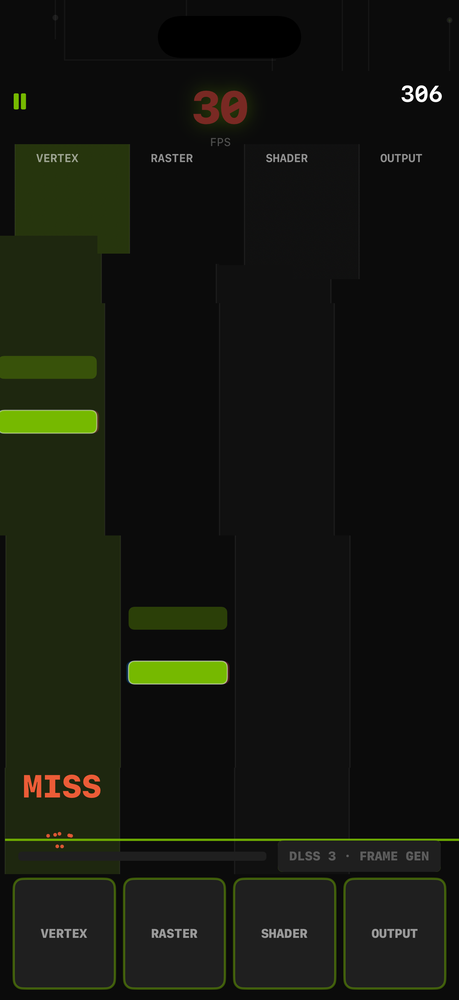
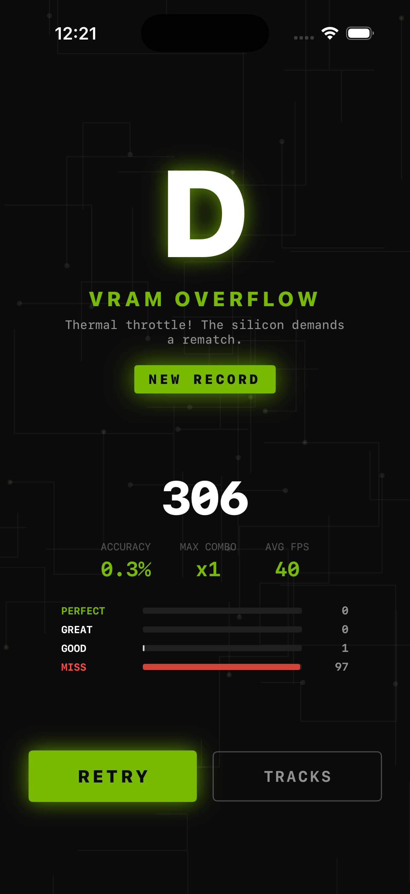

# FPS Hero

A native, portrait iPhone rhythm game with a GPU flavor: notes fly down four
shader-pipeline lanes — VERTEX, RASTER, SHADER, OUTPUT — and you tap to "render
frames" in time with a synthesized synthwave track. SwiftUI draws every screen
on Canvas; AVAudioEngine synthesizes all music and hit sounds in real time from
the track data, so the app ships with zero audio or art assets. Everything is
original procedural art — a loving fan homage with no NVIDIA logos, eye marks
or likenesses — and there are no accounts, servers or network calls.

## Play

Tap **TAP TO BOOT**, pick a track, and hit lane pads as each glowing bar reaches
the hit line. Judgments are **PERFECT ±45ms**, **GREAT ±90ms**, **GOOD ±140ms**;
later than that the note misses. Your **FPS is the life meter**: perfect hits
push it back toward **240** while misses drop it 45 at a time down to **30** —
and the lower it gets, the more the screen literally stutters: quantized frame
rate, horizontal tearing bands, ghost frames, chromatic split and a flickering
counter. Gameplay logic always runs on true time; only the visuals lag.

Perfect and great hits charge **DLSS 3 · FRAME GEN**. At full charge, tap it for
four seconds of frame generation: every note reaching the line auto-judges
PERFECT under a green scanline overlay.

Three tracks: **Tensor Drift** (104 BPM, 60s, chill), **Raster Rush** (128 BPM,
75s, medium) and **Overclock Overdrive** (150 BPM, 90s, hard, with 2-lane
chords). Finishing a run grades accuracy **S "RTX ON"** through **D "VRAM
OVERFLOW"** with stats, judgment breakdown and a NEW RECORD badge. Best scores,
run count and sound/haptic preferences persist locally. Pause with the
top-left button; leaving the foreground pauses the run.

## Build and run

Requirements: macOS, Xcode with an iOS Simulator runtime, XcodeGen (`brew install
xcodegen`). Deployment target iOS 17.0; portrait iPhone. No third-party runtime
dependencies or signing required for Simulator.

```sh
cd ios-fps-hero
xcodegen generate
xcodebuild -project FPSHero.xcodeproj -scheme FPSHero \
  -sdk iphonesimulator -configuration Debug \
  -derivedDataPath DerivedData CODE_SIGNING_ALLOWED=NO build
```

Open the generated project in Xcode and run **FPSHero** on an iPhone
Simulator. Alternatively install `DerivedData/Build/Products/Debug-iphonesimulator/FPSHero.app`
with `xcrun simctl install booted ...` and launch `studio.fpshero.game`.
Physical-device distribution requires your own Apple signing configuration.

The checked-in project is generated from `project.yml`. Regenerate it after
changing target configuration. Recreate the original icon with
`swift Scripts/MakeIcon.swift` from this directory.

## Checks

```sh
swift test
xcrun swift-format lint --strict --recursive App Core Tests Scripts Package.swift
```

The 14 tests exercise the pure-Foundation rules in `Core`: chart determinism
per seed, per-lane spacing, duration bounds and chord size, judgment window
boundaries, the combo score multiplier, FPS clamping and the 30 FPS floor,
nearest-note tap selection and whiffs, DLSS charge fill, the 4-second auto-hit
window and its expiry, the finish event at track end, grade thresholds, and
accuracy / average-FPS accounting.

## Screenshots






