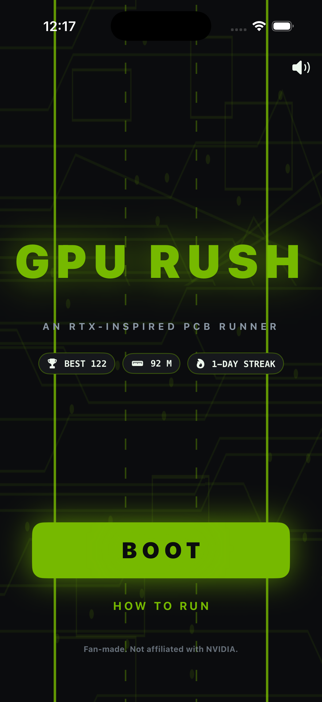
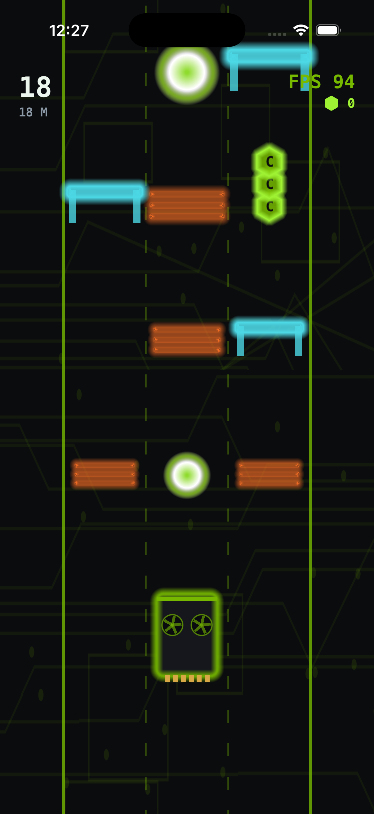
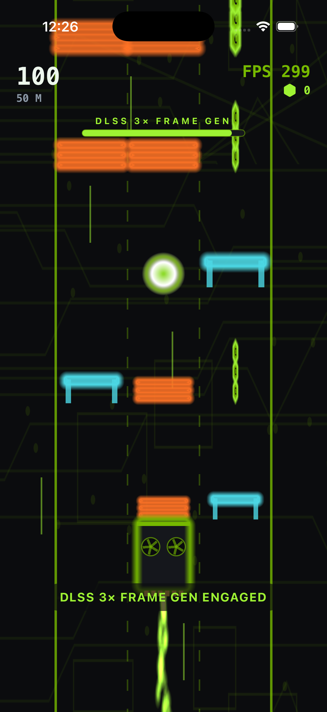
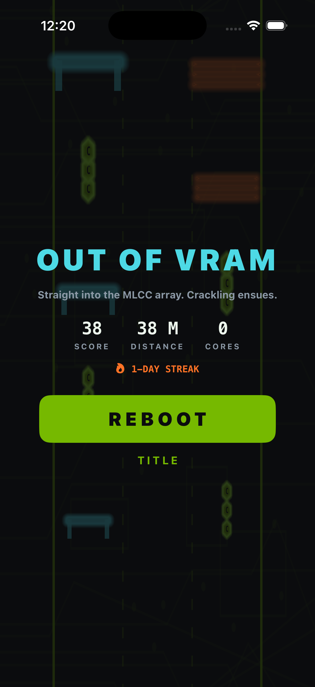

# GPU Rush

A native, portrait iPhone endless runner where you are the graphics card.
SwiftUI presents the title, HUD and results; SpriteKit renders a glowing PCB
highway. Original procedural art and a synthesized soundtrack require no
assets or services from the network. Fan-made; not affiliated with NVIDIA.

## Play

Tap **BOOT** and your card drops onto the highway. Swipe left/right to change
PCIe lanes, swipe up or tap to jump **heat waves**, and swipe down to slide
under **capacitor bars**. Collect CUDA-core chips for score and grab a DLSS
orb to triple your frame rate — and double your score — for five seconds.
Every 500 m earns a milestone. Best score, best distance, total runs, streak
and audio preference persist locally. Leaving the foreground pauses the run;
runs are not checkpointed across termination. No accounts or leaderboards.

## Build and run

Requirements: macOS, Xcode with an iOS Simulator runtime, XcodeGen (`brew install
xcodegen`). Deployment target iOS 17.0; portrait iPhone. No third-party runtime
dependencies or signing required for Simulator.

```sh
cd ios-gpu-rush
xcodegen generate
xcodebuild -project GPURush.xcodeproj -scheme GPURush \
  -sdk iphonesimulator -configuration Debug \
  -derivedDataPath DerivedData CODE_SIGNING_ALLOWED=NO build
```

Open the generated project in Xcode and run **GPURush** on an iPhone
Simulator. Alternatively install `DerivedData/Build/Products/Debug-iphonesimulator/GPURush.app`
with `xcrun simctl install booted ...` and launch `studio.gpurush.game`.
Physical-device distribution requires your own Apple signing configuration.

The checked-in project is generated from `project.yml`. Regenerate it after
changing target configuration. Recreate the original icon with
`swift Scripts/MakeIcon.swift` from this directory.

## Checks

```sh
swift test
xcrun swift-format lint --strict --recursive App Core Tests Scripts Package.swift
```

Tests cover bounded lane movement, monotonic speed ramp to cap, DLSS orb
activation/expiry, crash and dodge rules for both obstacle kinds, coin scoring
and the DLSS score multiplier, spawn fairness across 20 seeds (a row never
blocks all three lanes), deterministic simulation for a fixed seed, streak
bookkeeping, and the FPS counter. The simulation is pure Foundation and runs
under `swift test` on macOS; production uses a fresh random seed each run.
Rendering and rules use elapsed frame deltas capped at 50 ms.

Accessibility: named buttons, readable HUD, sound toggle, and screen shake is
disabled under Reduce Motion. Real-time dodging requires visual tracking and
touch input; a full VoiceOver gameplay mode is outside this V1.

## Screenshots





