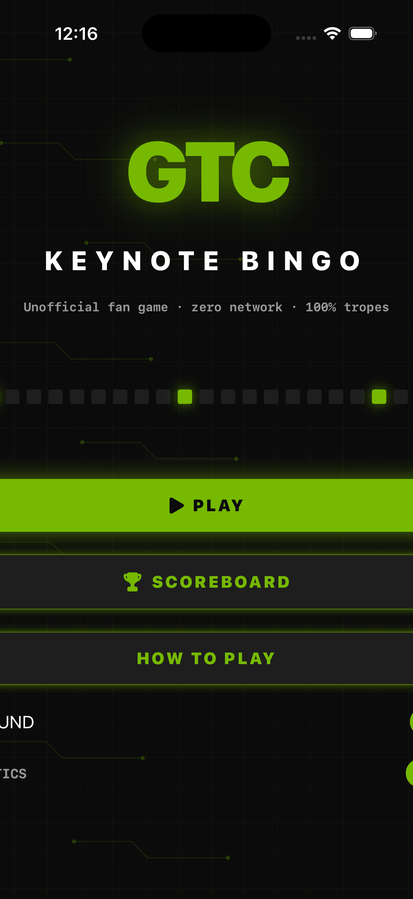
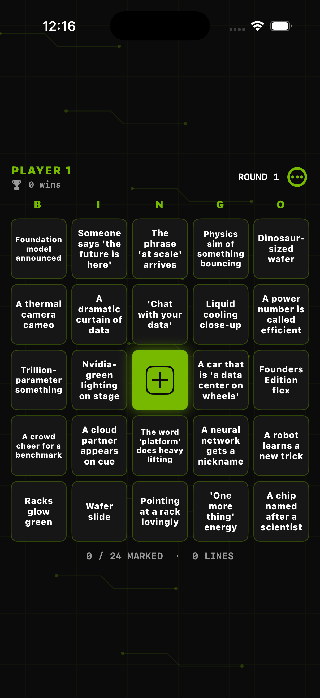
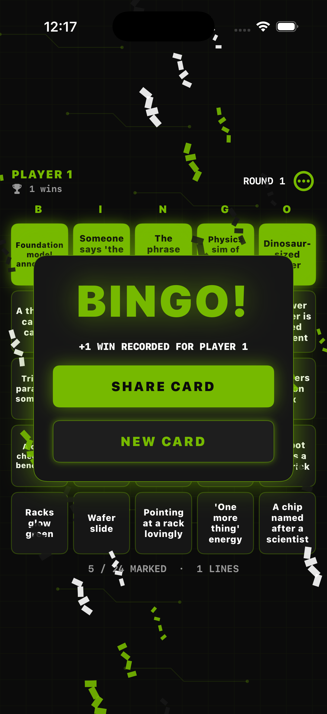
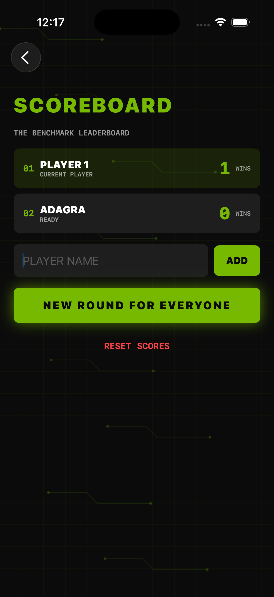

# GTC Keynote Bingo

GTC Keynote Bingo is an offline party game for watching a GPU keynote together.
Mark the tropes as they happen, pass the phone around, and call BINGO when a row,
column, or diagonal fills up. It is a native portrait iPhone app with deterministic
pure-Swift rules, local persistence, generated art, haptics, and an entirely
offline sound engine.

## Play

Tap **PLAY**, then mark a tile whenever the keynote delivers its matching GPU
moment. The center GPU free space is pre-marked. Complete any row, column, or
diagonal to record a win. Add up to six players from **SCOREBOARD**, pass the phone
between turns, and use **SHARE** to send a rendered card.

The game includes optional sound and haptics, fresh cards, round resets, a local
leaderboard, and a short how-to-play sheet. No account, network connection, or
third-party service is required.

## Build and run

Requirements: macOS, Xcode with an iOS 17.0 Simulator runtime, and XcodeGen
(`brew install xcodegen`). Signing is disabled for Simulator builds.

```sh
cd ios-gtc-bingo
xcodegen generate
xcodebuild -project GTCBingo.xcodeproj -scheme GTCBingo \
  -sdk iphonesimulator -configuration Debug \
  -derivedDataPath DerivedData CODE_SIGNING_ALLOWED=NO build
```

Install the generated app on a booted Simulator:

```sh
xcrun simctl install booted DerivedData/Build/Products/Debug-iphonesimulator/GTCBingo.app
xcrun simctl launch booted studio.gtcbingo.game
```

Recreate the generated icon with `swift Scripts/MakeIcon.swift` from this
directory. `GTCBingo.xcodeproj` is generated from `project.yml` and committed so
the app can be opened directly in Xcode.

## Checks

```sh
swift test
xcrun swift-format lint --strict --recursive App Core Tests Scripts Package.swift
```

The Core test suite covers the 64+ trope deck, uniqueness, seeded cards, all
twelve bingo lines, center behavior, one-away detection, player limits and
navigation, rounds, leaderboard ordering, and Codable persistence.

## Screenshots









## Branding

GTC Bingo is an NVIDIA-inspired fan app using green-on-charcoal GPU vocabulary.
It is unofficial and contains no NVIDIA logos, eye marks, likenesses, or branded
images. The only bundled image is the procedurally generated app icon.
