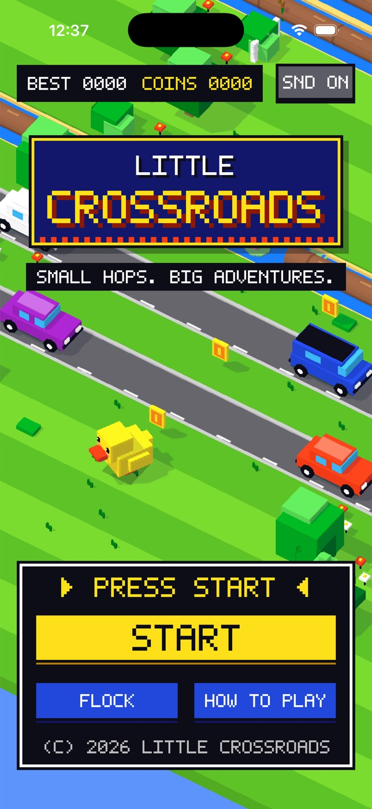

# Little Crossroads



A native iPhone hopping game built with SwiftUI and SceneKit. Guide an original tiny duck through a saturated, blocky 8-bit-style countryside: dodge traffic, ride moving logs, collect coins and welcome three additional companions.

The presentation follows classic console conventions: an original 5x7 bitmap typeface (`Sources/PixelFont.swift`) for every label, a monospaced sans-serif system font for body copy (no serif fonts anywhere), a limited saturated palette, chunky outlined panels with offset block shadows, a D-pad plus A-button control cluster, and frame-stepped animation for coins, ripples, logs and the hop arc. The SceneKit view renders without antialiasing at a reduced content scale so the world reads as crisp pixels.

## Build

Requires macOS, Xcode 15 or newer with an iOS Simulator runtime, and XcodeGen. The deployment target is iOS 17. No dependencies, account, server, or signing credentials are needed for Simulator play.

```sh
brew install xcodegen swiftformat
cd ios-little-crossroads
xcodegen generate
xcodebuild -project LittleCrossroads.xcodeproj -scheme LittleCrossroads \
  -sdk iphonesimulator -configuration Debug \
  -derivedDataPath build CODE_SIGNING_ALLOWED=NO build
```

Open `LittleCrossroads.xcodeproj`, select an iPhone simulator, and Run. The generated project is included; `project.yml` is the source of truth.

## Checks

```sh
swiftformat Sources Tests Scripts Package.swift --lint
swift test
```

The pure Swift gameplay suite checks score/coin deduplication, pause invariants, boundaries, traffic collisions, moving-log support, deterministic generation over 50,000 lane samples, safe rest-lane spacing and cosmetic progression. No tests set a manufactured player score.

Regenerate the original icon:

```sh
swift Scripts/GenerateIcon.swift Resources/Assets.xcassets/AppIcon.appiconset/AppIcon.png
```

## Autopilot (debug input driver)

`Scripts/Autopilot.swift` plays the visible app in the iOS Simulator with real mouse clicks on the on-screen D-pad and A button, so long runs can be demonstrated and recorded. It never touches the app, its save data or its rules: the app only broadcasts its live run state over UDP when launched with `-telemetryPort <port>` (`Sources/Telemetry.swift`; disabled otherwise), and the driver re-runs the same lane maths to pick a survivable hop.

```sh
xcrun simctl launch booted com.littlecrossroads.game -telemetryPort 47400
swiftc -O Scripts/Autopilot.swift -o /tmp/autopilot
/tmp/autopilot --port 47400 --target 100 --stop-at 120 --minutes 10
```

The Simulator window must be visible with device bezels hidden (Window > Show Device Bezels off). `--stop-at` pauses and quits the run once that many hops are banked so the result screen and saved best reflect the run; omit it to play until the time budget ends.

## Play

- Tap **Let's hop**, then tap the countryside or **HOP** to move one row forward.
- Swipe in any direction or use the on-screen directional controls. **Step back** moves one row back.
- Wait on grass for a gap. Cars and floating logs move continuously, but there is no idle countdown.
- Land on the solid portion of a log to cross water. Logs carry the duck sideways; jump off before drifting beyond the bank.
- Score is the furthest safely landed row. Repeating rows cannot earn more points or duplicate coins.
- The first two road lanes are separated by grassy rest areas. The first river appears on row six. Later sections have at most two consecutive hazards.
- Coins and best scores unlock Peppermint (4 lifetime coins or 8 hops), Blossom (12 coins or 18 hops), and Midnight (24 coins or 35 hops). Coins are never spent.
- Pause freezes hops, cars, logs and the camera's game target. Leaving the app automatically pauses. Return and explicitly resume.
- A collision ends the run immediately. **One more hop** starts a fresh normal random course.
- Best, lifetime coins, selected companion and sound preference persist locally via UserDefaults. There is no global leaderboard.
- The native Share action shares your actual achieved score as text.

## Design and constraints

All toy geometry, icon artwork and synthesized sound cues are original and generated locally. No third-party IP assets or network access are used. Reduced Motion disables nonessential coin and button animations; movement needed to play remains visible. Haptics depend on physical device support.

Portrait iPhone V1; no landscape, iPad-specific layouts, cloud sync, or App Store submission. SceneKit is used for its native 3D rendering and orthographic camera. This is an independent interpretation of the road-crossing genre, not an exact reproduction of another game's content.
