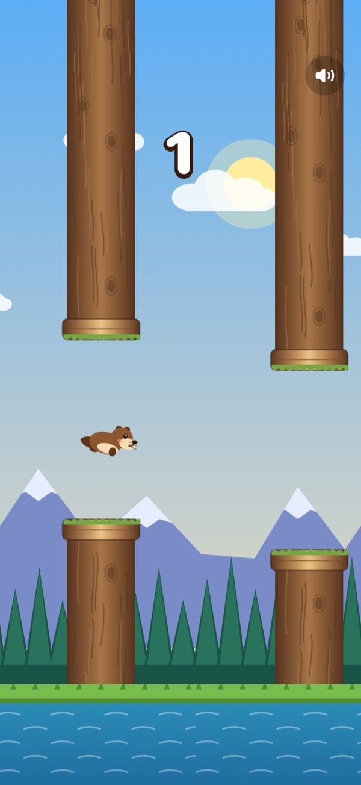

# Otter Flap



A native, offline iPhone take on the tap-to-flap arcade genre, starring a river otter. SwiftUI frames a SpriteKit playfield: tap to paddle upward, thread the gaps between mossy driftwood logs, and try not to splash into the river. Every sprite (otter animation frames, bark-textured logs, parallax mountains, pine forest, clouds and river bank) is drawn procedurally with Core Graphics, and all sounds are synthesized locally. No accounts, network, ads, runtime dependencies or third-party artwork.

## Build and run

Requires macOS, Xcode 16+ and an iOS Simulator (iOS 17+).

```sh
brew install xcodegen swiftformat
cd ios-otter-flap
xcodegen generate
xcodebuild -project OtterFlap.xcodeproj -scheme OtterFlap \
  -sdk iphonesimulator -configuration Debug \
  -derivedDataPath build CODE_SIGNING_ALLOWED=NO build
open OtterFlap.xcodeproj
```

Select an iPhone Simulator and Run. The checked-in Xcode project is generated from `project.yml`; regenerate with XcodeGen after changing target configuration. Device installation requires your own signing team; Simulator does not.

```sh
swift test                                        # simulation rules
xcodebuild -project OtterFlap.xcodeproj -scheme OtterFlap \
  -destination 'platform=iOS Simulator,name=iPhone 17' \
  -derivedDataPath build CODE_SIGNING_ALLOWED=NO test   # UI tests on the simulator
swiftformat Sources Tests UITests Scripts Package.swift --lint
swift Scripts/GenerateIcon.swift Assets.xcassets/AppIcon.appiconset/AppIcon.png
```

If `xcodebuild` reports "No simulator runtime version ... available to use with iphonesimulator SDK", run `xcodebuild -downloadPlatform iOS` so the simulator runtime matches the installed SDK.

## Rules

- The otter hovers on the title screen; the first tap starts the run.
- Each tap gives a fixed upward paddle; gravity takes over between taps (terminal fall speed is capped).
- Pass a driftwood log to score **1 point**. Gaps start at 200 pt and narrow by 1 pt per point to a 160 pt minimum; consecutive gaps never shift more than 250 pt, so every course is flyable.
- Touching a log knocks the otter out of the air; touching the river ends the run. The top of the screen is a soft ceiling.
- Medals: **Pebble** (5+), **Shell** (10+), **Pearl** (25+), **Golden Clam** (40+).
- Best score and the sound preference persist on device with UserDefaults. Backgrounding the app pauses a run; tap to resume.

## Structure

- `Sources/Core/FlapRules.swift`: pure, deterministic simulation (seeded course generation, physics, circle-vs-rect collision, scoring, medals). Built as the `OtterRules` Swift package for `swift test`.
- `Sources/App/FlapScene.swift`: SpriteKit renderer on a fixed 120 Hz simulation step with parallax scrolling, flap animation, crash flash and shake.
- `Sources/App/OtterArt.swift`: procedural vector sprites.
- `Sources/App/OtterFlapApp.swift`, `GameStore.swift`, `SoundEngine.swift`: SwiftUI HUD, title/results/pause overlays, persistence, synthesized audio and haptics.

## Verification

`swift test` covers ready-state hovering, flap/gravity, ground and log crashes, ceiling clamping, one-time scoring, fair on-screen gap generation across 40 seeds, seeded reproducibility and medal thresholds.

`OtterFlapUITests` runs on the iOS Simulator: title screen, tap to start, crash into results and replay; a seeded run (`-seed 42 -autopilotScore 3` launch arguments steer the otter through three logs) asserting a final score of 3; and the sound toggle.

## Design and constraints

Original experiment inspired by the flappy-bird genre, not a reproduction of any commercial game or its assets. Portrait iPhone only. VoiceOver labels identify controls and the playfield, but the real-time game is visual and is not fully nonvisually playable. No global leaderboard or cloud sync.
