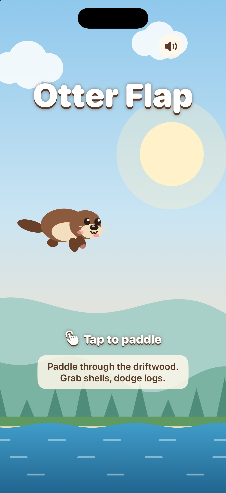

# Otter Flap



A native, one-touch flapping game for iPhone starring a cute river otter.
SwiftUI `Canvas` draws everything procedurally: a sunny sky, layered hills and
pines, rippling water, mossy driftwood gates and the otter herself. A fixed-step
Swift simulation (120 Hz) runs gravity, flaps, scrolling gates, shells and
collisions.

## Build and run

Requires macOS, Xcode 16 or newer, and XcodeGen. The app supports iOS 17+ in
portrait on iPhone. No dependencies, account, network service or signing
credentials are needed for Simulator.

```sh
cd ios-otter-flap
brew install xcodegen # if not already installed
xcodegen generate
xcodebuild -project OtterFlap.xcodeproj -scheme OtterFlap \
  -sdk iphonesimulator -configuration Debug \
  -derivedDataPath DerivedData CODE_SIGNING_ALLOWED=NO build
```

Open the generated `OtterFlap.xcodeproj`, select an iPhone Simulator and Run.
`project.yml` is the source of truth; generated Xcode metadata and build output
are ignored.

## How to play

- **Tap** anywhere to paddle upward; gravity pulls the otter back down.
- Slip through the gaps between driftwood logs. Each gate passed scores a point.
- Grab floating shells between gates for a bonus sparkle (counted separately).
- Touching a log or splashing into the river ends the run.
- Medals: Bronze 10, Silver 25, Gold 50, Pearl 100.
- Best score and the sound toggle persist locally in `UserDefaults`.

Sound effects are synthesized at runtime (flap, score, shell, bonk, splash) and
light haptics accompany flaps, points and crashes.

## Checks

```sh
swift format lint --strict --recursive Sources Tests Scripts Package.swift
swift test
```

Tests cover the ready hover, flap and gravity, water and ceiling handling, an
autopilot that scores through gaps, gap bounds, a fair first gate and medal
thresholds. The Swift package compiles the same rules used by the iOS app.

The app icon is original and reproducible:

```sh
swift Scripts/GenerateAssets.swift .
```

## Scope

An original game inspired by the one-touch flapping genre, not a copy of any
commercial assets. There are no ads, purchases, accounts or online leaderboards.
